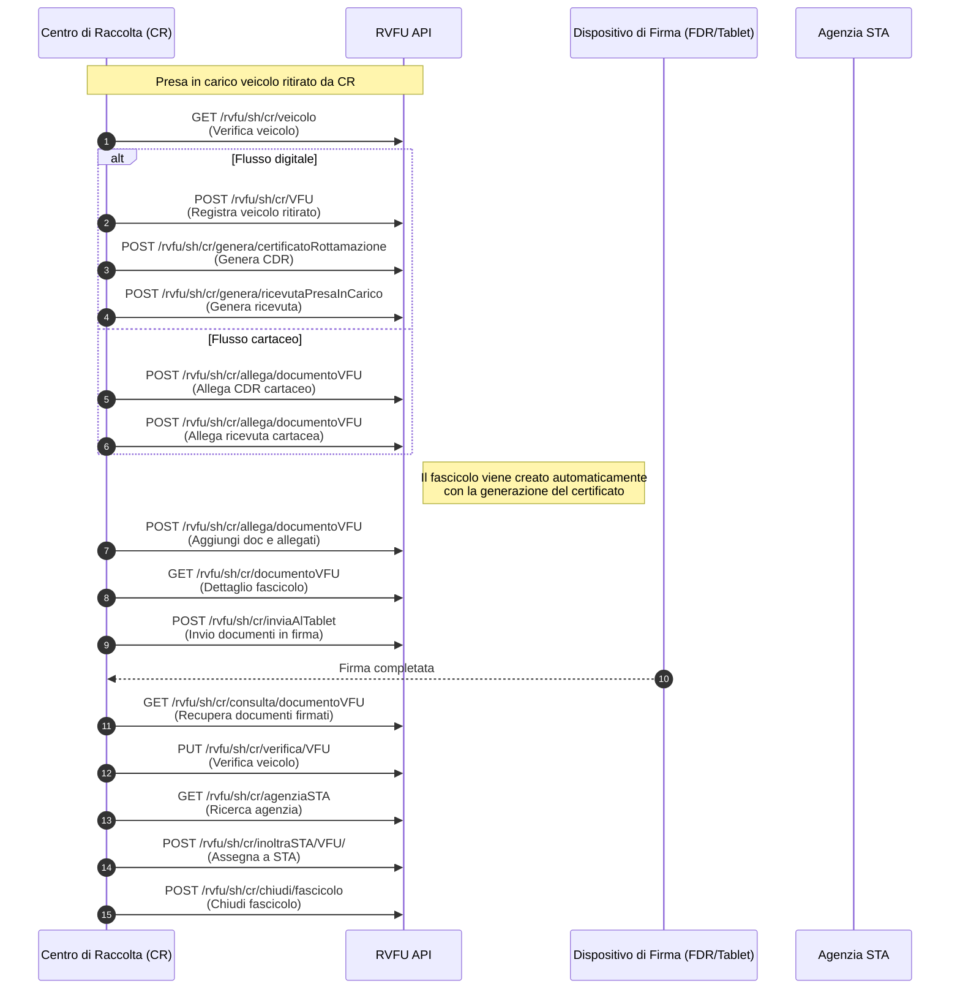
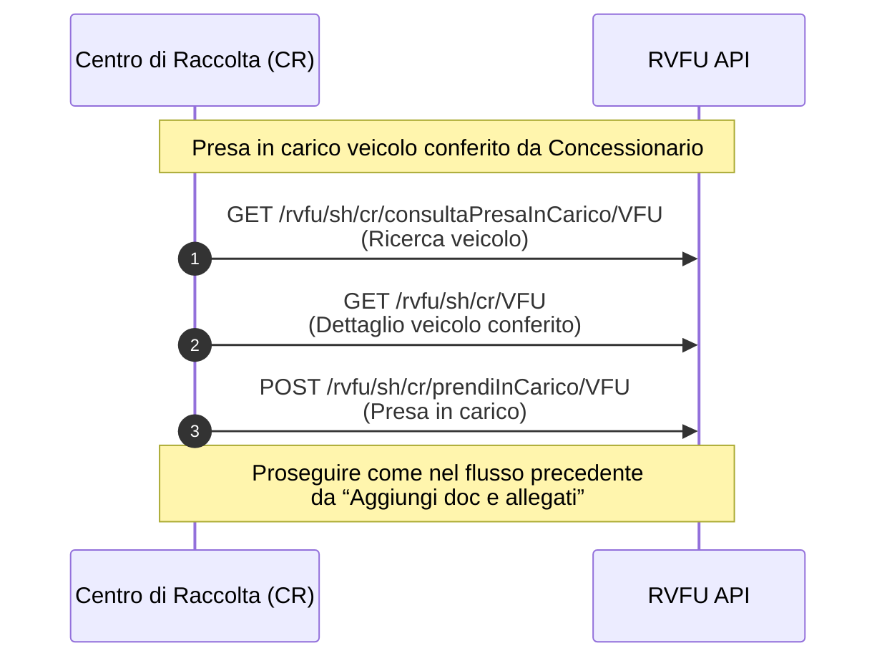

# RVFU — Sequence Diagrams (Markdown-ready)

> Questo file è pensato per essere **letto direttamente da Cursor** o trasformato in altri formati.  
> Include diagrammi **Mermaid** e riferimenti agli endpoint usati nei flussi.

## 1) Presa in carico veicolo ritirato da CR

---

## 2) Presa in carico veicolo conferito da Concessionario

---

## Riepilogo endpoint (per ricerca/grep rapido)

| Azione | Metodo + Path |
|---|---|
| Verifica veicolo | `GET /rvfu/sh/cr/veicolo` |
| Registra VFU (ritirato) | `POST /rvfu/sh/cr/VFU` |
| Genera Certificato di Rottamazione (CDR) | `POST /rvfu/sh/cr/genera/certificatoRottamazione` |
| Genera Ricevuta Presa in Carico | `POST /rvfu/sh/cr/genera/ricevutaPresaInCarico` |
| Allega documento (CDR/Ricevuta/Altro) | `POST /rvfu/sh/cr/allega/documentoVFU` |
| Dettaglio fascicolo / documenti | `GET /rvfu/sh/cr/documentoVFU` |
| Invio in firma (FDR/Tablet) | `POST /rvfu/sh/cr/inviaAlTablet` |
| Recupera documenti firmati | `GET /rvfu/sh/cr/consulta/documentoVFU` |
| Verifica VFU | `PUT /rvfu/sh/cr/verifica/VFU` |
| Ricerca Agenzia STA | `GET /rvfu/sh/cr/agenziaSTA` |
| Inoltro a STA | `POST /rvfu/sh/cr/inoltraSTA/VFU/` |
| Chiusura fascicolo | `POST /rvfu/sh/cr/chiudi/fascicolo` |
| Ricerca VFU “da prendere in carico” (conferiti) | `GET /rvfu/sh/cr/consultaPresaInCarico/VFU` |
| Dettaglio VFU | `GET /rvfu/sh/cr/VFU` |
| Prendi in carico VFU | `POST /rvfu/sh/cr/prendiInCarico/VFU` |

> **Nota:** nel documento originale alcune etichette riportano possibili refusi (es. `cunsulta`). Qui è stato uniformato a `consulta`. Se preferisci mantenere esattamente il testo originale, dimmelo e genero una variante “as-is”.

---

### Uso in Cursor
- Salva questo file come `RVFU_Sequence_Diagrams.md` nella repo.
- Cursor/VS Code renderizzerà automaticamente i diagrammi Mermaid nel preview Markdown.
