**Manuale Utente**

Registro Veicoli Fuori Uso

Centro di Raccolta

ro Veicoli Fuori Uso

Manuale Utente per Demolitori

V1.6 -- Ottobre 2025

Tabella dei contenuti

[1 Introduzione [5](#introduzione)](#introduzione)

[1.1 Scopo e campo di applicazione
[5](#scopo-e-campo-di-applicazione)](#scopo-e-campo-di-applicazione)

[1.2 Modalita' di accesso
[5](#modalita-di-accesso)](#modalita-di-accesso)

[2 descrizioni delle funzioni
[6](#descrizioni-delle-funzioni)](#descrizioni-delle-funzioni)

[2.1 Home Page [6](#home-page)](#home-page)

[2.2 Gestione Deleghe [9](#gestione-deleghe)](#gestione-deleghe)

[2.2.1 Nuova Delega al Ritiro
[9](#nuova-delega-al-ritiro)](#nuova-delega-al-ritiro)

[2.2.1 Lista Imprese Delegate
[10](#lista-imprese-delegate)](#lista-imprese-delegate)

[2.2.1.1 Esporta Lista Deleghe
[11](#esporta-lista-deleghe)](#esporta-lista-deleghe)

[2.2.1.2 Stampa Lista Deleghe
[11](#stampa-lista-deleghe)](#stampa-lista-deleghe)

[2.2.2 Dettaglio Delega [11](#dettaglio-delega)](#dettaglio-delega)

[2.2.2.1 Modifica Delega [11](#modifica-delega)](#modifica-delega)

[2.2.2.2 Revoca Delega [12](#revoca-delega)](#revoca-delega)

[2.2.2.3 Annulla Delega [12](#annulla-delega)](#annulla-delega)

[2.2.2.4 Esporta Lista Deleghe
[12](#esporta-lista-deleghe-1)](#esporta-lista-deleghe-1)

[2.2.2.5 Stampa Lista Deleghe
[12](#stampa-lista-deleghe-1)](#stampa-lista-deleghe-1)

[2.3 Registro dei Veicoli SENZA Obbligo di Iscrizione al PRA
[12](#registro-dei-veicoli-senza-obbligo-di-iscrizione-al-pra)](#registro-dei-veicoli-senza-obbligo-di-iscrizione-al-pra)

[2.3.1 Inserisci Veicolo Fuori Uso (no PRA)
[12](#inserisci-veicolo-fuori-uso-no-pra)](#inserisci-veicolo-fuori-uso-no-pra)

[2.3.1.1 Registrazione Dati Veicolo da Ritirare
[15](#registrazione-dati-veicolo-da-ritirare)](#registrazione-dati-veicolo-da-ritirare)

[2.3.1.1 Inserimento e Registrazione di Veicoli non riconosciuti
[19](#inserimento-e-registrazione-di-veicoli-non-riconosciuti)](#inserimento-e-registrazione-di-veicoli-non-riconosciuti)

[2.3.1.2 Genera e stampa Certificato di Rottamazione
[23](#genera-e-stampa-certificato-di-rottamazione)](#genera-e-stampa-certificato-di-rottamazione)

[2.3.1.3 Acquisisci Dati Certificato di Rottamazione
[25](#acquisisci-dati-certificato-di-rottamazione)](#acquisisci-dati-certificato-di-rottamazione)

[2.3.1.4 Allega Certificato di Rottamazione Cartaceo
[25](#allega-certificato-di-rottamazione-cartaceo)](#allega-certificato-di-rottamazione-cartaceo)

[2.3.1.5 Firma Certificato di Rottamazione cartaceo
[25](#firma-certificato-di-rottamazione-cartaceo)](#firma-certificato-di-rottamazione-cartaceo)

[2.3.1.6 Genera e stampa Ricevuta di presa in carico documentazione
[26](#genera-e-stampa-ricevuta-di-presa-in-carico-documentazione)](#genera-e-stampa-ricevuta-di-presa-in-carico-documentazione)

[2.3.1.7 Allega Ricevuta di presa in carico
[26](#allega-ricevuta-di-presa-in-carico)](#allega-ricevuta-di-presa-in-carico)

[2.3.2 Gestione Veicoli Fuori Uso -- Presa in carico (no PRA)
[27](#gestione-veicoli-fuori-uso-presa-in-carico-no-pra)](#gestione-veicoli-fuori-uso-presa-in-carico-no-pra)

[2.3.2.1 Scarica Lista Veicoli
[29](#scarica-lista-veicoli)](#scarica-lista-veicoli)

[2.3.2.2 Stampa Lista Veicoli
[29](#stampa-lista-veicoli)](#stampa-lista-veicoli)

[2.3.2.3 Dettaglio Veicolo Registrato
[29](#dettaglio-veicolo-registrato)](#dettaglio-veicolo-registrato)

[2.3.2.4 Presa in carico Veicolo Fuori Uso (no PRA)
[33](#presa-in-carico-veicolo-fuori-uso-no-pra)](#presa-in-carico-veicolo-fuori-uso-no-pra)

[2.3.2.5 Trasferisci Veicolo Fuori Uso (no PRA)
[36](#trasferisci-veicolo-fuori-uso-no-pra)](#trasferisci-veicolo-fuori-uso-no-pra)

[2.3.2.6 Visualizza Certificato di Rottamazione
[44](#visualizza-certificato-di-rottamazione)](#visualizza-certificato-di-rottamazione)

[2.3.2.7 Visualizza Ricevuta Presa in carico Documentazione
[44](#visualizza-ricevuta-presa-in-carico-documentazione)](#visualizza-ricevuta-presa-in-carico-documentazione)

[2.3.3 Gestione Veicoli Fuori Uso -- Rottama VFU (no PRA)
[44](#gestione-veicoli-fuori-uso-rottama-vfu-no-pra)](#gestione-veicoli-fuori-uso-rottama-vfu-no-pra)

[2.3.3.1 Dettaglio Veicolo da Rottamare
[45](#dettaglio-veicolo-da-rottamare)](#dettaglio-veicolo-da-rottamare)

[2.3.3.2 Modifica Dati Registro
[50](#modifica-dati-registro)](#modifica-dati-registro)

[2.3.3.3 Annulla Inserimento Registro
[50](#annulla-inserimento-registro)](#annulla-inserimento-registro)

[2.3.3.4 Valida Veicolo [51](#valida-veicolo)](#valida-veicolo)

[2.3.3.5 Gestisci Documenti Fascicolo
[53](#gestisci-documenti-fascicolo)](#gestisci-documenti-fascicolo)

[2.3.3.5.1 Inserisci nuovo documento
[55](#inserisci-nuovo-documento)](#inserisci-nuovo-documento)

[2.3.3.5.1 Sostituisci documento
[55](#sostituisci-documento)](#sostituisci-documento)

[2.3.3.5.2 Invia documenti al tablet (Firma documento)
[55](#invia-documenti-al-tablet-firma-documento)](#invia-documenti-al-tablet-firma-documento)

[2.3.3.5.3 Recupera documenti firmati
[56](#recupera-documenti-firmati)](#recupera-documenti-firmati)

[2.3.3.5.4 Elimina documento
[56](#elimina-documento)](#elimina-documento)

[2.3.3.5.5 Chiudi Fascicolo [57](#chiudi-fascicolo)](#chiudi-fascicolo)

[2.3.3.6 Radia Veicolo [60](#radia-veicolo)](#radia-veicolo)

[2.3.4 Gestione Veicolo Fuori Uso -- Radiati e Demoliti (no PRA)
[60](#gestione-veicolo-fuori-uso-radiati-e-demoliti-no-pra)](#gestione-veicolo-fuori-uso-radiati-e-demoliti-no-pra)

[2.3.4.1 Modifica veicolo Radiato o Demolito
[62](#modifica-veicolo-radiato-o-demolito)](#modifica-veicolo-radiato-o-demolito)

[2.3.5 Gestione Veicolo Fuori Uso -- Ceduto (no PRA)
[70](#gestione-veicolo-fuori-uso-ceduto-no-pra)](#gestione-veicolo-fuori-uso-ceduto-no-pra)

[2.4 Registro dei Veicoli CON Obbligo di Iscrizione al PRA
[75](#registro-dei-veicoli-con-obbligo-di-iscrizione-al-pra)](#registro-dei-veicoli-con-obbligo-di-iscrizione-al-pra)

[2.4.1 Inserisci Veicolo Fuori Uso (PRA)
[75](#inserisci-veicolo-fuori-uso-pra)](#inserisci-veicolo-fuori-uso-pra)

[2.4.1.1 Inserisci veicolo da radiare
[75](#inserisci-veicolo-da-radiare)](#inserisci-veicolo-da-radiare)

[2.4.1.2 Inserisci veicolo radiato
[77](#inserisci-veicolo-radiato)](#inserisci-veicolo-radiato)

[2.4.1.3 Registrazione Dati Veicolo da Ritirare
[77](#registrazione-dati-veicolo-da-ritirare-1)](#registrazione-dati-veicolo-da-ritirare-1)

[2.4.1.4 Genera e stampa Certificato di Rottamazione
[80](#genera-e-stampa-certificato-di-rottamazione-1)](#genera-e-stampa-certificato-di-rottamazione-1)

[2.4.1.5 Acquisisci Dati Certificato di Rottamazione
[82](#acquisisci-dati-certificato-di-rottamazione-1)](#acquisisci-dati-certificato-di-rottamazione-1)

[2.4.1.6 Allega Certificato di Rottamazione Cartaceo
[82](#allega-certificato-di-rottamazione-cartaceo-1)](#allega-certificato-di-rottamazione-cartaceo-1)

[2.4.1.7 Firma Certificato di Rottamazione cartaceo
[83](#firma-certificato-di-rottamazione-cartaceo-1)](#firma-certificato-di-rottamazione-cartaceo-1)

[2.4.2 Gestione Veicoli Fuori Uso (PRA) -- Presa in carico
[83](#gestione-veicoli-fuori-uso-pra-presa-in-carico)](#gestione-veicoli-fuori-uso-pra-presa-in-carico)

[2.4.2.1 Scarica Lista Veicoli
[86](#scarica-lista-veicoli-1)](#scarica-lista-veicoli-1)

[2.4.2.2 Stampa Lista Veicoli
[86](#stampa-lista-veicoli-1)](#stampa-lista-veicoli-1)

[2.4.2.3 Dettaglio Veicolo Registrato
[86](#dettaglio-veicolo-registrato-1)](#dettaglio-veicolo-registrato-1)

[2.4.2.4 Presa in carico Veicolo Fuori Uso (PRA)
[90](#presa-in-carico-veicolo-fuori-uso-pra)](#presa-in-carico-veicolo-fuori-uso-pra)

[2.4.2.5 Trasferisci Veicolo Fuori Uso ad altro CR (PRA)
[90](#trasferisci-veicolo-fuori-uso-ad-altro-cr-pra)](#trasferisci-veicolo-fuori-uso-ad-altro-cr-pra)

[2.4.2.6 Visualizza Certificato di rottamazione (PRA)
[90](#visualizza-certificato-di-rottamazione-pra)](#visualizza-certificato-di-rottamazione-pra)

[2.4.3 Gestione Veicoli Fuori Uso (PRA) -- Rottama VFU
[90](#gestione-veicoli-fuori-uso-pra-rottama-vfu)](#gestione-veicoli-fuori-uso-pra-rottama-vfu)

[2.4.3.1 Dettaglio Veicolo da Rottamare
[93](#dettaglio-veicolo-da-rottamare-1)](#dettaglio-veicolo-da-rottamare-1)

[2.4.3.2 Modifica Veicolo Fuori Uso (PRA)
[97](#modifica-veicolo-fuori-uso-pra)](#modifica-veicolo-fuori-uso-pra)

[2.4.3.3 Annulla Inserimento Registro (PRA)
[97](#annulla-inserimento-registro-pra)](#annulla-inserimento-registro-pra)

[2.4.3.4 Valida Veicolo Fuori Uso (PRA)
[98](#valida-veicolo-fuori-uso-pra)](#valida-veicolo-fuori-uso-pra)

[2.4.3.5 Gestisci Documenti Fascicolo (PRA)
[98](#gestisci-documenti-fascicolo-pra)](#gestisci-documenti-fascicolo-pra)

[2.4.3.5.1 Dettaglio Fascicolo Veicolo Fuori Uso (PRA)
[98](#dettaglio-fascicolo-veicolo-fuori-uso-pra)](#dettaglio-fascicolo-veicolo-fuori-uso-pra)

[2.4.3.5.2 Inserisci nuovo documento
[101](#inserisci-nuovo-documento-1)](#inserisci-nuovo-documento-1)

[2.4.3.5.3 Sostituisci documento
[101](#sostituisci-documento-1)](#sostituisci-documento-1)

[2.4.3.5.4 Invia documenti al tablet (Firma Documento)
[101](#invia-documenti-al-tablet-firma-documento-1)](#invia-documenti-al-tablet-firma-documento-1)

[2.4.3.5.5 Recupera documenti firmati
[102](#recupera-documenti-firmati-1)](#recupera-documenti-firmati-1)

[2.4.3.5.6 Visualizza documento
[102](#visualizza-documento)](#visualizza-documento)

[2.4.3.5.7 Elimina documento
[102](#elimina-documento-1)](#elimina-documento-1)

[2.4.3.5.8 Modifica Documento Veicolo Fuori Uso (PRA)
[103](#modifica-documento-veicolo-fuori-uso-pra)](#modifica-documento-veicolo-fuori-uso-pra)

[2.4.3.6 Chiudi Fascicolo
[103](#chiudi-fascicolo-1)](#chiudi-fascicolo-1)

[2.4.3.7 Associa Veicolo Fuori Uso (PRA) a STA
[106](#associa-veicolo-fuori-uso-pra-a-sta)](#associa-veicolo-fuori-uso-pra-a-sta)

[2.4.3.8 Integrazione Veicolo Fuori Uso (PRA)
[109](#integrazione-veicolo-fuori-uso-pra)](#integrazione-veicolo-fuori-uso-pra)

[2.4.3.9 Riapertura Fascicolo Veicolo Fuori Uso (PRA)
[110](#riapertura-fascicolo-veicolo-fuori-uso-pra)](#riapertura-fascicolo-veicolo-fuori-uso-pra)

[2.4.4 Gestione Veicolo Fuori Uso -- Radiati e Demoliti (PRA)
[113](#gestione-veicolo-fuori-uso-radiati-e-demoliti-pra)](#gestione-veicolo-fuori-uso-radiati-e-demoliti-pra)

[2.4.5 Gestione Veicolo Fuori Uso -- Ceduti (PRA)
[113](#gestione-veicolo-fuori-uso-ceduti-pra)](#gestione-veicolo-fuori-uso-ceduti-pra)

[2.5 Visualizza VFU e Visualizza VFU PRA
[114](#visualizza-vfu-e-visualizza-vfu-pra)](#visualizza-vfu-e-visualizza-vfu-pra)

[2.5.1 Visualizza VFU e VFU radiati
[114](#visualizza-vfu-e-vfu-radiati)](#visualizza-vfu-e-vfu-radiati)

[2.5.1 Visualizza storico VFU
[120](#visualizza-storico-vfu)](#visualizza-storico-vfu)

**Storico delle versioni del documento**

+----------+--------------+-------------+----------------------------------------+
| Versione | Data         | Approvatore | > Sezione Interessata e descrizione    |
|          | Versione     | RTI         | > del cambiamento                      |
|          |              |             |                                        |
|          |              | Ruolo       |                                        |
+:========:+:============:+=============+========================================+
| 1.0      | > 31/03/2021 |             | > Creazione del documento              |
+----------+--------------+-------------+----------------------------------------+
| 1.1      | > 28/07/2023 |             | > Adeguamento a nuovo template         |
|          |              |             | > documento                            |
+----------+--------------+-------------+----------------------------------------+
| 1.2      | > 20/11/2023 |             | > Versione per pilota                  |
+----------+--------------+-------------+----------------------------------------+
| 1.3      | > 05/06/2024 |             | - Aggiunto Paragrafo 2.3.1 inserimento |
|          |              |             |   veicolo non PRA per causali SD e PA  |
|          |              |             |                                        |
|          |              |             | - Aggiunto Paragrafo 2.3.1.1           |
|          |              |             |   Inserimento e Registrazione veicoli  |
|          |              |             |   non riconosciuti                     |
|          |              |             |                                        |
|          |              |             | - Modificato 2.3.1.2 Certificato di    |
|          |              |             |   Rottamazione                         |
|          |              |             |                                        |
|          |              |             | - Modificato 2.3.3.3 Annulla           |
|          |              |             |   inserimento registro                 |
|          |              |             |                                        |
|          |              |             | - Modificato 2.3.3.5.5 Chiudi          |
|          |              |             |   fascicolo                            |
|          |              |             |                                        |
|          |              |             | - Aggiunto paragrafo 2.4.1.1 Inserisci |
|          |              |             |   veicolo da radiare                   |
|          |              |             |                                        |
|          |              |             | - Aggiunto 2.4.1.2 Inserisci veicolo   |
|          |              |             |   radiato                              |
|          |              |             |                                        |
|          |              |             | - Modificato paragrafo 2.4.1.4 Genera  |
|          |              |             |   e stampa Certificato di Rottamazione |
|          |              |             |                                        |
|          |              |             | - Modificato paragrafo 2.4.3.4 Valida  |
|          |              |             |   veicolo fuori uso (PRA)              |
|          |              |             |                                        |
|          |              |             | - Modificato paragrafo 2.4.3.6 Chiudi  |
|          |              |             |   fascicolo                            |
+----------+--------------+-------------+----------------------------------------+
| 1.4      | > 05/11/2024 |             | - Aggiornamento schermate documento.   |
+----------+--------------+-------------+----------------------------------------+
| 1.5      | > 10/02/2025 |             | > Aggiornamento manuale allineato al   |
|          |              |             | > rilascio del 17.12.2024              |
|          |              |             |                                        |
|          |              |             | - Gestione della distinta in fase di   |
|          |              |             |   registrazione veicolo (2.3.1 --      |
|          |              |             |   2.4.1)                               |
|          |              |             |                                        |
|          |              |             | - Nuova gestione soggetto detentore    |
|          |              |             |   giuridico (2.3.1.1 -- 2.3.1.2)       |
|          |              |             |                                        |
|          |              |             | - Funzione di annullamento inoltro a   |
|          |              |             |   STA (2.4.3.7)                        |
|          |              |             |                                        |
|          |              |             | - Aggiunta del campo "note aggiuntive  |
|          |              |             |   per parti mancanti" (2.3.1.1 --      |
|          |              |             |   2.3.1.2)                             |
|          |              |             |                                        |
|          |              |             |   Trasferimento ad altro demolitore    |
|          |              |             |   prima della presa in carico (2.3.2.5 |
|          |              |             |   -- 2.4.2.5)                          |
|          |              |             |                                        |
|          |              |             | - Termini entro i quali distruggere i  |
|          |              |             |   documenti cartacei (2.4.3 --         |
|          |              |             |   2.3.4.1)                             |
+----------+--------------+-------------+----------------------------------------+
| 1.6      | > 10/2025    |             | > Aggiornamento manuale allineato al   |
|          |              |             | > rilascio del 11.09.2025              |
|          |              |             |                                        |
|          |              |             | - Trasferimento del VFU ad altro CR    |
|          |              |             |   (anche azienda diversa) nello stato  |
|          |              |             |   RADIATO (PAR 2.3.2.5, 2.4.2.5)       |
|          |              |             |                                        |
|          |              |             | - Nuovo stato VFU 'CEDUTO' (PAR 2.3.5, |
|          |              |             |   2.4.5)                               |
+----------+--------------+-------------+----------------------------------------+

**Distribuzione**

La versione ufficiale del presente documento è disponibile nel Portale
della Fornitura. Ogni copia stampata è da ritenersi copia non
controllata.

# Introduzione

## Scopo e campo di applicazione

Il presente manuale intende fornire un supporto all'utente
Demolitore/Centro di Raccolta per l'utilizzo dell'applicazione
***Gestione Registro Veicoli Fuori Uso***. Il manuale sarà aggiornato in
accordo alle evoluzioni del servizio.

## Modalita' di accesso

Aprire il browser e inserire il seguente indirizzo:

https://www.ilportaledeltrasporto.it

L'utente dovrà poi effettuare il login inserendo Utenza e Password.

Selezionare la voce Gestione Demolitori

# descrizioni delle funzioni

## Home Page

L'utente che viene autenticato dalla pagina di login accede alla Home
Page dell'applicazione.

La Home Page contiene il menu in alto con le voci attraverso cui è
possibile eseguire le azioni di proprio interesse.

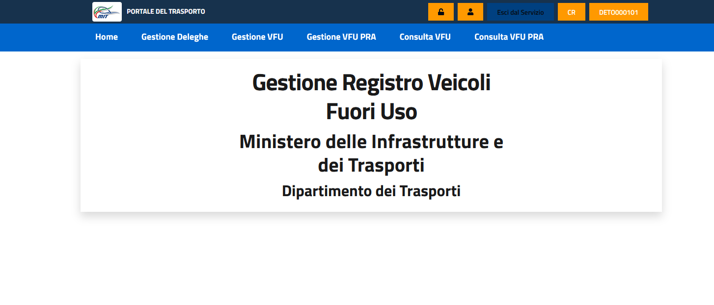{width="5.770138888888889in"
height="2.4680555555555554in"}

Le funzionalità previste sono le seguenti:

- **Gestione Deleghe**: le funzioni del menu consentono di attribuire e
  gestire le deleghe di un Centro di Raccolta ad un Concessionario per
  il ritiro dei veicoli da rottamare per suo conto. Le deleghe possono
  essere attribuite, modificate o revocate. Il Centro di Raccolta può
  consultare la lista delle deleghe con il relativo stato e la durata.

- **Gestione VFU**: le funzioni del menu consentono ad un Centro di
  Raccolta di registrare il ritiro di un veicolo fuori uso, senza
  Obbligo di Iscrizione al PRA, da avviare alla rottamazione e di
  espletare tutte le operazioni previste dal processo di rottamazione.
  Per questa tipologia di veicoli è prevista l'emissione del Certificato
  di rottamazione, da consegnare all'intestatario o al detentore del
  veicolo e la ricevuta di presa in carico della documentazione, che
  l'intestatario dovrà consegnare all'ufficio UMC competente per
  territorio che provvederà alla cancellazione del veicolo dall'Archivio
  Nazionale dei Veicoli (ANV).

- **Gestione VFU PRA**: le funzioni del menu consentono al Centro di
  Raccolta di registrare il ritiro di un veicolo fuori uso, con obbligo
  di Iscrizione al PRA, da avviare alla rottamazione e di espletare
  tutte le operazioni previste dal processo di rottamazione. Per questa
  tipologia di veicoli è prevista l'emissione del Certificato di
  rottamazione, da consegnare all'intestatario o al detentore del
  veicolo. E', inoltre, possibile proseguire la lavorazione fino ad
  effettuare direttamente la radiazione del veicolo dal PRA e dall'ANV,
  mediante l'utilizzo delle funzionalità disponibili sul Portale del
  Trasporto. E', infine, possibile scegliere se avvalersi di uno studio
  di consulenza per l'espletamento della pratica di
  cessazione/Radiazione del veicolo.

- **Consulta VFU**: Le funzioni del menu consentono al Centro di
  Raccolta di consultare il registro dei Veicoli fuori Uso non iscritti
  al PRA e di visualizzare per ciascuno lo storico dei passaggi di stato
  nel corso della lavorazione.

- **Consulta VFU PRA:** Le funzioni del menu consentono al Centro di
  Raccolta di consultare il registro dei Veicoli fuori Uso iscritti al
  PRA e di visualizzare per ciascuno lo storico dei passaggi di stato
  nel corso della lavorazione.

Di seguito le funzioni disponibili nei diversi menu:

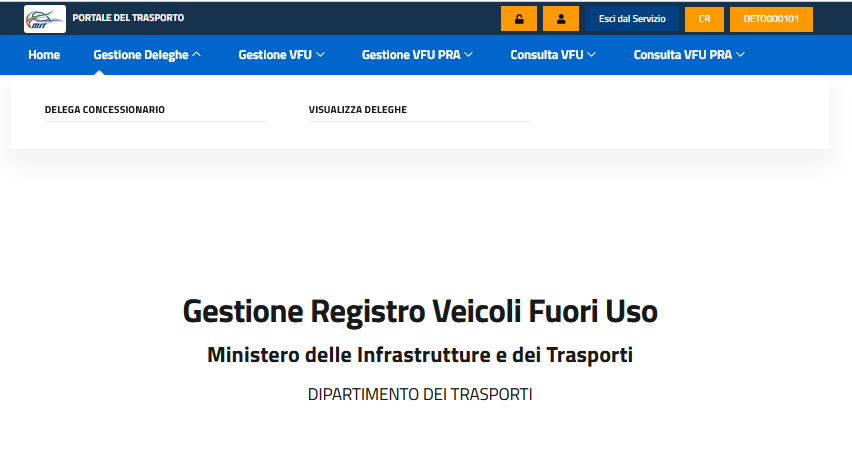{width="5.770138888888889in"
height="3.1083333333333334in"}

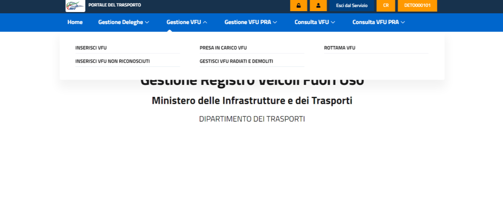{width="5.770138888888889in"
height="2.4145833333333333in"}

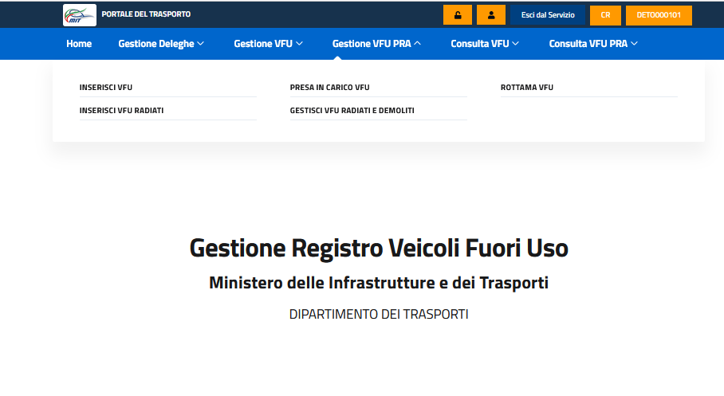{width="5.770138888888889in"
height="3.158333333333333in"}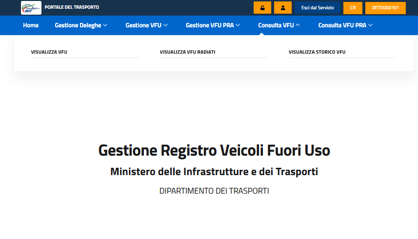{width="5.770138888888889in"
height="3.2993055555555557in"}

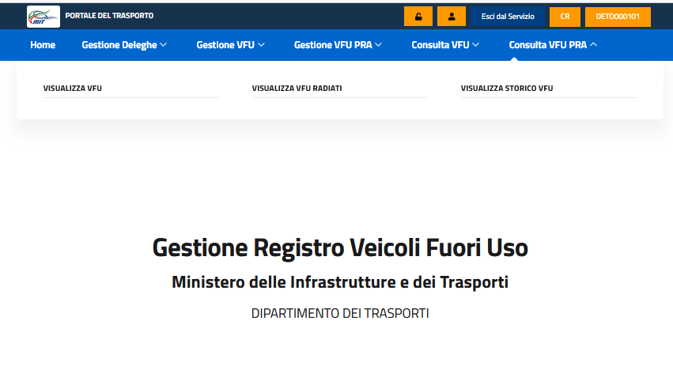{width="5.770138888888889in"
height="3.1395833333333334in"}

## Gestione Deleghe

### Nuova Delega al Ritiro

Selezionando la voce "**Delega Concessionario**" di menu "**Gestione
Deleghe**", il centro di raccolta può individuare il concessionario,
l'automercato o la casa costruttrice con la quale ha stipulato un
contratto privato per il ritiro dei veicoli da rottamare. Le
informazioni principali di tali accordi devono essere registrate nel
sistema per consentire il ritiro dei veicoli e il loro inserimento nel
Registro dei Veicoli fuori Uso, da parte del concessionario delegato.

Il Centro di Raccolta accede alla pagina di ricerca dell'impresa da
delegare, nella quale può indicare il Codice fiscale e selezionare il
tasto "**Ricerca**".

Con il tasto "**Pulisci"** si eliminare il campo inserito.

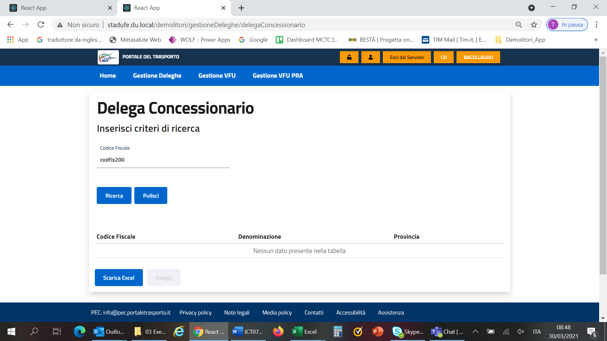{width="5.771653543307087in"
height="3.3542071303587053in"}

Il sistema effettua tutti i controlli previsti sull'impresa cercata e in
caso di errore restituisce i messaggi

- Impresa non attiva

- Esiste una delega attiva con l'impresa indicata

Se invece l'impresa indicata esiste negli archivi ACI e risulta attiva e
non esiste una delega in corso di validità tra il Centro di Raccolta e
l'impresa cercata, è visualizzata la sua denominazione e sono presentati
i campi da valorizzare per caratterizzare la delega. All'utente sono
richiesti:

- data di decorrenza e di scadenza della delega

- eventuali note

e dopo selezionando il tasto "Inserisci Delega".

### Lista Imprese Delegate

La funzione consente di individuare tutte le imprese per le quali
sussiste un rapporto di delega con il Centro di Raccolta di appartenenza
della matricola collegata.

La ricerca può essere effettuata scegliendo uno dei seguenti filtri:

- codice fiscale Impresa, per verificare la presenza di deleghe per una
  specifica impresa

- Intervallo temporale di decorrenza della delega, per ottenere tutte le
  deleghe iniziate in un determinato arco temporale

- Intervallo temporale di scadenza della delega, per ottenere tutte le
  deleghe che scadono in un determinato arco temporale

- stato della delega (attiva o revocata)

- nessun filtro: in questo modo si ottiene la lista di tutte le imprese
  per le quali esiste un rapporto di delega con il Centro di Raccolta in
  corso di validità (cioè ancora attiva).

Il risultato della ricerca fornisce l'elenco delle deleghe con indicati:

- Identificativo delega

- Codice fiscale dell'impresa delegata

- Date di Decorrenza e Scadenza della delega

- Stato delega (attiva, revocata)

- Denominazione impresa delegata

- Tipologia (CC, CN, AM) impresa delegata

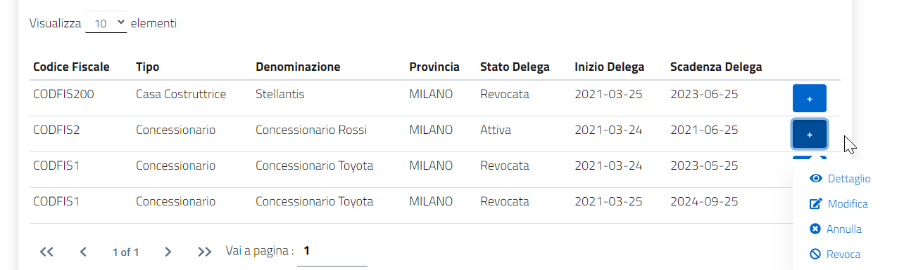{width="5.771653543307087in"
height="1.732179571303587in"}

Per ciascun elemento della lista è possibile scegliere le funzioni

- Dettaglio

- Modifica

- Annulla

- Revoca.

Inoltre, la lista visualizzata, può essere scaricata in un file in
formato excel, mediante la funzione "**Scarica Excel**", o può essere
stampata in un file in formato pdf, mediante la funzione "**Stampa**".

Se non esistono risultati che soddisfano i criteri di ricerca indicati
viene visualizzato il messaggio di errore "Nessuna delega trovata".

#### Esporta Lista Deleghe

La lista delle imprese delegate ricercate può essere scaricata in un
file, in formato excel, che riporta oltre al titolo anche la data di
scarico e il n° totale delle deleghe.

#### Stampa Lista Deleghe

La lista delle imprese delegate ricercate può essere stampata su un
file, in formato PDF, che riporta oltre al titolo anche la data di
stampa, la matricola del richiedente, il n° totale delle deleghe.

### Dettaglio Delega

Scelta la delega di interesse, il sistema prospetta i dati di dettaglio:

- Identificativo delega

- Codice fiscale dell'impresa delegata

- Date di Decorrenza e Scadenza della delega

- Stato delega (attiva, revocata)

- Denominazione impresa delegata

- Tipologia (CC, CN, AM) impresa delegata

- note (se presenti)

- matricola e data di inserimento

Sono abilitate le funzioni

- Dettaglio

- Modifica

- Elimina

- Revoca.

Il tasto **Indietro** consente di tornare alla lista delle deleghe.

#### Modifica Delega

Tra i dati attuali della delega visualizzati dal sistema sono
modificabili

- la data di scadenza

- le note.

La modifica della data di scadenza della delega deve essere coerente con
l'eventuale presenza di ritiri di veicoli, cioè non devono essere
presenti ritiri di veicoli che ricadono nel periodo di riduzione della
delega.

Il tasto **Conferma** consente l'aggiornamento dei dati.

#### Revoca Delega

L'utente che vuole revocare una delega deve indicare la motivazione
della revoca, e il sistema verificherà non siano presenti veicoli
ritirati dall'impresa delegata dopo la data di revoca.

Il tasto **Conferma** consente l'aggiornamento dei dati.

#### Annulla Delega

L'utente può eliminare una delega concessa a patto che l'impresa
delegata non abbia già effettuato almeno un ritiro di veicolo per conto
del Centro di Raccolta. In caso contrario si può operare con la funzione
di modifica per limitare il periodo di delega. Anche in fase di
annullamento occorre indicare la motivazione.

Il tasto **Conferma** consente l'aggiornamento dei dati.

#### Esporta Lista Deleghe

La lista delle deleghe attive può essere scaricata in un file, in
formato excel, che riporta oltre al titolo anche la data di scarico e il
n° totale delle deleghe.

#### Stampa Lista Deleghe

La lista delle deleghe attive può essere stampata su un file, in formato
PDF, che riporta oltre al titolo anche la data di stampa, la matricola
del richiedente, il n° totale delle deleghe.

## Registro dei Veicoli SENZA Obbligo di Iscrizione al PRA

In questa sezione è possibile registrare tutti i veicoli che:

- non sono iscritti al PRA per normativa o non sono iscirtti al PRA per
  omissione, qualora la demolizione sia stata richiesta da una Pubblica
  Amministrazione non sono iscritti in nessun archivio nazionale.

### Inserisci Veicolo Fuori Uso (no PRA)

Scegliendo la voce "**Gestione VFU**" è disponibile la funzione
"**Inserisci Veicolo**".

L'utente deve ricercare il veicolo indicando:

- Per i soli ciclomotori, il tipo (C) e il CIC, o in sua assenza il n°
  di telaio

- Per gli altri tipi di veicolo, il tipo e la targa, o in sua assenza il
  n° di telaio,

- il Codice fiscale dell'intestatario

- la causale di inserimento, selezionabile tra SD DEMOLIZIONE e PA
  DEMOLIZIONE SU PROVVVEDIMENTO PA

selezionando poi il tasto "Ricerca".

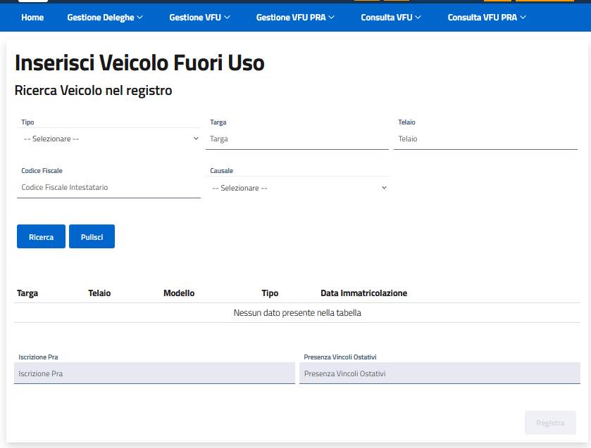{width="5.771653543307087in"
height="4.382400481189851in"}

Il sistema accede ai sistemi MCTC-DTT per verificare i dati del veicolo
e l'eventuale presenza di vincoli ostativi alla demolizione. Il sistema
restituisce tra le altre le seguenti informazioni:

- obbligo di iscrizione al PRA

- presenza di vincoli ostativi alla demolizione.

È possibile selezionare il tipo di veicolo scegliendo tra le opzioni
possibili riportate dall'applicativo, come mostrato in figura seguente.

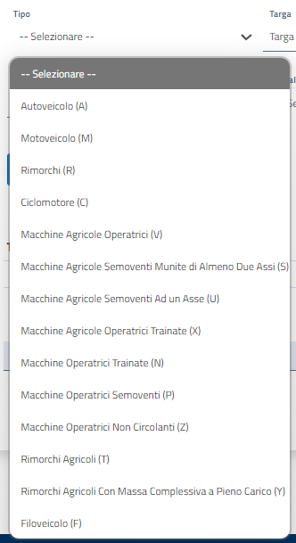{width="4.070866141732283in"
height="7.590431977252844in"}

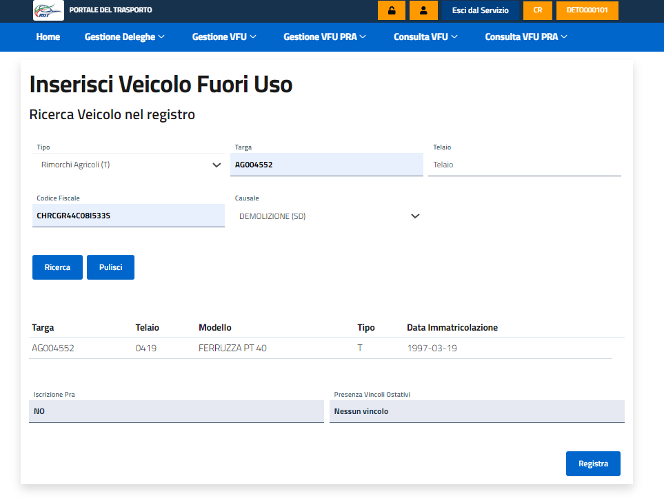{width="5.770138888888889in"
height="4.331944444444445in"}

Il sistema può rispondere nel seguente modo:

- il veicolo non esiste: si devono modificare i parametri di ricerca

- il veicolo è già radiato: si interrompe l'inserimento nel registro

- il veicolo ha l'obbligo di iscrizione al PRA: il sistema indirizza
  alla sezione per la gestione di questa tipologia di veicoli (vedere §
  successivi)

- il codice fiscale intestatario inserito non è valido: si interrompe
  l'inserimento nel registro

- Il codice fiscale intestatario inserito non corrisponde a quello
  associato al veicolo; si può proseguire nell'inserimento popolando i
  dati dell'intestatario, i campi corrispondenti sono editabili, il
  sistema il sistema abilita il tasto "**Registra**".

- il veicolo presenta vincoli ostativi: in questo caso il demolitore può
  decidere se prendere in carico il veicolo specificando l'indicatore
  "**Forzatura Presa in Carico**"

- il veicolo non presenta alcun vincolo e può essere ritirato e preso in
  carico: in questo caso il sistema abilita il tasto "**Registra**".

#### Registrazione Dati Veicolo da Ritirare 

Il sistema visualizza le seguenti sezioni:

- dati del veicolo, preimpostati e non modificabili,

  - tipo veicolo, targa, telaio, fabbrica e modello, anno
    immatricolazione, iscrizione al PRA e di Presenza Vincoli Ostativi

- dati dell'intestatario del veicolo

> Specificando se si tratti di persona **Fisica** o **Giuridica**.

- dati anagrafici

- indirizzo

- campi per l'indicazione dei documenti di riconoscimento (richiesti
  all'utente)

Se il codice fiscale inserito nel campo Codice fiscale intestatario
corrisponde a quello presente a sistema, i dati saranno precompilati,
altrimenti dovranno essere popolati dall'utente.

- campi per l'indicazione dei dati del detentore che consegna il veicolo
  per conto dell'intestatario (dati opzionali che l'utente può indicare
  se diverso dall'intestatario)

  - dati anagrafici del detentore del veicolo

  - indirizzo del detentore

  - 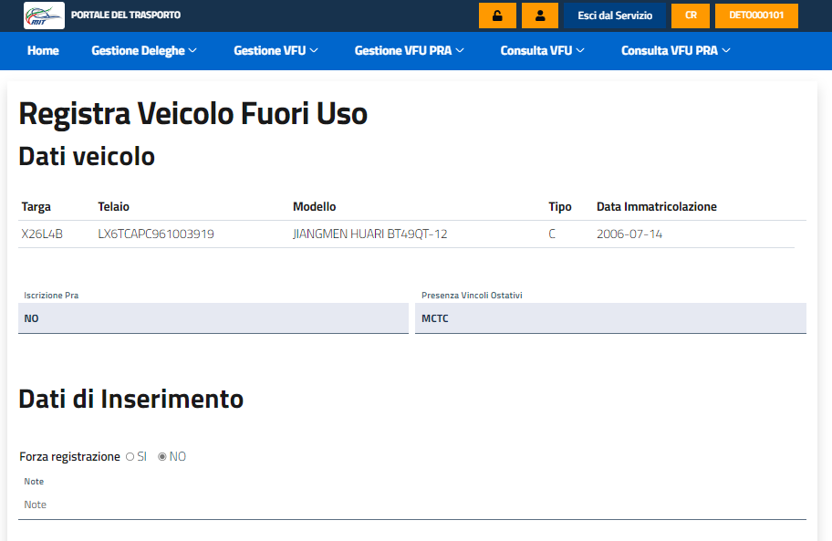{width="5.770138888888889in"
    height="3.752083333333333in"}estremi dei documenti di riconoscimento

[Nel caso di veicolo non radiabile, vengono visualizzate le causali di
non radiabilità con l'informazione sulla possibilità di forzare
l'inserimento., se sono tutte forzabili è possibile comunque registrare
il veicolo nel Registro, specificando l'indicatore di "**Forza
Registrazione"**.]{.mark}

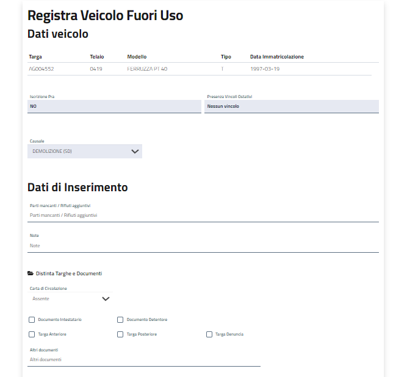{width="4.632182852143482in"
height="4.298832020997375in"}

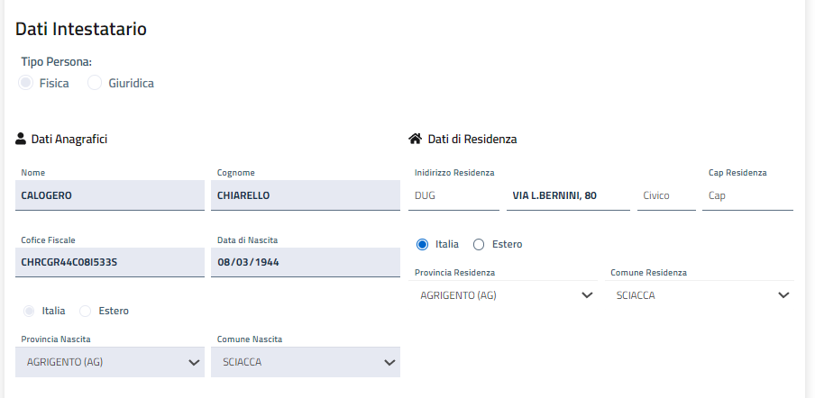{width="5.770138888888889in"
height="2.821527777777778in"}

Nella sezione "Dati di Residenza", l'utente deve selezionare il **DUG**
scegliendo tra una lista di possibili valori proposti dall'applicazione.

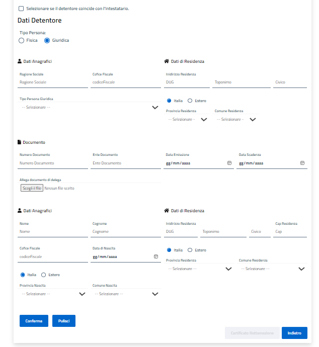{width="4.4030041557305335in"
height="4.791912729658793in"}

Nel caso si specifichi un soggetto giuridico l'applicazione chiede anche
l'inserimento dei dati anagrafici del soggetto persona fisica che
rappresenta l'azienda.

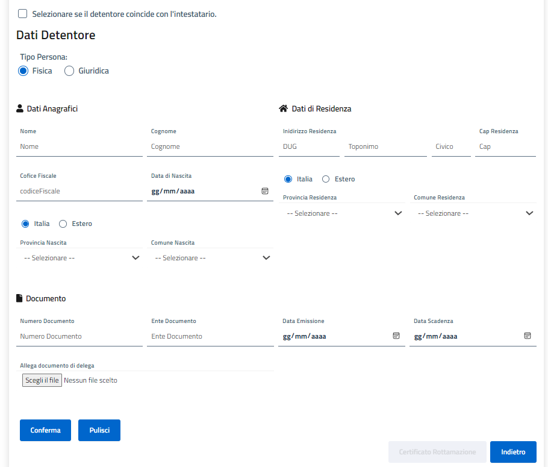{width="5.770138888888889in"
height="4.913888888888889in"}

Selezionando il tasto "**Conferma**" il sistema inserisce il veicolo
ritirato nel Registro, assegnando un n° identificativo all'interno del
registro, che viene visualizzato con il messaggio di operazione
eseguita.

Il veicolo registrato assume lo stato "**Preso in Carico**" e potrà
essere lavorato da una qualunque delle matricole del Centro di Raccolta
che lo ha ritirato.

#### Inserimento e Registrazione di Veicoli non riconosciuti 

La registrazione di veicoli non riconosciuti, perché non presenti in
nessuno degli archivi nazionali o perché non identificabili, può essere
effettuata selezionando la voce di sottomenu Inserisci VFU non
riconosciuti" del menu "Gestione VFU"

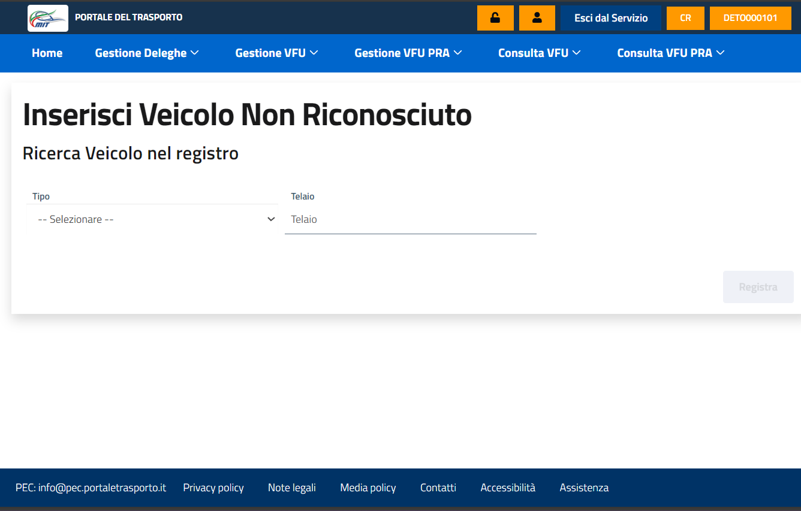{width="5.770138888888889in"
height="3.6840277777777777in"}

La pagina consentirà di inserire:

- Tipo veicolo

- Telaio se presente

[il CF non viene richiesto nella schermata menù 'Inserisci Veicolo Non
Riconosciuto' in quanto non è un dato obbligatorio.]{.mark}

La causale sarà impostata da sistema per il caso specifico.

Selezionando Registra, Il sistema se possibile, verificherà che il
veicolo sia già presente nel registro e in caso affermativo impedirà
l'inserimento, altrimenti sarà possibile proseguire.

I dati richiesti sono

- Note obbligatorie

- Dati intestatario:

Specificando se si tratti di persona **Fisica** o **Giuridica**.

- Dati detentore

La causale verrà impostata da sistema a NN VEICOLI NON RICONOSCIUTI.

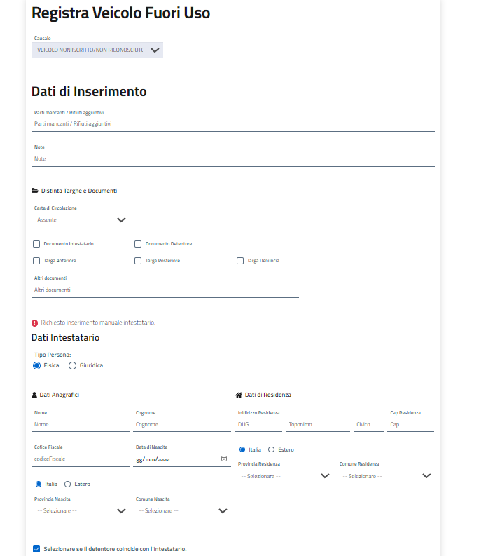{width="4.840526027996501in"
height="5.507227690288714in"}

Selezionale l'apposita casella
{width="0.28128937007874016in"
height="0.2500349956255468in"} se il Detentore coincide con
l'intestatario.

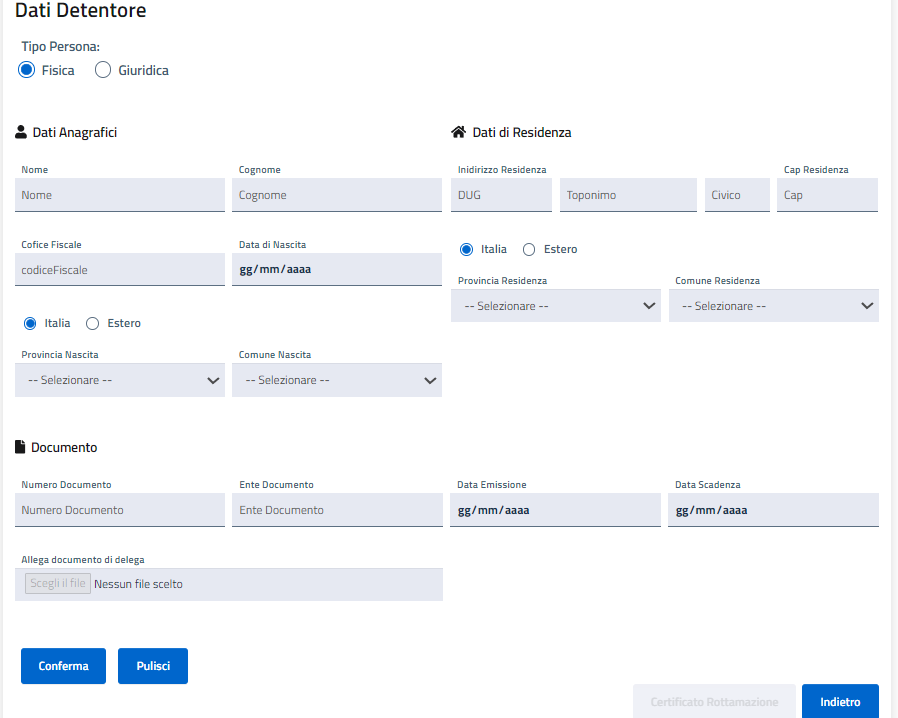{width="5.770138888888889in"
height="4.613888888888889in"}

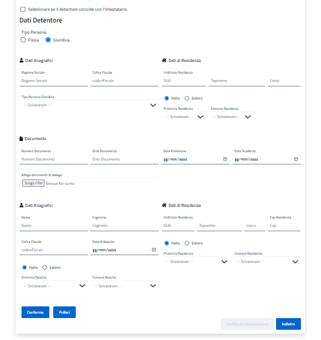{width="4.562734033245844in"
height="4.840526027996501in"}

Nel caso si specifichi un soggetto giuridico l'applicazione chiede anche
l'inserimento dei dati anagrafici del soggetto persona fisica che
rappresenta l'azienda.

#### Genera e stampa Certificato di Rottamazione

Dopo aver inserito il veicolo nel Registro, è possibile generare e
stampare il certificato di rottamazione, che deve essere consegnato al
detentore del veicolo.

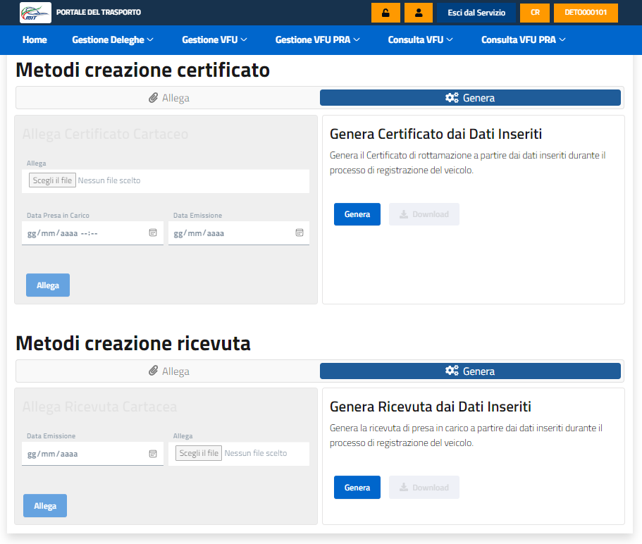{width="5.770138888888889in"
height="4.889583333333333in"}

Il certificato riporta

- La causale di inserimento

- i dati del veicolo

- le informazioni di registrazione (dati veicolo, intestatario ed
  eventuale detentore)

- n° e data del certificato

- riferimenti al Centro di raccolta che ha in carico il veicolo.

Le note eventuali inserite dall'utente saranno riportate all'interno del
certificato e selezionando il tasto "**Download Certificato**" si
ottiene il certificato, emesso in formato PDF già firmato.

Il documento generato può essere stampato.

Il certificato emesso può essere recuperato anche in un momento
successivo accedendo alle funzioni di consultazione previste all'interno
dell'applicazione.

Il n° del certificato è generato secondo un criterio che tiene conto del
tipo, della data e della modalità di generazione del documento.

Il codice ha il seguente formato:

YYYYMMDD-XZ-PPPPPPPP-AAAA

dove

- YYYYMMDD è la data di generazione del documento

- X assume il valore C per certificato di rottamazione

- Z assume il valore D per certificato digitale generato automaticamente
  dal sistema

- PPPPPPPP è un n° progressivo a livello nazionale

- AAAAA è il Codice assegnato al Centro di Raccolta che lo genera

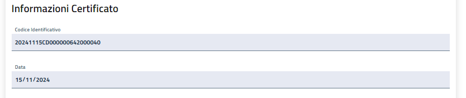{width="5.770138888888889in"
height="1.2180555555555554in"}

es. di n° certificato digitale: 20210322-CD-12345678-A1234

Il Certificato conterrà le diciture previste dalla normativa per le
specifiche causali.

#### Acquisisci Dati Certificato di Rottamazione

Nel caso in cui la presa in carico del veicolo sia avvenuta fuori dal
Centro di Raccolta in condizioni che hanno impedito la registrazione e
la generazione automatica del certificato di rottamazione, è consentita
l'emissione di un certificato cartaceo, ma poi il Centro di Raccolta
deve acquisire a sistema la copia cartacea.

In fase di registrazione veicolo, il sistema richiede di indicare la
presenza di un certificato di rottamazione cartaceo, e in questo caso è
abilitato il campo per l'indicazione della data di emissione del
certificato cartaceo

Selezionando il tasto "**Acquisisci**" il sistema registra i dati
indicati e assegna il numero identificato al certificato, generato
secondo gli stessi criteri definiti per il certificato digitale generato
dal sistema.

Nel codice del certificato cartaceo:

- X assume il valore C per certificato di rottamazione

- Z assume il valore C per certificato cartaceo

es. di n° certificato cartaceo: 20210322-CC-12345678-A1234

#### Allega Certificato di Rottamazione Cartaceo

Una volta popolati i dati del certificato di rottamazione cartaceo, è
richiesto di caricare nel sistema la copia digitalizzata.

Pertanto, è disponibile il tasto "**Allega**" che consente l'upload di
un file in formato Pdf/Jpeg/Bmp/Gif/Png con dimensione massima non
superiore a 2 Mb.

Una volta allegato il file occorre procedere con le operazioni di firma
del documento utilizzando la Firma Digitale Remota (FDR).

#### Firma Certificato di Rottamazione cartaceo

Una volta caricato il documento, occorre selezionare il tasto "**Firma
documento**" dal fascicolo, che invia sul dispositivo collegato il
documento da firmare, dopo di che si potrà apporre la firma. Terminata
l'operazione sul tablet, sarà possibile ottenere il documento firmato
mediante il tasto "**Recupera** **Documento Firmato**".

#### Genera e stampa Ricevuta di presa in carico documentazione

Dopo aver inserito il veicolo fuori uso nel Registro, trattandosi di
veicolo senza obbligo di iscrizione al PRA, deve essere generata, oltre
al certificato di rottamazione, anche la ricevuta di presa in carico
della documentazione, che l'intestatario o il detentore del veicolo deve
essere consegnata all'UMC competente per territorio al fine di
cancellare il veicolo dall'Archivio Nazionale dei Veicoli.

Il certificato riporta

- i dati del veicolo

- le informazioni di registrazione

- n° e data della ricevuta

- riferimenti al Centro di raccolta che ha in carico il veicolo.

L'utente deve indicare nelle note, che saranno riportate all'interno
della ricevuta, la lista della documentazione ritirata,quindi
selezionando il tasto "**Download Ricevuta**" ottiene la ricevuta di
presa in carico documentazione, emessa in formato PDF già firmata.

Il documento generato può essere stampato.

La ricevuta emessa può essere recuperata anche in un momento successivo
accedendo alle funzioni di consultazione previste all'interno
dell'applicazione.

Come per il certificato, anche la ricevuta riporterà un n°
identificativo generato secondo lo stesso criterio utilizzato per il
certificato di rottamazione. Il codice della ricevuta sarà il seguente:

YYYYMMDD-XZ-PPPPPPPP-AAAAA

dove

- YYYYMMDD è la data di generazione del documento

- X ssume il valore R per ricevuta presa in carico

- Z assume il valore D per ricevuta digitale generata automaticamente
  dal sistema

- PPPPPPPP è un n° progressivo a livello nazionale

- AAAAA è il Codice assegnato al Centro di Raccolta che lo genera

es. di n° ricevuta digitale: 20210322-RD-12345678-A1234

#### Allega Ricevuta di presa in carico

Come per il certificato di rottamazione, nel caso in cui la presa in
carico del veicolo sia avvenuta al di fuori del Centro di Raccolta in
condizioni che hanno impedito la registrazione immediata del veicolo e
l'emissione della ricevuta digitale, è consentita l'emissione della
ricevuta di presa in carico in forma cartacea da caricare a sistema in
un momento successivo. Le modalità sono analoghe a quelle di gestione
del certificato cartaceo.

### Gestione Veicoli Fuori Uso -- Presa in carico (no PRA)

Scegliendo la voce "**Registro dei Veicoli Fuori Uso senza obbligo di
Iscrizione al PRA**" sono disponibili le funzioni di "**Presa in carico
VFU**" e "**Rottama Veicolo VFU**".

L'utente può specificare una serie di parametri per ricercare uno o più
veicoli già inseriti nel Registro dei Veicoli Fuori Uso.

La ricerca può essere effettuata specificando:

- tipo veicolo e targa o in alternativa tipo veicolo e n° di telaio, per
  uno specifico veicolo

- stato del veicolo (selezionabile da un menu a tendina) che può
  assumere i valori:

  - **Conferito**, per ottenere tutti i veicoli ritirati da un
    concessionario delegato e conferito al Centro di Raccolta;

  - **Preso in carico**, se si cercano i veicoli ritirati dallo stesso
    Centro di Raccolta o quelli già presi in carico per la lavorazione;

  - **Validato**, per ottenere i veicoli per cui è in corso la
    lavorazione ed è stata effettuata la validazione

  - **Da Radiare**, per ottenere i veicoli già lavorati che sono in
    attesa della radiazione da parte dell'ufficio UMC competente per
    territorio

  - **Radiato**, per individuare i veicoli che sono stati radiati, per i
    quali è possibile procedere alla distruzione delle targhe. La
    documentazione deve essere conservata per il periodo definito dalla
    normativa vigente (10 anni).

- intervallo temporale di data ritiro

- impresa di ritirato veicolo, ottenendo così la lista dei veicoli che
  un determinato concessionario ha ritirato per proprio conto.

I diversi criteri di selezione possono essere combinati riducendo in tal
modo i risultati della ricerca.

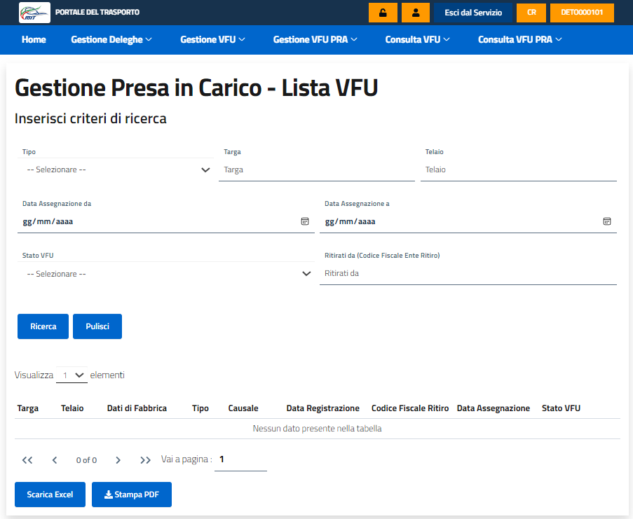{width="5.770138888888889in"
height="4.7347222222222225in"}

Alla selezione del tasto "**Ricerca**" è visualizzata la lista dei
veicoli che soddisfano i criteri di ricerca. Per ciascun elemento della
lista ottenuta sono visualizzati:

- Identificativo del veicolo nel registro

- dati del veicolo (Tipo -- Targa -- N° Telaio -- Fabbrica)

- Dati di registrazione (data ritiro, Impresa di Ritiro)

- stato di lavorazione del veicolo

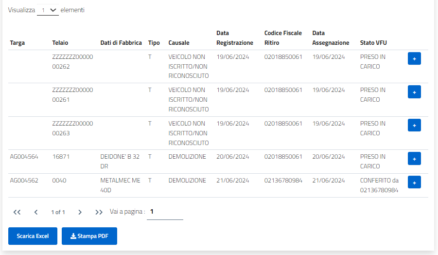{width="5.770138888888889in"
height="3.35625in"}

Mediante la funzione "**Dettaglio**" si può accedere ai dati del
veicolo, oltre ad essere disponibili i tasti per lo scarico e la stampa
della lista visualizzata e anche delle altre pagine successive. Viene
riportato il contenuto di tutte le pagine.

#### Scarica Lista Veicoli

La lista dei veicoli ricercati può essere scaricata in un file, in
formato excel, che riporta oltre ai dati visualizzati e quelli delle
pagine precedenti e successive (viene riportato il contenuto di tutte le
pagine), anche il titolo, la data di scarico e il n° totale dei veicoli.

#### Stampa Lista Veicoli

La lista dei veicoli ricercati può essere stampata su un file, in
formato PDF, che riporta oltre ai dati visualizzati e quelli delle
pagine precedenti e successive (viene riportato il contenuto di tutte le
pagine), anche il titolo, la data di stampa, la matricola del
richiedente, il n° totale dei veicoli.

#### Dettaglio Veicolo Registrato

Per il veicolo scelto, il sistema visualizza le seguenti sezioni, sempre
presenti indipendentemente dallo stato di lavorazione del veicolo:

- **dati veicolo**, che non sono modificabili,

  - tipo veicolo, targa, telaio, fabbrica e modello, anno
    immatricolazione

  - note

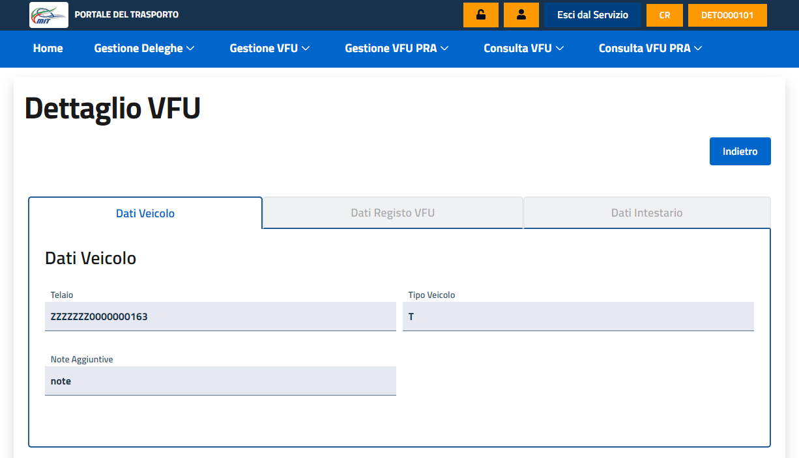{width="5.770138888888889in"
height="3.3131944444444446in"}

- **dati del Registro** (non modificabili)

  - causale di inserimento

  - stato del veicolo nel registro

  - data e impresa di ritiro (che può essere un concessionario delegato
    o il Centro di raccolta)

  - data e impresa di trasferimento (solo se il veicolo è stato oggetto
    di trasferimento tra Centri di Raccolta)

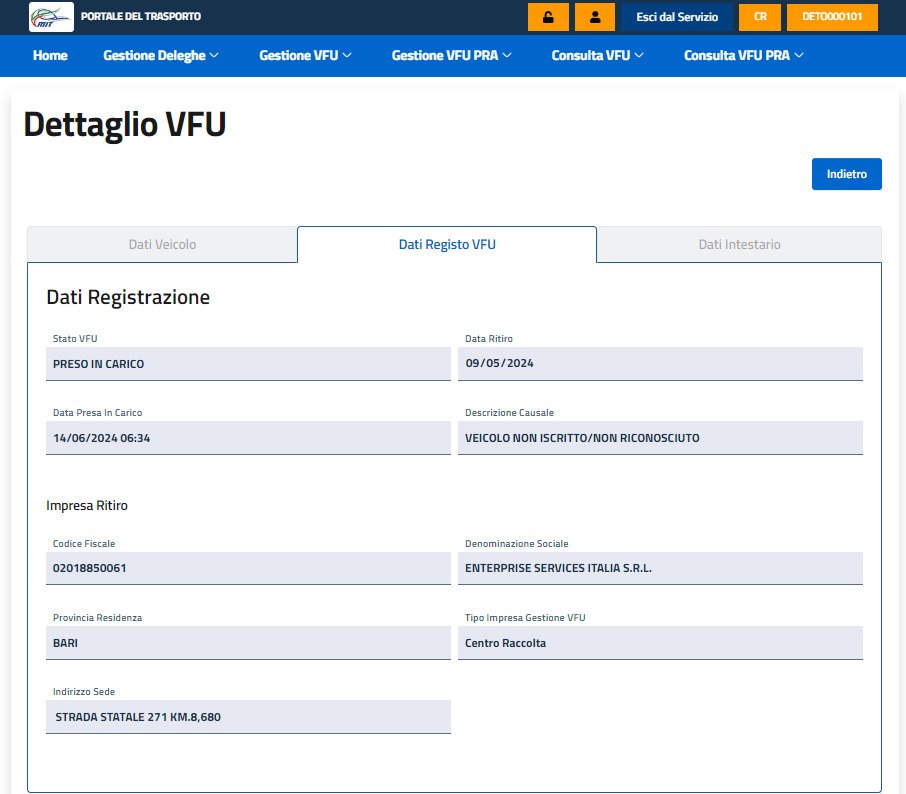{width="5.770138888888889in"
height="5.0569444444444445in"}

- **dati dell'intestatario del veicolo**

  - dati anagrafici (non modificabili)

  - indirizzo

  - campi per l'indicazione dei documenti di riconoscimento

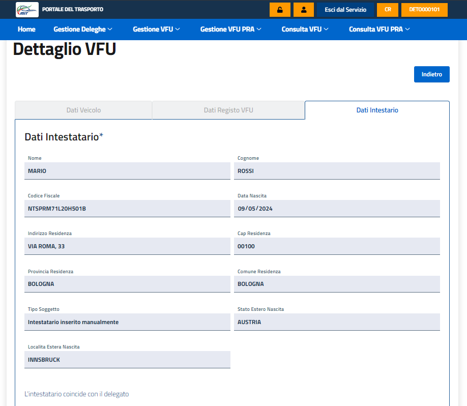{width="5.770138888888889in"
height="5.0159722222222225in"}

- **dati del delegato** che ha consegnato il veicolo per conto
  dell'intestatario (se presente)

  - dati anagrafici del detentore del veicolo

  - indirizzo del detentore

  - estremi dei documenti di riconoscimento

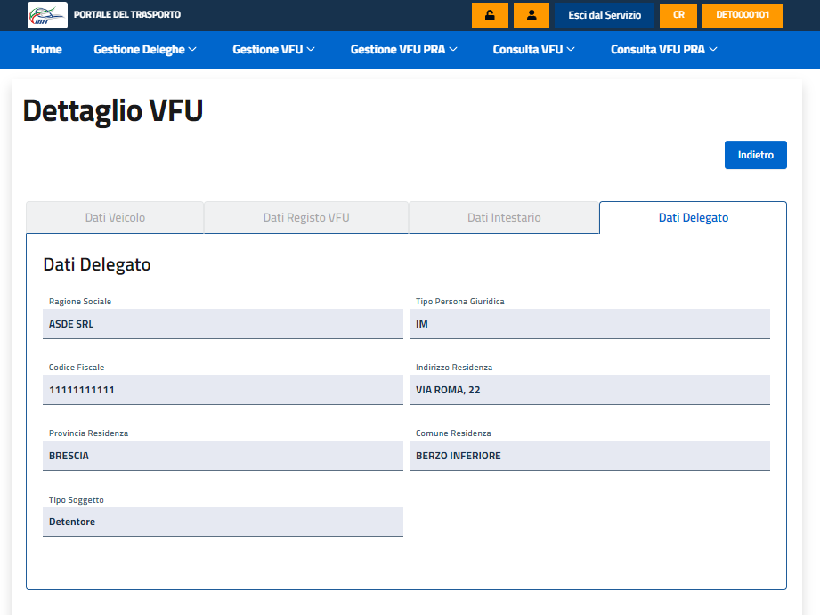{width="5.770138888888889in"
height="4.329166666666667in"}

- **dati del certificato di rottamazione** e della ricevuta di presa in
  carico della documentazione (codice, data, note)

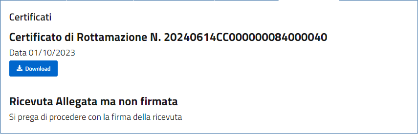{width="5.770138888888889in"
height="1.851388888888889in"}

In aggiunta sono disponibili i tasti per accedere alle funzionalità:

a.  **Prendi in Carico**, per veicoli in stato **"Conferito" o
    "Trasferito"**, che devono essere presi in carico

b.  **Trasferisci ad altro CR**, per veicoli in stato **"Conferito"** o
    **"Presi in carico"** per consentire al Centro di Raccolta di
    inviare ad un altro Centro quei veicoli che non riesce a lavorare.

#### Presa in carico Veicolo Fuori Uso (no PRA)

Prima di vedere la presa in carico è necessario segnalare che è
possibile trasferire ad altro demolitore (stessa azienda ossia stessa
p.iva) prima della presa in carico stessa. In particolar modo, si
seleziona la sezione del menù "**Presa in carivo vfu**".

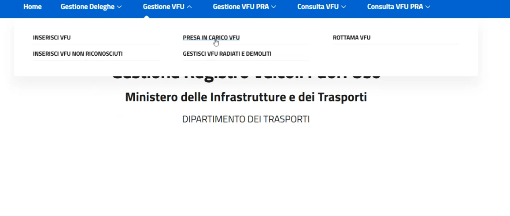{width="5.770138888888889in"
height="2.451388888888889in"}

In seguito, si ricerca per Stato VFU un veicolo nello stato conferito.
Una volta trovato il veicolo di interesse si seleziona la funzionalità
del "**Dettaglio**".

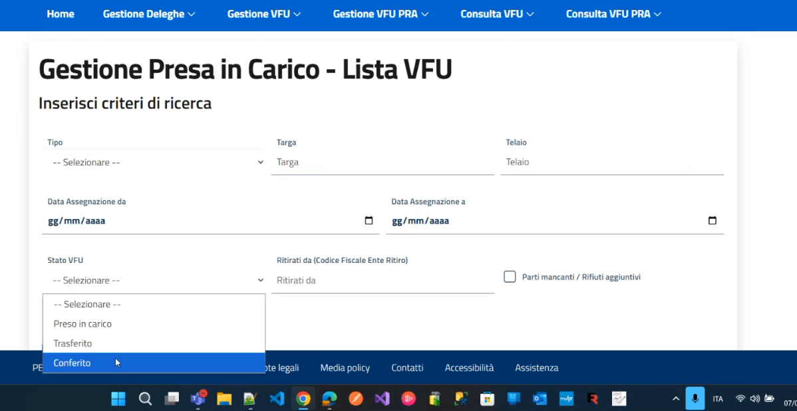{width="5.770138888888889in"
height="2.98125in"}

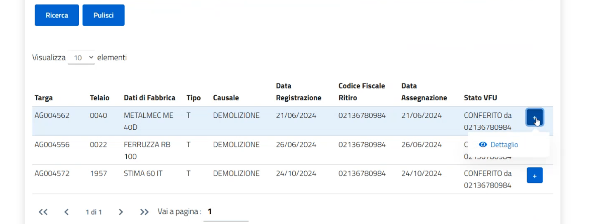{width="5.770138888888889in"
height="2.202777777777778in"}

Nella schermata successiva si accede alla possibilità di poter eseguire
due funzionalità. In particolar modo prima della "**Prendi in carico**"
è possibile usufruire della funzionalità "**Trasferisci**".

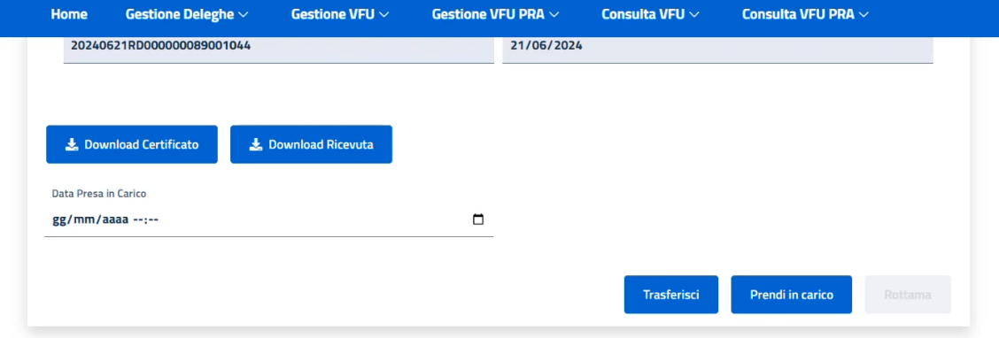{width="5.770138888888889in"
height="1.9541666666666666in"}

Per poter proseguire con la funzionalità "**Prendi in carico"** è
necessario inserire Data e Ora della presa in carico.

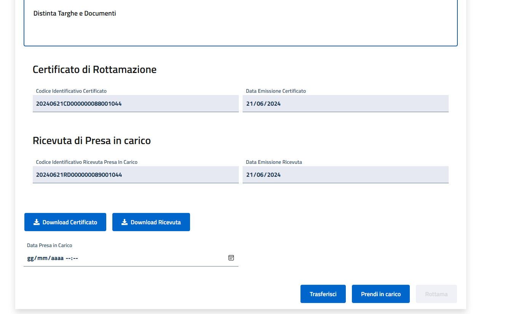{width="5.770138888888889in"
height="3.5944444444444446in"}

Selezionando il tasto "**Prendi in Carico**" compare la richiesta di
conferma e scegliendo SI il veicolo entra nella disponibilità del Centro
di Raccolta per la lavorazione.

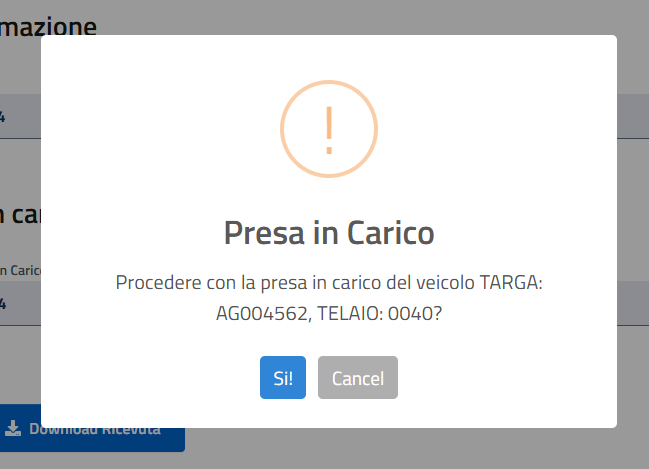{width="4.507176290463692in"
height="3.25711176727909in"}

A seguito di esito positivo lo stato del veicolo diventa "**Preso in
Carico**" e può essere avviata la rottamazione descritta al § 2.3.3.

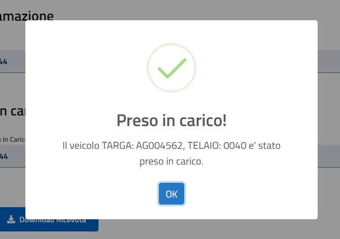{width="4.653017279090114in"
height="3.2779461942257218in"}

#### Trasferisci Veicolo Fuori Uso (no PRA)

Selezionando il tasto "**Trasferisci Veicolo**" si apre il form che
consente di scegliere un altro Centro di Raccolta al quale trasferire un
veicolo per la lavorazione (per es. nel caso in cui non si riesca ad
effettuare la rottamazione per sovraccarico di lavoro). Il trasferimento
ad altra sede del veicolo è possibile anche se lo stato VEICOLO è
INSERITO e non ancora preso in carico.

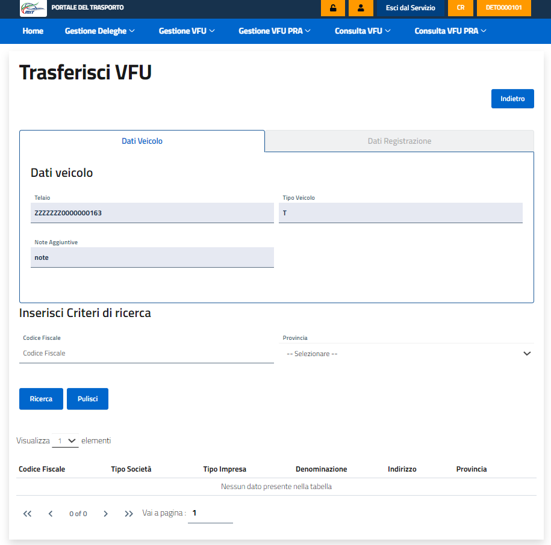{width="5.771653543307087in"
height="5.714693788276465in"}

Il Centro di Raccolta deve ricercare il Centro di Raccolta cui
trasferire il veicolo e può farlo per codice fiscale o provincia.
Selezionando il tasto "**Ricerca**", sono visualizzati i Centri di
raccolta che soddisfano i criteri di ricerca che risultano attivi e
scelto quello di interesse occorre selezionare il tasto
"**Trasferisci**".

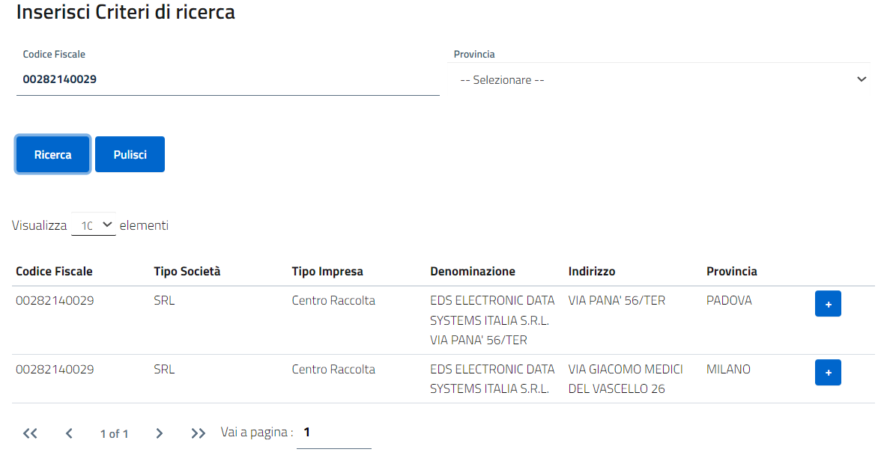{width="5.770138888888889in"
height="3.0993055555555555in"}

Indicate data e motivazione del trasferimento e selezionato il tasto
"**Si trasferisci**" il veicolo passa nello stato "**Trasferito**", e
resta in attesa della presa in carico da parte del nuovo Centro di
Raccolta

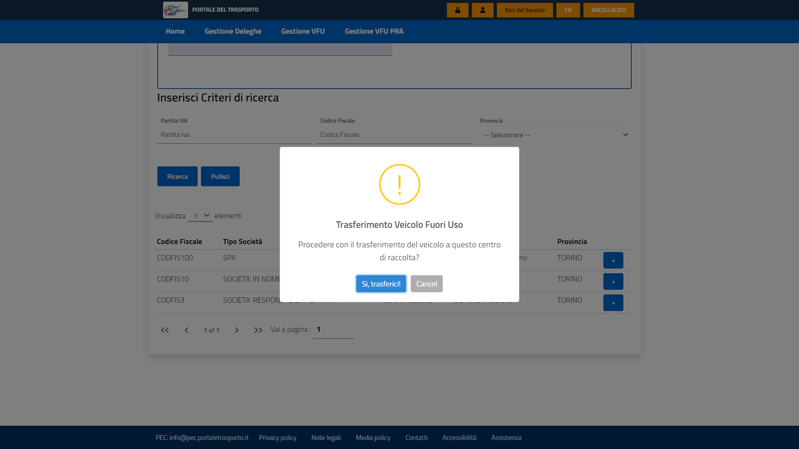{width="4.072444225721785in"
height="2.7222222222222223in"}.

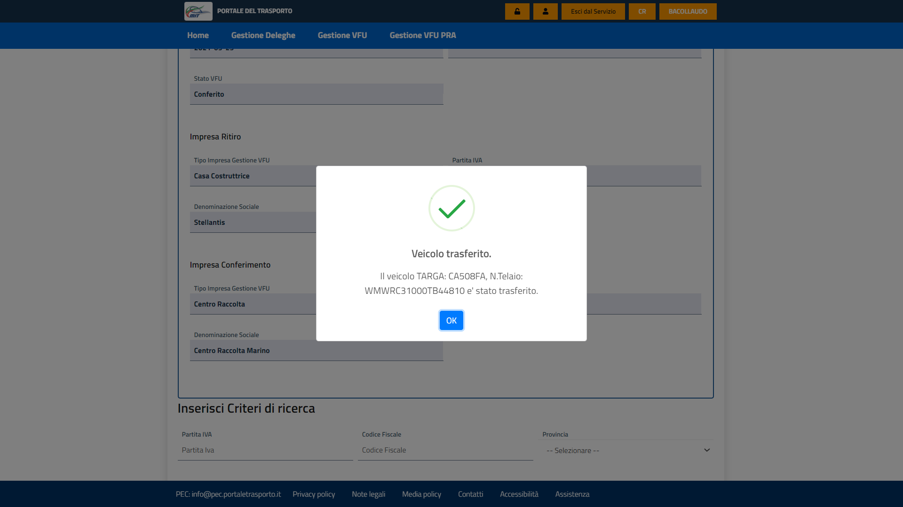{width="4.070866141732283in"
height="2.6694192913385826in"}

È consentito, inoltre, il trasferimento ad altro CR dei veicoli nello
stato RADIATO; a differenza dei trasferimenti che avvengono negli stati
precedenti, è possibile specificare anche un CR di altra azienda.

La successiva presa in carico da parte del nuovo CR riporta il vfu in
stato RADIATO,

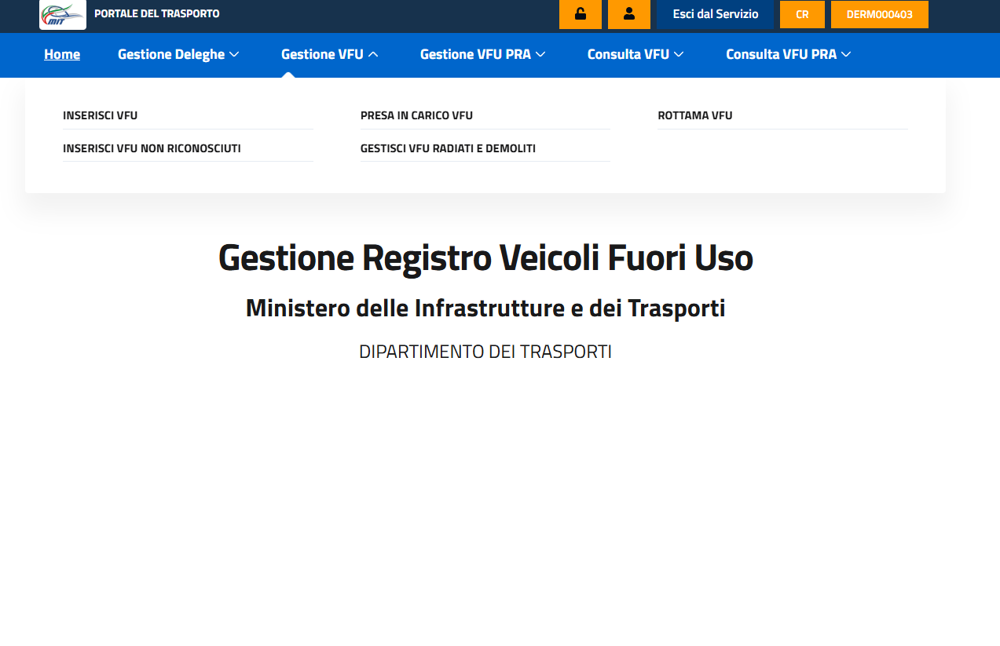{width="5.770138888888889in"
height="3.7305555555555556in"}

Dalla sezione del menù "**Gestisci vfu radiati e demoliti**" si
individua il veicolo di interesse nello stato RADIATO e si procede
cliccando sul pulsante modifica.

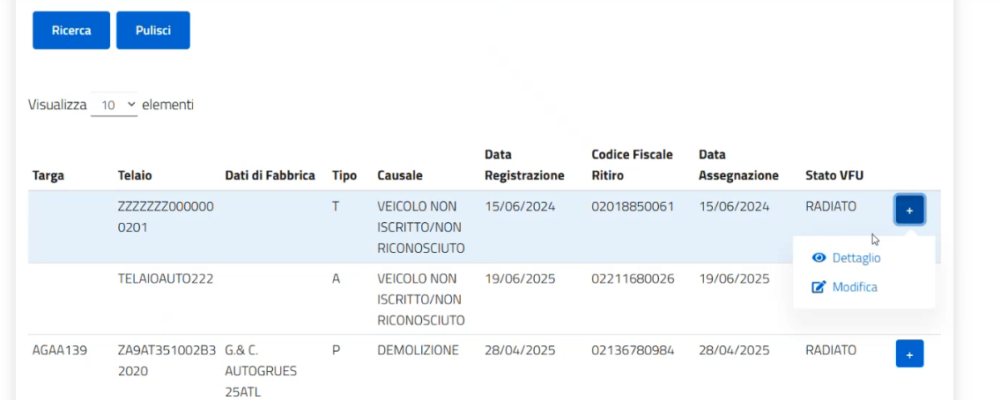{width="5.770138888888889in"
height="2.308333333333333in"}

Dopo aver cliccato il tasto modica, come si può vedere dalla schermata,
è presente la nuova funzionalità "**Trasferisci**".

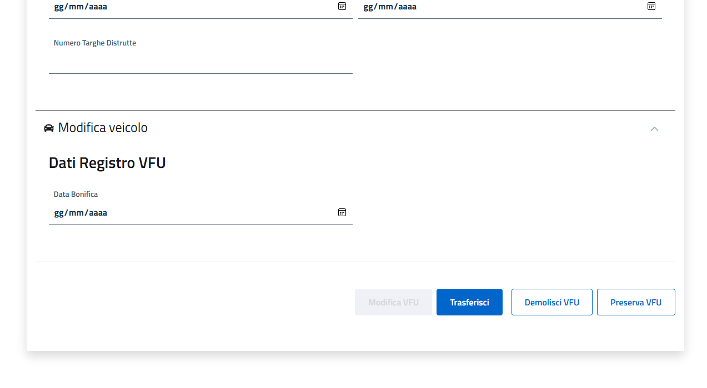{width="5.770138888888889in"
height="3.1729166666666666in"}

Dopo aver cliccato sul pulsante "Trasferisci" appare una schermata dove
è possibile scegliere un altro centro di raccolta per effettuare il
trasferimento.

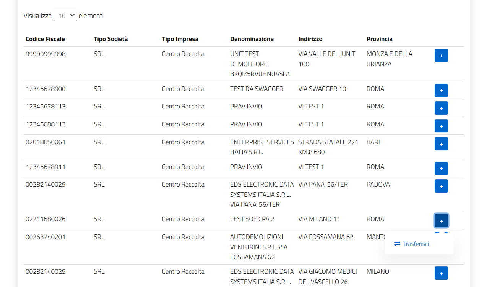{width="5.770138888888889in"
height="3.3805555555555555in"}

Una volta individuato il centro di raccolta, si utilizza la funzionalità
"trasferisci" che permette di visualizzare un messaggio che consente di
procedere con il trasferimento del veicolo al centro di raccolta
prescelto.

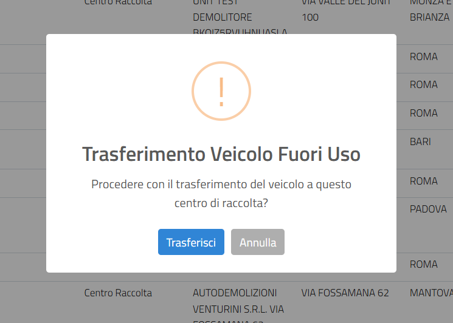{width="5.173876859142607in"
height="3.694634733158355in"}

Successivamente alla conferma del trasferimento viene visualizzato un
messaggio dove è richiesto il motivo del trasferimento del veicolo fuori
uso. Per procedere con il trasferimento bisogna inserire la motivazione
e cliccare successivamente sul tasto conferma.

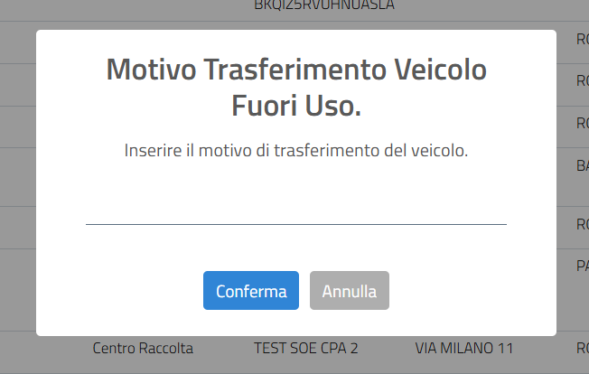{width="4.528010717410324in"
height="2.8751476377952754in"}

Infine, una volta effettuato il trasferimento, viene visualizzato un
messaggio di conferma che il veicolo è stato trasferito.

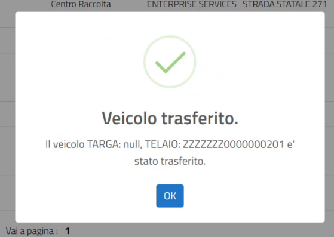{width="3.882143482064742in"
height="2.7570866141732284in"}

Si effettua, ora, il login con le utenze del centro di raccolta a cui è
stato trasferito il veicolo.

Questa volta la sezione del menù da prendere come riferimento è "**Presa
in carico vfu**" e si ricerca il veicolo che è stato trasferito (ad
esempio cercando per numero di telaio). Successivamente, per procedere
bisogna cliccare sul pulsante **Dettaglio.**

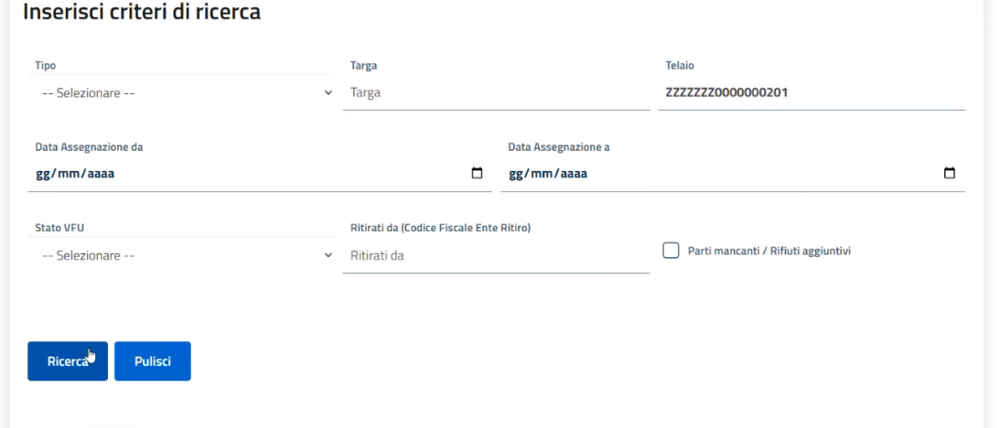{width="5.770138888888889in"
height="2.470833333333333in"}

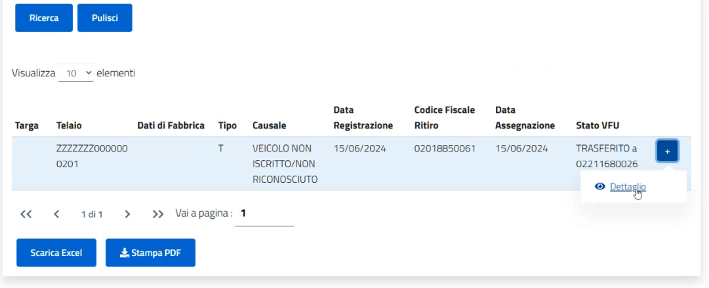{width="5.770138888888889in"
height="2.3541666666666665in"}

Successivamente sarà presente il pulsante "**Presa in carico**". Una
volta cliccato apparirà un messaggio di richiesta a poter procedere con
la presa in carico del veicolo.

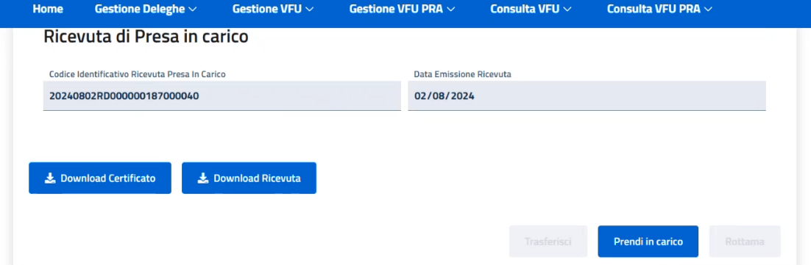{width="5.770138888888889in"
height="1.8902777777777777in"}

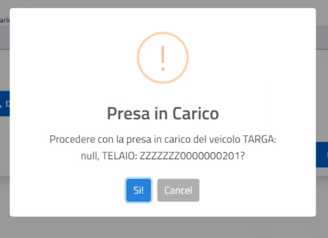{width="3.8543646106736658in"
height="2.7987554680664917in"}

Infine, verrà restituito un messaggio che conferma la presa in carico
del veicolo.

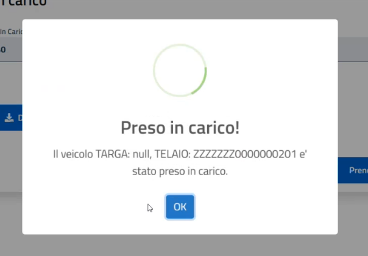{width="4.194659886264217in"
height="2.9237609361329833in"}

Una volta preso in carico, il veicolo è visibile anche dalla sezione del
menù "**Gestisci vfu radiati e demoliti**" e si può ricominciare lo
stesso processo fino ad ora descritto e quindi trasferire di nuovo ad un
altro centro raccolta. (Non esiste un limite al numero di
trasferimenti).

#### Visualizza Certificato di Rottamazione 

Selezionando il tasto "**Visualizza**" posto a fianco dei dati del
certificato di rottamazione è possibile ottenere la copia digitale del
certificato di rottamazione firmato e consegnato all'intestatario del
veicolo o al detentore che lo ha consegnato.

Il documento in formato PDF può essere salvato in locale o stampato.

#### Visualizza Ricevuta Presa in carico Documentazione

Selezionando il tasto "**Visualizza**" posto a fianco dei dati della
ricevuta di presa in carico della documentazione è possibile ottenere la
copia digitale della ricevuta, consegnata all'intestatario del veicolo o
al detentore che lo ha consegnato.

Il documento in formato PDF può essere salvato in locale o stampato.

### Gestione Veicoli Fuori Uso -- Rottama VFU (no PRA)

la funzione si attiva scegliendo sotto la voce "**Registro dei Veicoli
Fuori Uso senza obbligo di Iscrizione al PRA**" la funzione "**Rottama
VFU**".

L'utente può specificare una serie di parametri per ricerca uno o più
veicoli già inseriti nel Registro dei Veicoli Fuori Uso, come descritto
nel § 2.3.2.

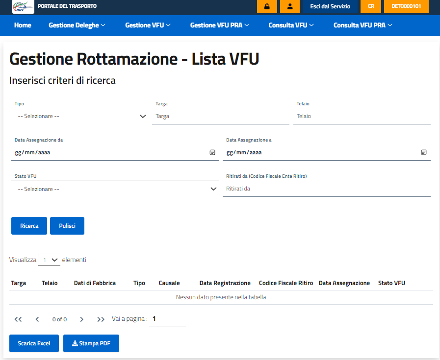{width="5.770138888888889in"
height="4.727777777777778in"}

#### Dettaglio Veicolo da Rottamare

Per il veicolo scelto, il sistema visualizza le seguenti sezioni, sempre
presenti indipendentemente dallo stato di lavorazione del veicolo:

- **dati veicolo**, che non sono modificabili,

  - tipo veicolo, targa, telaio, fabbrica e modello, anno
    immatricolazione

  - note

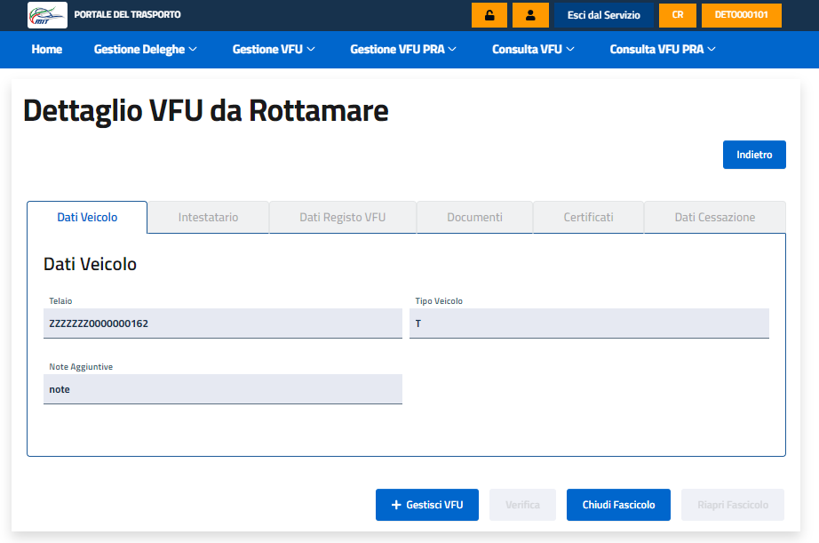{width="5.770138888888889in"
height="3.823611111111111in"}

- **dati del Registro** (non modificabili)

  - causale di inserimento

  - stato del veicolo nel registro

  - data e impresa di ritiro (che può essere un concessionario delegato
    o il Centro di raccolta)

  - data e impresa di trasferimento (solo se il veicolo è stato oggetto
    di trasferimento tra Centri di Raccolta)

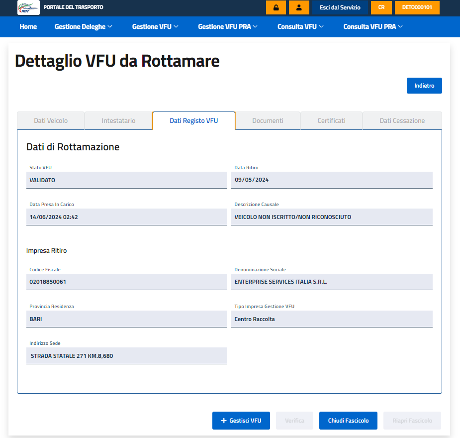{width="5.770138888888889in"
height="5.489583333333333in"}

- **dati dell'intestatario del veicolo**

  - dati anagrafici (non modificabili)

  - indirizzo

  - campi per l'indicazione dei documenti di riconoscimento

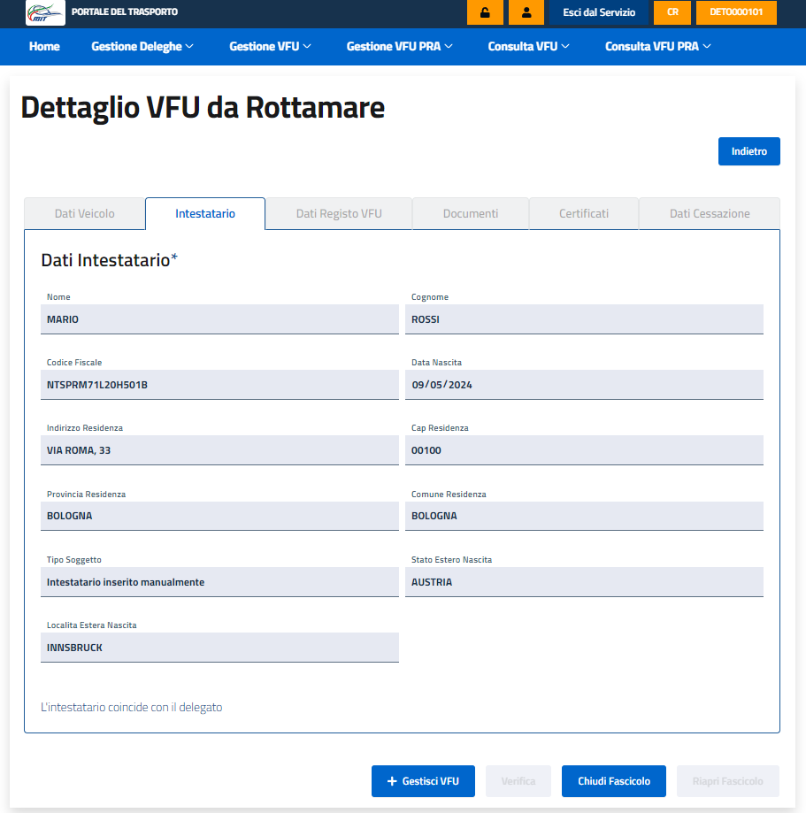{width="5.770138888888889in"
height="5.820833333333334in"}

- **dati del delegato** che ha consegnato il veicolo per conto
  dell'intestatario (se presente)

  - dati anagrafici del detentore del veicolo

  - indirizzo del detentore

  - estremi dei documenti di riconoscimento

Sulla base dello stato di lavorazione del veicolo possono essere
presenti anche le sezioni:

- **documenti**, dove sono riportati i documenti già presenti nel
  fascicolo del registro

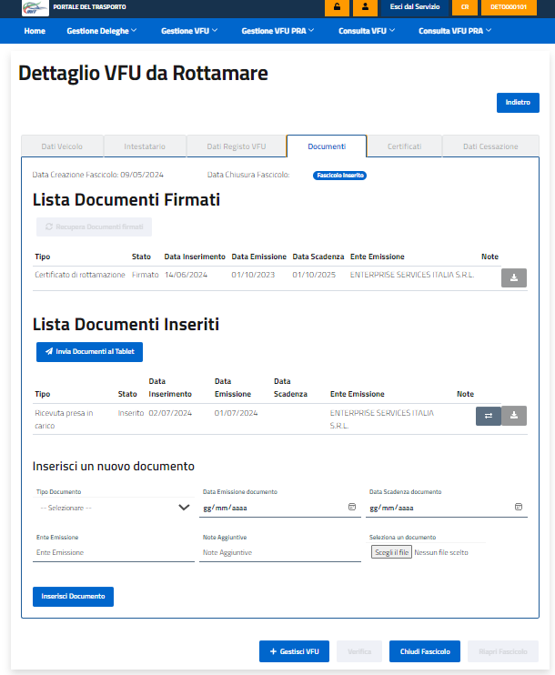{width="5.770138888888889in"
height="7.01875in"}

- **dati di cessazione/radiazione**, dove è visibile il risultato
  dell'avvenuta radiazione

Selezionando il tasto "**Gestione VFU**" si potrà accedere alle
funzionalità:

a.  **Prendi in Carico**, per veicoli in stato **"Conferito"**, che
    devono essere presi in carico

b.  **Modifica Veicolo**, per veicoli in stato **"Presi in carico"**

c.  **Annulla Veicolo**, solo per veicoli presi in carico direttamente
    dal Centro di raccolta.

{width="5.770138888888889in"
height="1.2916666666666667in"}

In aggiunta sono disponibili i tasti per accedere alle funzionalità:

a.  **Verifica Veicolo**, per veicoli in stato **"Presi in carico",**
    per avviare la lavorazione

b.  **Chiudi Fascicolo**, per i veicoli per cui è terminata la fase di
    rottamazione

c.  **Radia Veicolo** per i veicoli in stato **"Da Radiare"**

#### Modifica Dati Registro 

La funzione di Modifica dei dati consente di aggiornare i dati del
veicolo inserito nel registro se non è stato ancora generato, o inserito
il Certificato di rottamazione, altrimenti è consentita la sola modifica
delle note de veicolo.

#### Annulla Inserimento Registro 

L'Annullamento del veicolo nel registro è consentita SOLO se il veicolo
è stato ritirato dallo stesso Centro di Raccolta. Per i veicoli
conferiti da un concessionario o trasferiti da altro Centro di Raccolta
la funzione è inibita.

L'annullamento è consentito solo se avviene alla stessa data della
generazione del CDR, altrimenti viene restituito un messaggio di
operazione non consentita.

Selezionando il tasto "Annulla" il sistema richiede la conferma e
rispondendo SI il veicolo viene eliminato (annullato) dal Registro.
Rimane comunque traccia delle operazioni fatte sul veicolo e delle
matricole che le hanno effettuate.

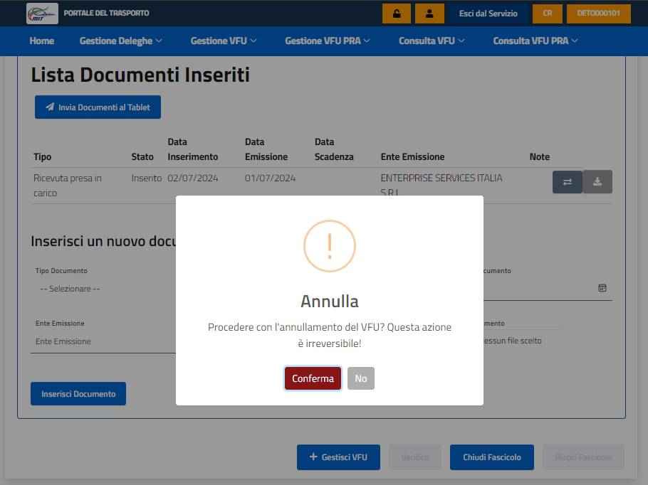{width="5.770138888888889in"
height="4.324305555555555in"}

#### Valida Veicolo

La funzione, attivabile mediante selezione del tasto "**Valida**", è
disponibile per i veicoli che si trovano nello stato "**Preso in
Carico**" e consente di effettuare la verifica di assenza di vincoli
amministrativi che si oppongono alla rottamazione del veicolo.

In caso di esito negativo della validazione sarà visualizzato il
messaggio esplicativo dell'impossibilità a proseguire con la
rottamazione.

In caso contrario, cioè in assenza di vincoli ostativi, si visualizza
l'esito positivo dei
controlli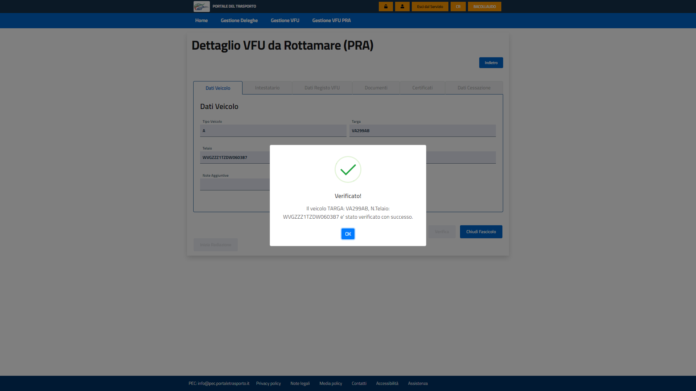{width="5.771653543307087in"
height="4.592045056867891in"}

Lo stato del veicolo diventa "**Validato**" e si può procedere con la
rottamazione e la successiva radiazione.

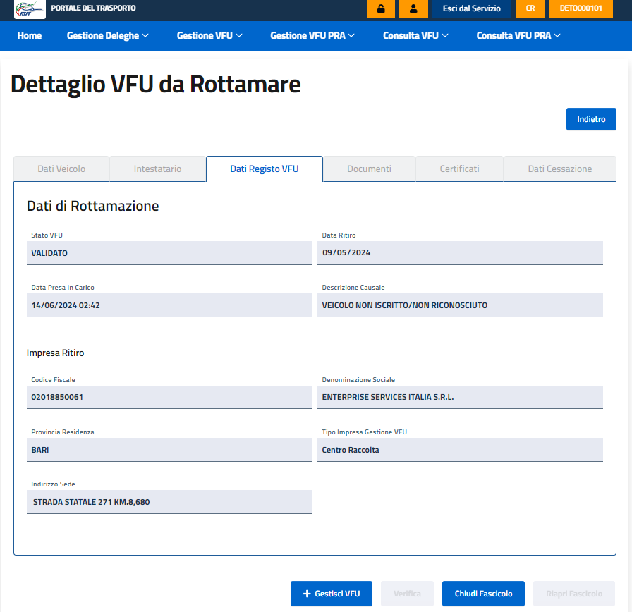{width="5.770138888888889in"
height="5.589583333333334in"}

#### Gestisci Documenti Fascicolo

Dalla sezione "**Documenti**" del "**Dettaglio Veicolo da Rottamare**" è
possibile agire sulla documentazione che costituisce il fascicolo del
registro.

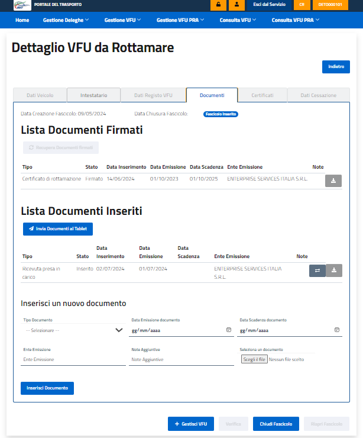{width="5.770138888888889in"
height="6.954166666666667in"}

Attraverso le icone affianco a ciascun documento è possibile operare sui
documenti.

- Eliminare un documento già inserito

> 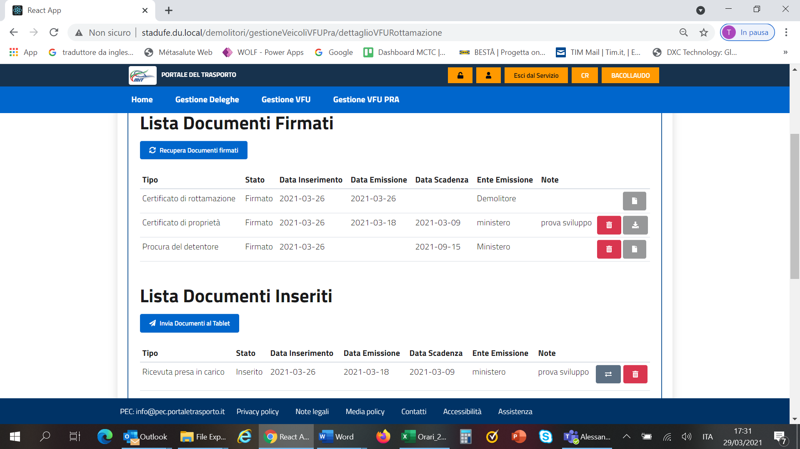{width="0.4781408573928259in"
> height="0.39675634295713036in"}

- Scaricare documento

> {width="0.48803696412948383in"
> height="0.37644247594050745in"}

- Sostituire il file allegato

> {width="0.5108103674540683in"
> height="0.3916207349081365in"}

##### Inserisci nuovo documento

Nella sezione "**Inserisci un nuovo Documento**" è possibile indicare i
dati del nuovo documento

- tipo documento

- data ed ente di emissione

- data di scadenza

- note

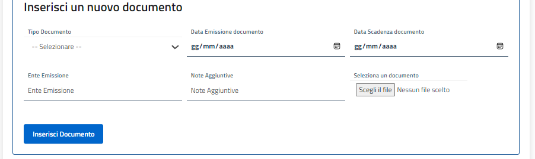{width="5.770138888888889in"
height="1.7208333333333334in"}

e selezionando il tasto "**Inserisci Documento**" i dati sono aggiunti
nel fascicolo del registro e al documento è assegnato un identificativo
e lo stato è impostato con il valore "**Inserito**".

Dopo, mediante la funzione "Scegli file", si può allegare la copia
digitalizzata del documento che dovrà essere firmata mediante la Firma
Digitale Remota (FDR) fornita a tutti i Centri di raccolta.

Dopo l'inserimento con esito positivo il documento è aggiunto alla lista
dei documenti firmati.

##### Sostituisci documento 

Nella sezione "**Lista Documenti Inseriti**" è possibile procedere alla
sostituzione di un allegato selezionando il tasto
{width="0.5362106299212599in"
height="0.411094706911636in"}.

Il sistema permette di allegare il nuovo documento che sostituisce
quello esistente. I dati caratteristici restano inalterati.

Inoltre, è possibile scaricare il documento inserito selezionando il
tasto {width="0.45923447069116363in"
height="0.3914785651793526in"}.

##### Invia documenti al tablet (Firma documento)

Nella sezione "**Lista Documenti Inseriti**" è possibile inviare in
firma i documenti in essa contenuti, selezionando il tasto "**Invia
Documenti al Tablet**"

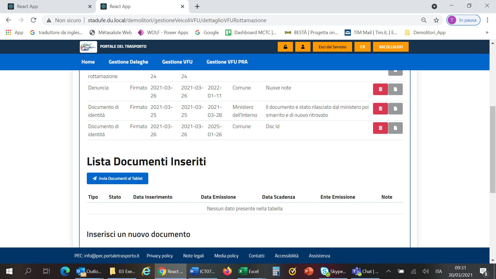{width="1.3263998250218723in"
height="0.32054680664916885in"}

Tutti i documenti presenti saranno inviati in firma e il loro stato è
modificato in "**Inviato in firma**".

Dopo aver inviato i documenti al Tablet, apparirà la seguente schermata:

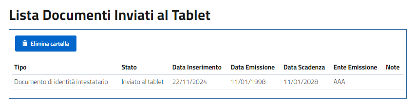{width="5.770138888888889in"
height="1.4388888888888889in"}

Attraverso il tasto
{width="1.3228346456692914in"
height="0.3282950568678915in"} è possibile eliminare i documenti inviati
al Tablet, dopo aver cliccato il pulsante apparirà il seguente messaggio
di conferma.

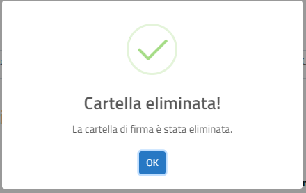{width="4.070866141732283in"
height="2.572047244094488in"}

##### Recupera documenti firmati

Nella sezione "**Lista Documenti Inseriti**" è anche disponibile il
tasto "**Recupera documenti firmati**", che agisce sui documenti della
lista che si trovano nello stato "**Inviato in firma**".

La funzione recupera la copia firmata dei documenti per cui è stato
completato il processo di firma e, all'esito positivo, aggiunge i
documenti nella lista dei documenti firmati modificandone lo stato in
"**Firmato**".

##### Elimina documento 

La funzione, attivata mediante selezione dell'icona

{width="0.4781408573928259in"
height="0.39675634295713036in"}

permette l'eliminazione di un documento presente nel fascicolo del
registro, a meno del certificato di rottamazione e della ricevuta di
presa in carico documentazione, che non può essere eliminato.

Il sistema richiede conferma dell'operazione che non è reversibile
mostrando il messaggio:

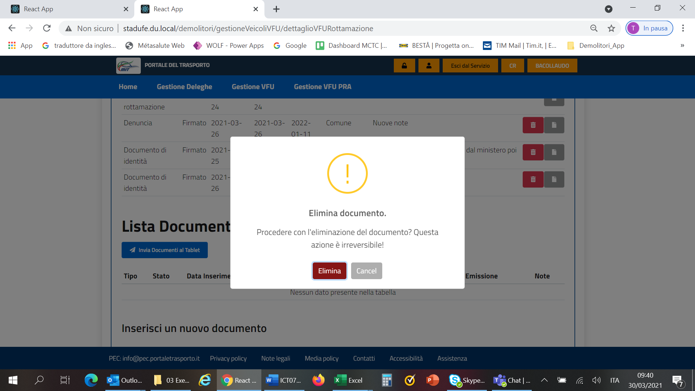{width="4.070866141732283in"
height="2.709417104111986in"}

Confermata l'operazione il documento non è più nella disponibilità del
demolitore.

Nota: l'operazione effettuata è comunque tracciata, con la matricola
dell'operatore che l'ha effettuata, per eventuali controlli degli uffici
competenti.

##### Chiudi Fascicolo

La funzione consente di registrare il completamento delle operazioni di
rottamazione selezionando il tasto "**Chiudi Fascicolo**"

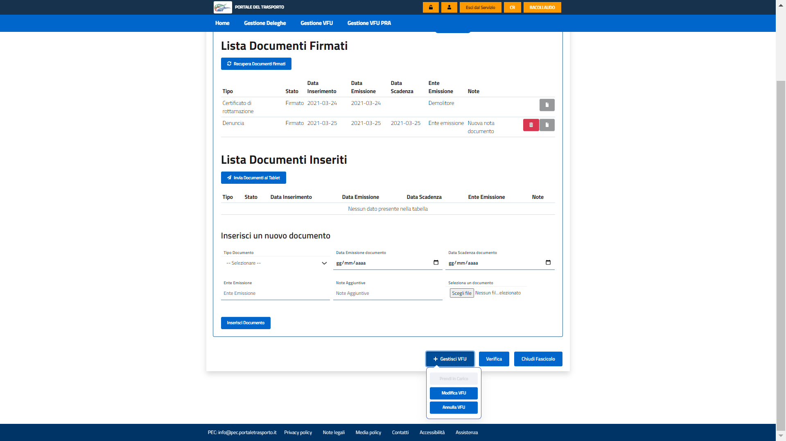{width="4.070866141732283in"
height="2.2088549868766405in"}

Il sistema richiede la conferma dell'operazione visualizzando il
messaggio

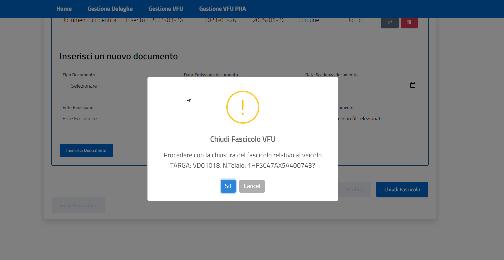{width="4.070833333333334in"
height="2.625in"}

Per ottenere un esito positivo è necessario che si verifichino le
seguenti condizioni:

- tutti i documenti del fascicolo siano stati firmati, e in caso
  negativo il sistema restituisce il messaggio

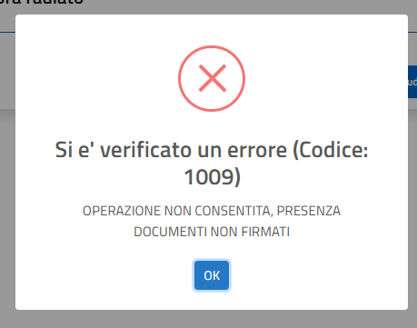{width="3.1529396325459316in"
height="2.5070734908136485in"}

- siano presenti nel fascicolo tutti i documenti obbligatori previsti
  per il tipo di veicolo che si sta rottamando, e in caso negativo il
  sistema restituisce il messaggio

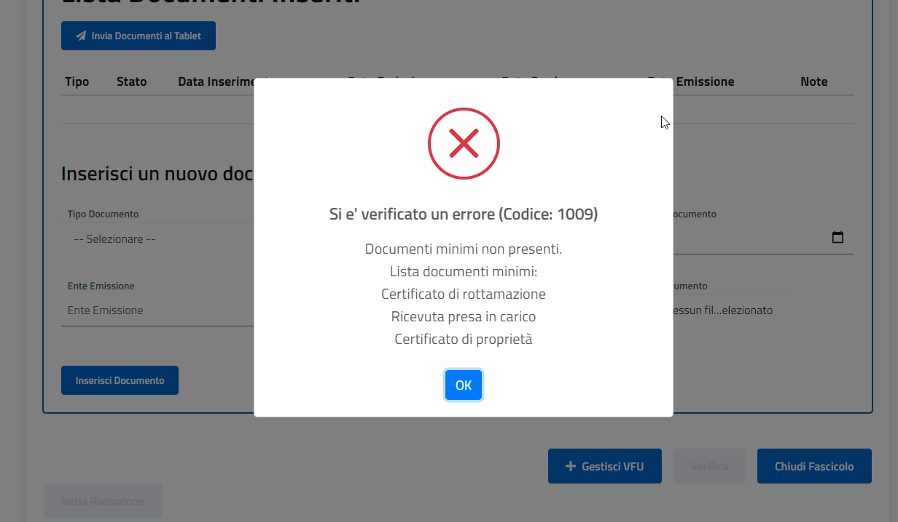{width="4.070833333333334in"
height="2.8819444444444446in"}

Alla conferma dell'operazione lo stato del fascicolo diventa
"**Completo**" e lo stato del veicolo diventa

- "**Da radiare**". Per le causali SD DEMOLIZIONE, PA DEMOLIZIONE SU
  PROVVEDIMANTO PA

- "**Radiato**". per la causale NN

È possibile, inoltre, attraverso il pulsante
{width="1.3231146106736658in"
height="0.40978346456692916in"} far passare lo stato del fascicolo da
"**Fascicolo Chiuso**" in "**Fascicolo Integrazione".**

{width="4.070866141732283in"
height="0.48276246719160104in"}

In questo stato, è possibile aggiungere e modificare documenti e dati
precedentemente inseriti.

Ad eccezione dei documenti "CRD", "CDPD", "Ricevuta presa in carico" e
"Ricevuta radiazione", è possibile eliminare tutti i documenti inseriti.

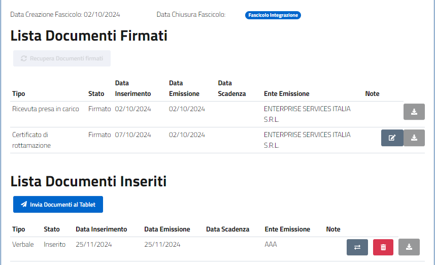{width="5.770138888888889in"
height="3.5145833333333334in"}

#### Radia Veicolo

La funzione, attivabile mediante selezione del tasto "**Radia
veicolo**", è disponibile per i veicoli che si trovano nello stato "**Da
Radiare**" e consente di aggiornare lo stato del veicolo non PRA a
**"Radiato".** Tale azione è permessa solo entro la data successiva a
quella del passaggio allo stato **"Da Radiare".** In caso di operazione
non consentita sarà visualizzato un messaggio di errore.

Al clic su "Radia veicolo" verrà visualizzato il messaggio

o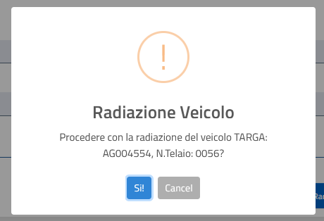{width="4.070866141732283in"
height="2.7788090551181104in"}

Selezionando OK lo stato del veicolo verrà aggiornato a "Radiato".

### Gestione Veicolo Fuori Uso -- Radiati e Demoliti (no PRA)

Scegliendo la voce "**Registro dei Veicoli Fuori Uso senza obbligo di
Iscrizione al PRA**" è disponibile la voce di menu "**Gestione VFU
radiati e demoliti**".

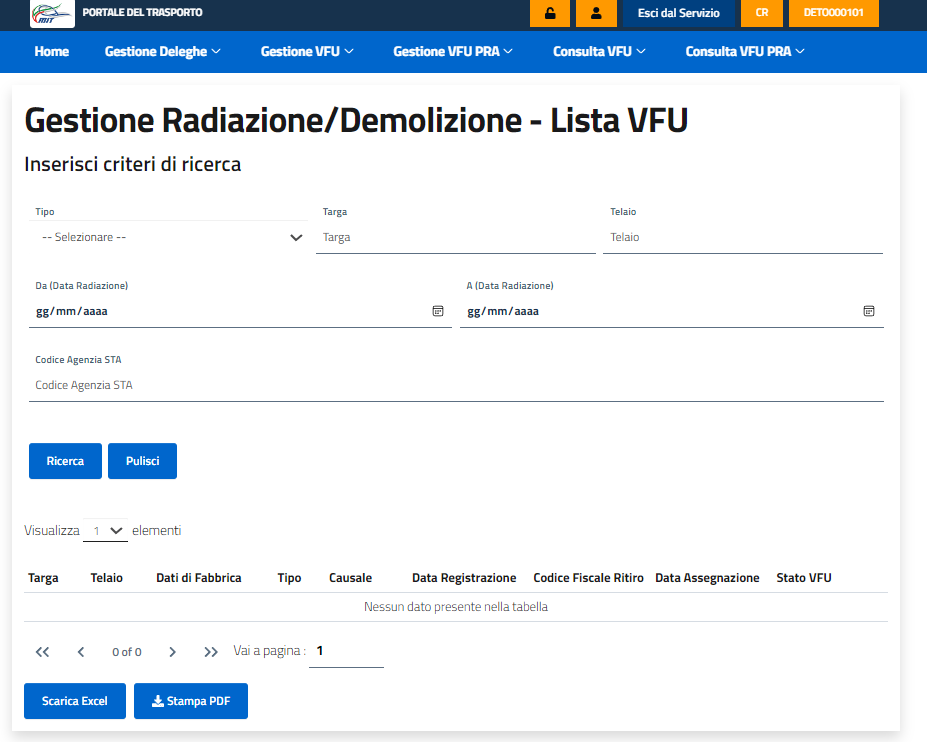{width="5.770138888888889in"
height="4.61875in"}

L'utente può specificare una serie di parametri per ricerca di uno o più
veicoli già inseriti nel Registro dei Veicoli Fuori Uso e che si trovino
nello stato **"Radiato"** o **"Demolito"**

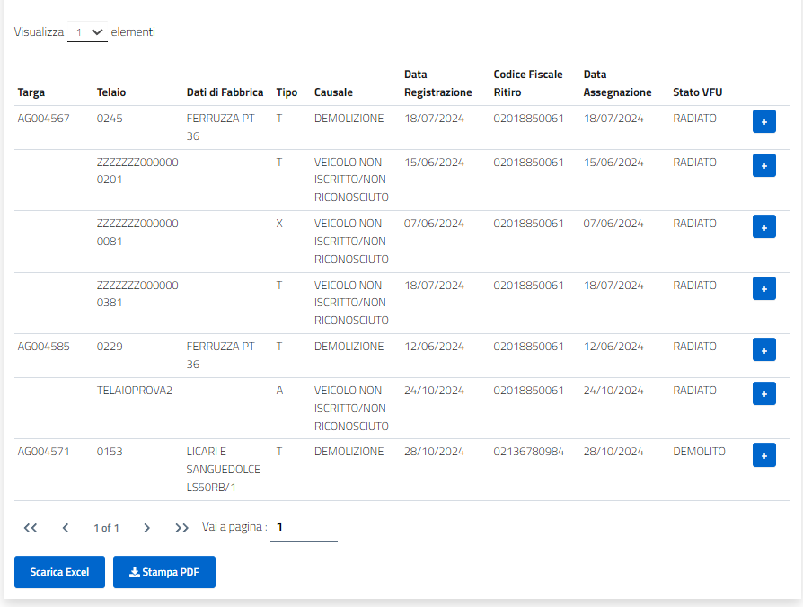{width="5.770138888888889in"
height="4.363194444444445in"}

Sono disponibili per ogni occorrenza le funzionalità di:

- **Dettaglio,** per la visualizzazione dei dati di dettaglio del
  veicolo con le stesse modalità già descritte nelle sezioni precedenti.

- **Modifica,** per modificare le note ed effettuare azioni sul veicolo
  in base allo stato, come specificato al paragrafo seguente.

#### Modifica veicolo Radiato o Demolito

La funzione, attivabile mediante la selezione della voce **Modifica** su
una occorrenza della lista risultato della ricerca, visualizza una
pagina diversa in base allo stato del veicolo

1.  Se il veicolo è "**Radiato"**

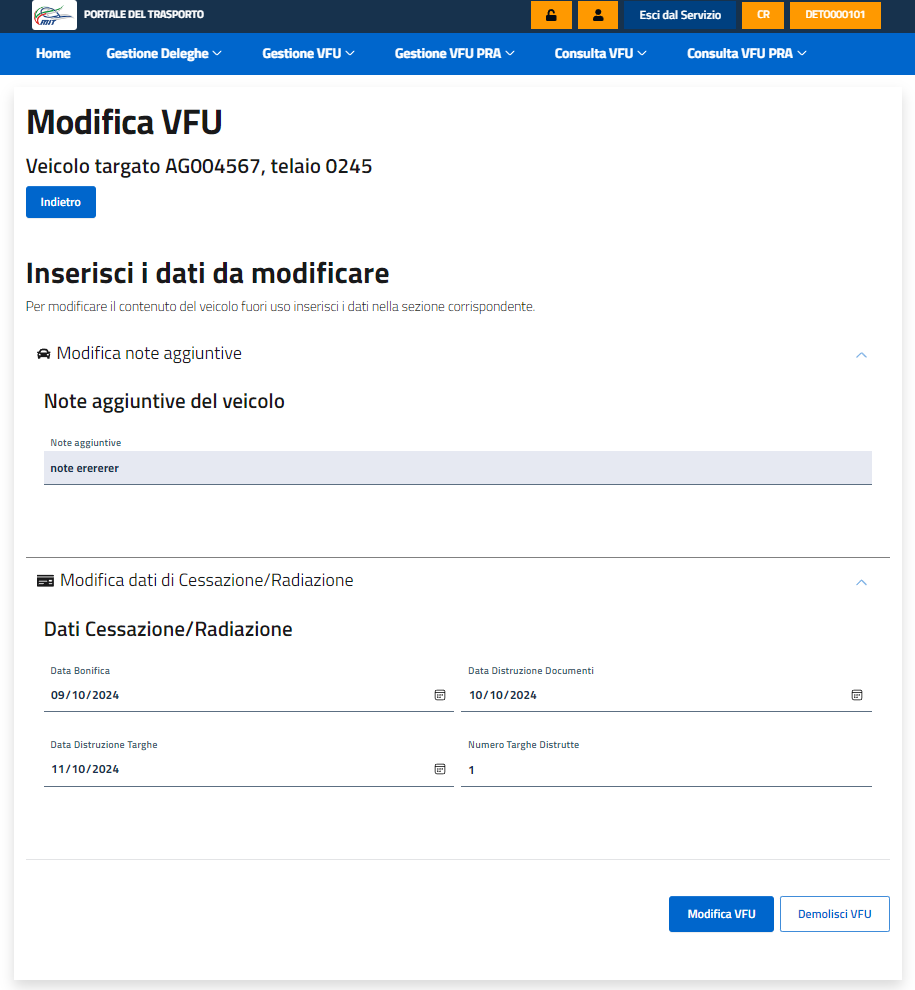{width="5.770138888888889in"
height="6.24375in"}

Sono disponibili le funzioni

a.  **Modifica VFU** per salvare le note.

b.  **Demolisci VFU,** per aggiornare lo stato del veicolo a
    "**Demolito"** a seguito della effettiva demolizione del veicolo,
    distruzione delle targhe e dei documenti, inserendo i dati:

    - Numero di targhe distrutte

    - Data distruzione targhe

    - Data distruzione documenti

Si ricorda che la distruzione della documentazione deve avvenire ***non
prima del 120° giorno*** successivo a quello di emissione del
certificato di rottamazione.

Il predetto termine si applica alla documentazione sia dei veicoli presi
in carico nella Sezione "Veicoli iscritti al PRA" sia di quelli presi in
carico nella Sezione "Veicoli non iscritti al PRA" del RVFU

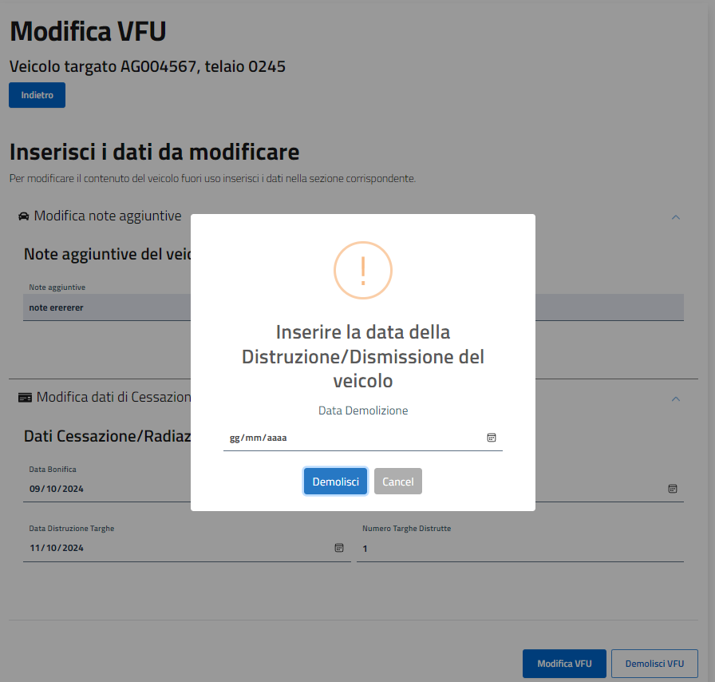{width="5.771653543307087in"
height="5.501443569553806in"}

Selezionando **Demolisci**

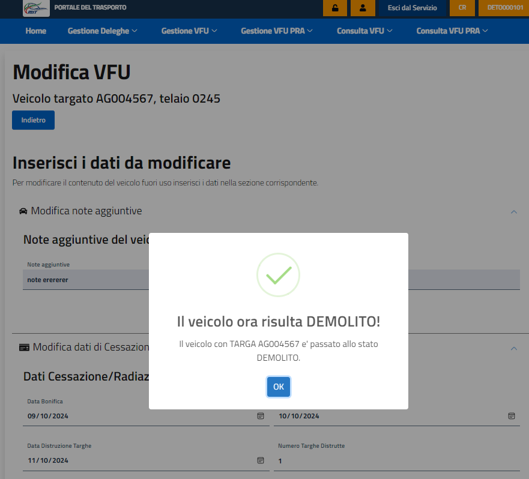{width="5.770138888888889in"
height="5.226388888888889in"}

Lo stato del veicolo è aggiornato a "**Demolito"** e sono memorizzati i
dati inseriti.

2.  Se il veicolo è "Demolito", la selezione della voce **Modifica** su
    una occorrenza della lista risultato della ricerca visualizzerà la
    pagina

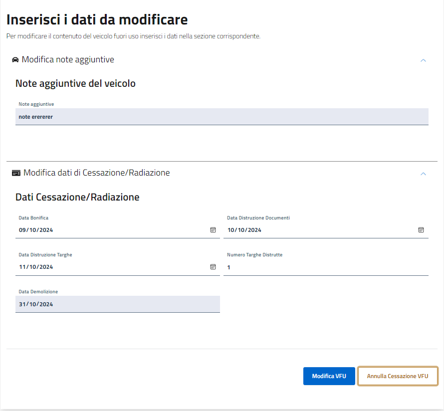{width="5.770138888888889in"
height="5.342361111111111in"}

Sono disponibili le funzioni

a.  **Modifica VFU** per salvare le note.

b.  **Annulla cessazione VFU** per annullare l'inserimento dei dati di
    Demolizione e riportare il veicolo nello stato **"Radiato"**

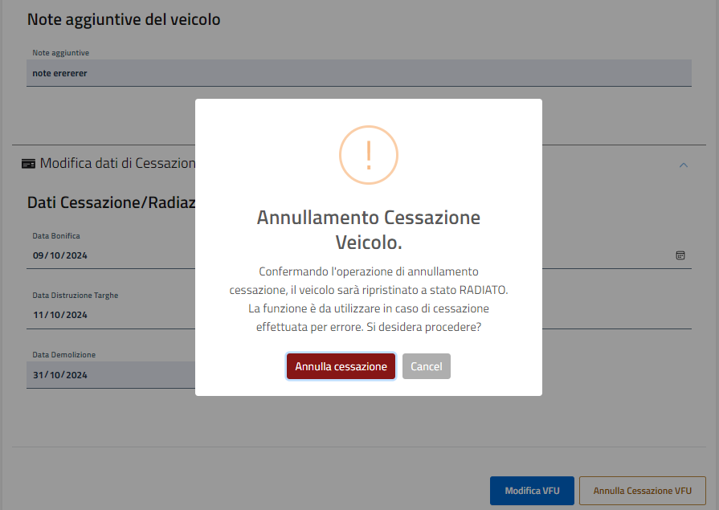{width="5.770138888888889in"
height="4.09375in"}

Selezionando **Annulla Cessazione**

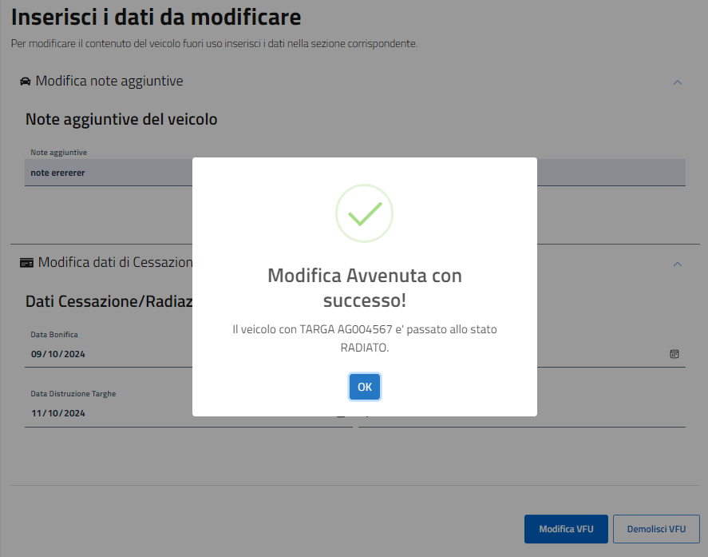{width="5.770138888888889in"
height="4.534027777777778in"}

Il veicolo viene riportato allo stato **Radiato**, i dati inseriti per
la demolizione sono eliminati.

Nel momento in cui si effettua la demolizione è presente un messaggio di
alert se il fascicolo risulta aperto. In particolar modo, dalla sezione
del menù "**Gestisci vfu radiati e demoliti**" si effettua la ricerca
del veicolo radiato di riferimento e per proseguire bisogna cliccare
sulla funzione "**modifica**".

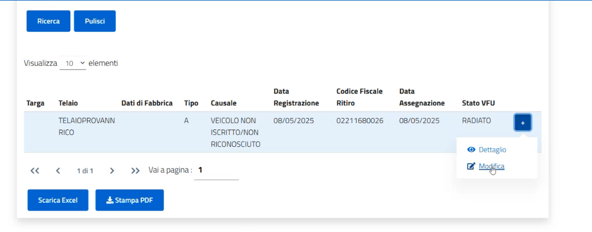{width="5.770138888888889in"
height="2.2694444444444444in"}

Si accede ad una schermata in cui è possibile accedere a tre
funzionalità, tra cui, "**Trasferisci**", "**Demolisci VFU**" e
"**Preserva VFU**". Cliccando sulla funzionalità "**Demolisci VFU**" si
procede con la demolizione del veicolo.

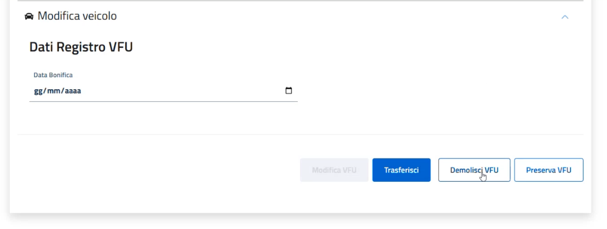{width="5.770138888888889in"
height="2.1868055555555554in"}

Tornando nuovamente alla ricerca, questa volta si procede con la
funzione "**Dettaglio**", per andare a verificare se il fascicolo
risulta aperto o chiuso.

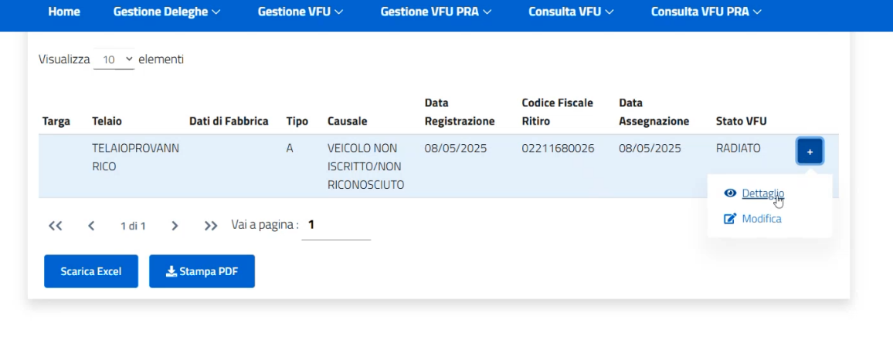{width="5.770138888888889in"
height="2.30625in"}

Viene controllata la sezione "**Documenti**" e in particolar modo
bisogna verificare se il fascicolo risulta essere in integrazione oppure
chiuso.

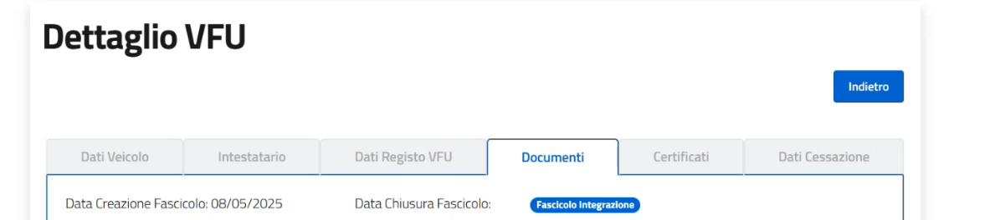{width="5.770138888888889in"
height="1.275in"}

Lasciando il fascicolo aperto, quindi in integrazione, se si procede con
la funzionalità "**Demolisci VFU**" (schermata precedente) verrà
restituito un messaggio che indica che il fascicolo non risulta chiuso.
Se si procede positivamente, verrà richiesto di inserire la data della
Distruzione/Dismissione del veicolo.

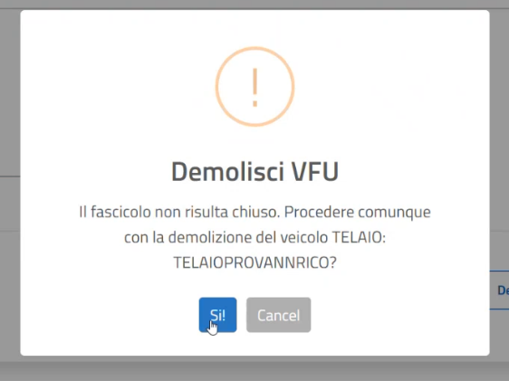{width="3.9029779090113736in"
height="2.9237609361329833in"}

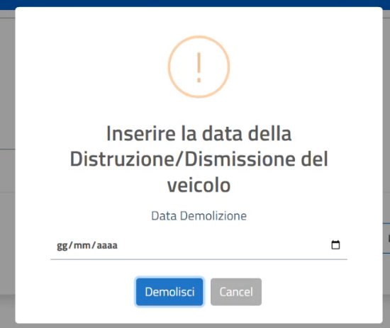{width="3.8196402012248467in"
height="3.215442913385827in"}

Se invece il fascicolo risulta chiuso e si procede, come prima, alla
demolizione, in questo caso non apparirà più il messaggio precedente ma
direttamente verrà richiesto di inserire la data della
Distruzione/Dismissione del veicolo.

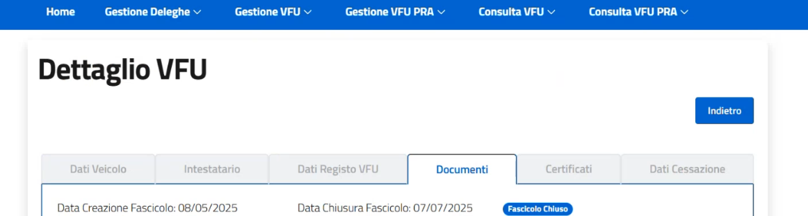{width="5.770138888888889in"
height="1.5493055555555555in"}

{width="3.8196402012248467in"
height="3.215442913385827in"}

###  Gestione Veicolo Fuori Uso -- Ceduto (no PRA)

Viene introdotto un nuovo stato VFU in cui può trovarsi il veicolo:
'CEDUTO'.

È stato inserito per gestire i casi in cui il veicolo non viene
DEMOLITO, ma rimane integro anche se radiato (es. viene conservato per
interesse storico).

Lo stato CEDUTO è alternativo al DEMOLITO: entrambi gli stati sono
definitivi e attestano la conclusione del processo.

Dallo stato RADIATO quindi il veicolo può passare a DEMOLITO o CEDUTO
come ultimo stadio finale.

Per procedere bisogna selezionare dal menù la sezione "**Gestisci VFU
radiati e demoliti**".

{width="5.770138888888889in"
height="2.3402777777777777in"}

Si ricerca un veicolo in stato radiato e si seleziona modifica.

{width="5.770138888888889in"
height="3.629166666666667in"}

Nella schermata successiva si può notare la funzionalità "**Cedi VFU**".

{width="4.944698162729659in"
height="4.146046587926509in"}

Cliccando sul tasto "Cedi VFU" si riceverà un messaggio che la modifica
è avvenuta con successo.

{width="3.0904363517060367in"
height="2.4167913385826774in"}

Una volta cliccato ok, apparirà nella schermata principale il tasto
"**Ripristina Stato Radiato**".

{width="4.423838582677165in"
height="4.187715441819773in"}

Cliccando sul pulsante "**Ripristina Stato Radiato**" apparirà il
seguente messaggio di conferma:

{width="2.8751476377952754in"
height="2.444570209973753in"}

Confermando positivamente la volontà di ripristinare apparirà il
seguente messaggio di successo:

{width="3.1321052055993in"
height="2.5070734908136485in"}

## Registro dei Veicoli CON Obbligo di Iscrizione al PRA

### Inserisci Veicolo Fuori Uso (PRA)

#### Inserisci veicolo da radiare

Scegliendo la voce "**Gestione VFU PRA**" è disponibile la funzione
"**Inserisci VFU**".

L'utente deve ricercare il veicolo indicando il tipo, la targa o in sua
assenza il n° di telaio e la causale di inserimento, a scelta tra SD
DEMOLIZIONE e PA DEMOLIZIONE SU PROVVEDIMENTO PA, selezionando il testo
"**Ricerca**".

Il sistema accede ai sistemi MCTC-DTT e ACI per verificare i dati del
veicolo e l'eventuale presenza di vincoli ostativi alla demolizione. Il
sistema restituisce tra le altre le seguenti informazioni:

- obbligo di iscrizione al PRA

- presenza di vincoli ostativi alla demolizione (nel caso di veicolo con
  obbligo di iscrizione al PRA, le verifiche di radiabilità sono
  effettuati tanto nei sistemi ACI che nei sistemi MCTC).

- regime del veicolo.

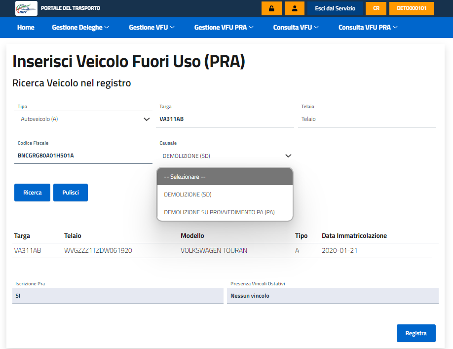{width="5.770138888888889in"
height="4.44375in"}

È possibile selezionare il tipo di veicolo scegliendo tra le opzioni
possibili riportate dall'applicativo, come mostrato in figura seguente.

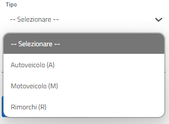{width="4.070866141732283in"
height="2.986241251093613in"}

Il sistema può rispondere nel seguente modo:

- il veicolo non esiste: non è possibile l'inserimento.

- il veicolo è già presente nel registro, viene bloccato l'inserimento.

- il veicolo è già radiato: si interrompe l'inserimento nel registro

- il codice fiscale intestatario inserito non è valido: si interrompe
  l'inserimento nel registro

- Il codice fiscale intestatario inserito non corrisponde a quello
  associato al veicolo; si può proseguire nell'inserimento popolando i
  dati dell'intestatario, i campi corrispondenti sono editabili, il
  sistema il sistema abilita il tasto "**Registra**".

- il veicolo presenta vincoli ostativi: MCTC, non è possibile
  l'inserimento

- Nel caso di veicolo non radiabile al PRA, vengono visualizzate le
  causali di non radiabilità con l'informazione sulla possibilità di
  forzare l'inserimento., se sono tutte forzabili è possibile comunque
  registrare il veicolo nel Registro, specificando l'indicatore di
  "**Forza Registrazione"**.

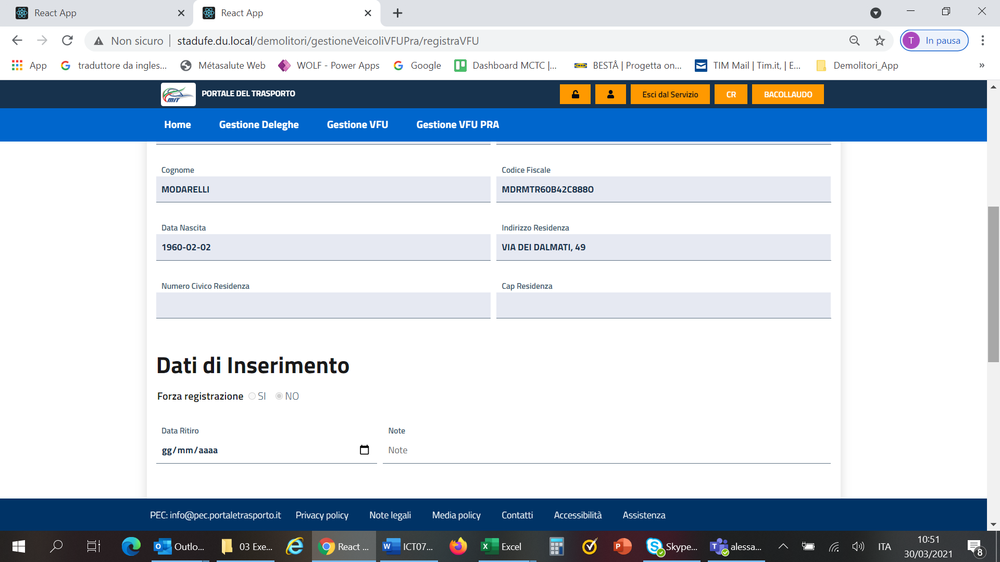{width="4.479950787401575in"
height="0.7604866579177603in"}

- il veicolo non presenta alcun vincolo e può essere ritirato e preso in
  carico: in questo caso il sistema abilita il tasto "**Registra**".

- il veicolo NON ha l'obbligo di iscrizione al PRA: il sistema indirizza
  alla sezione per la gestione di questa tipologia di veicoli (vedere §
  precedenti)

- il veicolo non presenta alcun vincolo e può essere ritirato e preso in
  carico: in questo caso il sistema abilita il tasto "**Registra**".

- il veicolo NON ha l'obbligo di iscrizione al PRA: il sistema indirizza
  alla sezione per la gestione di questa tipologia di veicoli (vedere §
  precedenti)

#### Inserisci veicolo radiato

Scegliendo la voce "Gestione VFU PRA" è disponibile la funzione
"Inserisci VFU radiati". Da questa sezione è possibile inserire nel
registro veicoli già radiati al PRA che devono essere ancora demoliti.

Il funzionamento è analogo a quello descritto nel paragrafo precedente,
non è richiesta la selezionate dela causale che sarà impostata da
sistema per la specifica casistica.

Il sistema accede ai sistemi MCTC-DTT e ACI, Il sistema può rispondere
nel seguente modo:

- Il veicolo non esiste: non è possibile l'inserimento.

- il veicolo è già presente nel registro: non è possibile l'inserimento.

- Il veicolo non è radiato al PRA: non è possibile l'inserimento.

- Il codice fiscale intestatario inserito non corrisponde a quello
  associato al veicolo; si può proseguire nell'inserimento popolando i
  dati dell'intestatario, i campi corrispondenti sono editabili, il
  sistema il sistema abilita il tasto "**Registra**".

- il veicolo non presenta nessuno degli impedimenti precedenti essere
  ritirato e preso in carico: in questo caso il sistema abilita il tasto
  "**Registra**".

- il veicolo NON ha l'obbligo di iscrizione al PRA: il sistema indirizza
  alla sezione per la gestione di questa tipologia di veicoli (vedere §
  precedenti)

### 

#### Registrazione Dati Veicolo da Ritirare 

Il sistema visualizza le seguenti sezioni:

- dati del veicolo, preimpostati e non modificabili,

  - tipo veicolo, targa, telaio, fabbrica e modello, anno
    immatricolazione

  - indicatori di obbligo di iscrizione al PRA e di Presenza Vincoli
    Ostativi

- dati dell'intestatario del veicolo

  - dati anagrafici

  - indirizzo

  - campi per l'indicazione dei documenti di riconoscimento (richiesti
    all'utente)

> 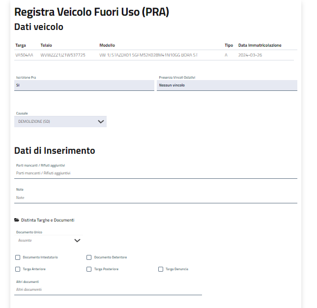{width="4.479397419072616in"
> height="4.354390857392826in"}
>
> 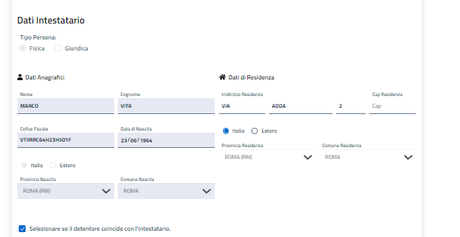{width="4.611348425196851in"
> height="2.3820669291338583in"}
>
> Se il codice fiscale inserito nel campo Codice fiscale intestatario,
> al momento della ricerca, corrisponde a quello presente a sistema, i
> dati saranno precompilati, altrimenti dovranno essere popolati
> dall'utente.

- campi per l'indicazione dei dati del detentore che consegna il veicolo
  per conto dell'intestatario (dati opzionali che l'utente può indicare
  se diverso dall'intestatario).

> Specificando se si tratti di persona **Fisica** o **Giuridica**.

- dati anagrafici del detentore del veicolo

- indirizzo del detentore

- estremi dei documenti di riconoscimento

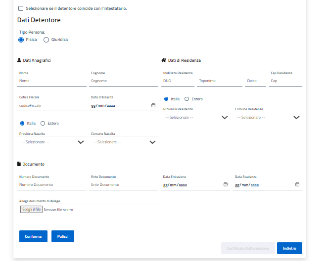{width="4.604402887139107in"
height="3.6668547681539807in"}

Nella sezione "Dati di Residenza", l'utente deve selezionare il **DUG**
scegliendo tra una lista di possibili valori proposti dall'applicazione.

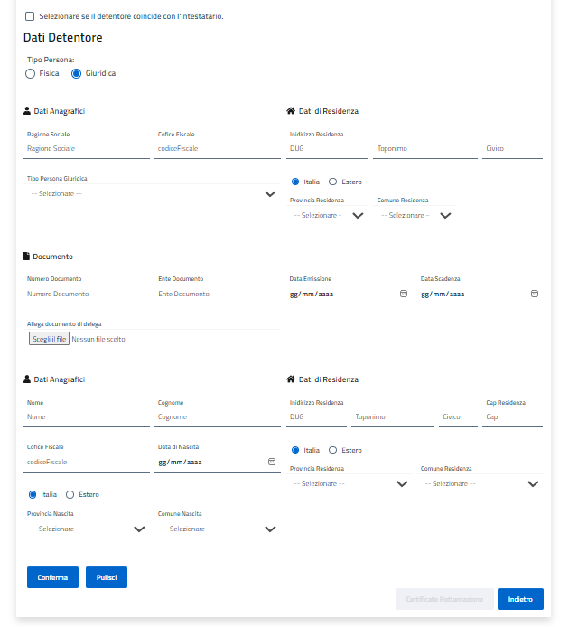{width="4.375225284339457in"
height="4.819691601049869in"}

Nel caso si specifichi un soggetto giuridico l'applicazione chiede anche
l'inserimento dei dati anagrafici del soggetto persona fisica che
rappresenta l'azienda.

Selezionando il tasto "**Conferma**" il sistema inserisce il veicolo
ritirato nel Registro, assegnando un n° identificativo all'interno del
registro, che viene visualizzato con il messaggio di operazione
eseguita.

Selezionando il tasto "**Pulisci**", è possibile eliminare i campi
inseriti.

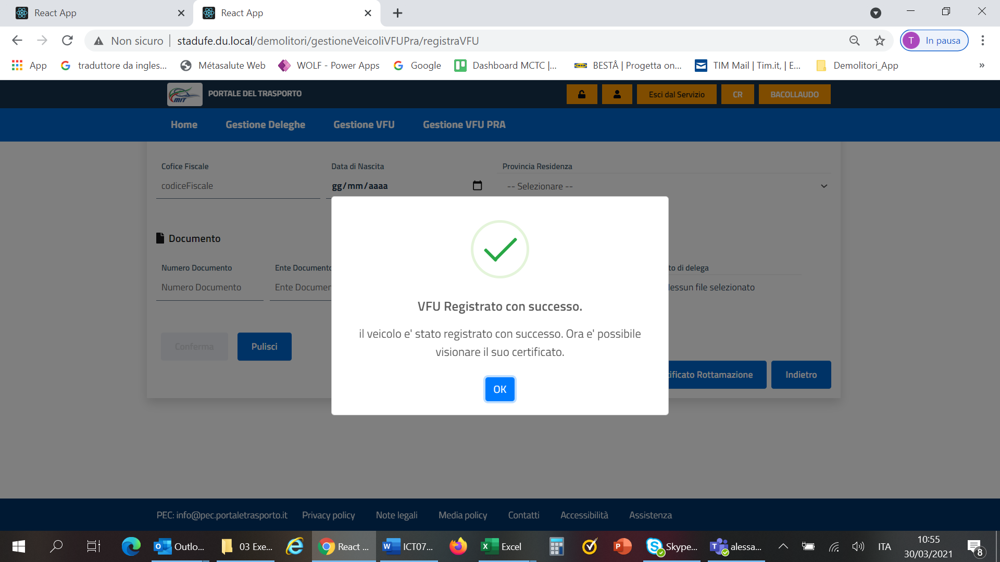{width="4.070866141732283in"
height="2.7045199037620296in"}

Il veicolo registrato assume lo stato "**Preso in Carico**" e potrà
essere lavorato da una qualunque delle matricole del Centro di Raccolta
che lo ha ritirato.

#### Genera e stampa Certificato di Rottamazione

Dopo aver inserito il veicolo nel Registro, è possibile generare e
stampare il certificato di rottamazione, che deve essere consegnato al
detentore del veicolo, mediante il tasto "**Certificato Rottamazione**".

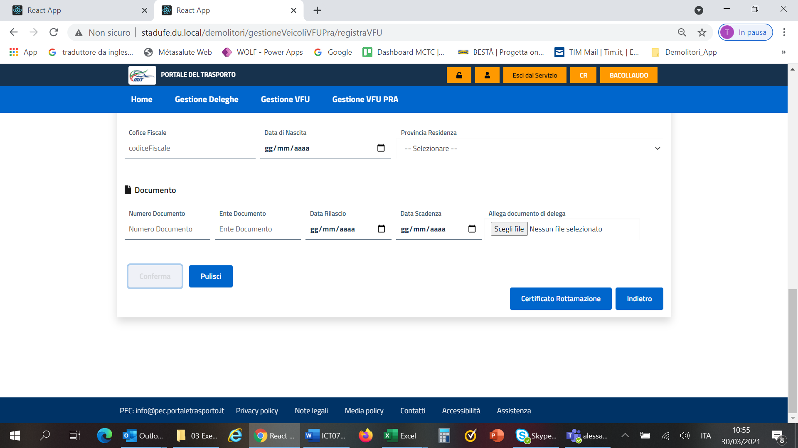{width="5.771653543307087in"
height="0.7214566929133859in"}

Se il veicolo è stato ritirato in precedenza con emissione di un
certificato cartaceo l'utente deve allegare la copia digitalizzata
altrimenti deve procedere alla generazione e alla stampa.

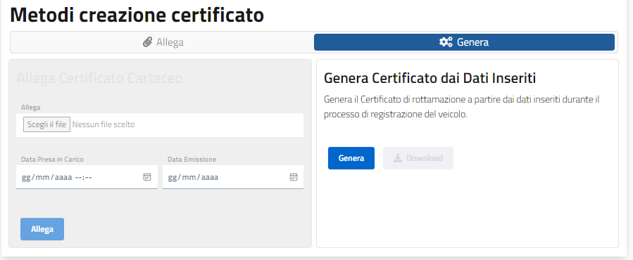{width="5.770138888888889in"
height="2.3743055555555554in"}

Selezionando il tato "**Genera**" il sistema crea il certificato che può
essere scaricato selezionando "**Download**".

Il certificato riporta

- i dati del veicolo

- le informazioni di registrazione (identificativo veicolo e data di
  presa in carico)

- n° e data del certificato

- riferimenti al Centro di raccolta che ha in carico il veicolo.

L'utente può indicare eventuali note che saranno riportate all'interno
del certificato e selezionando il tasto "**Download Certificato**"
ottiene il certificato, emesso in formato PDF già firmato.

Il documento generato può essere stampato.

Il certificato emesso può essere recuperato anche in un momento
successivo accedendo alle funzioni di consultazione previste all'interno
dell'applicazione.

Il n° del certificato è generato secondo un criterio che tiene conto del
tipo, della data e della modalità di generazione del documento.

Il codice ha il seguente formato:

YYYYMMDD-XZ-PPPPPPPP-AAAA

dove

- YYYYMMDD è la data di generazione del documento

- X assume il valore C per certificato di rottamazione

- Z assume il valore D per certificato digitale generato automaticamente
  dal sistema

- PPPPPPPP è un n° progressivo a livello nazionale

- AAAAA è il Codice assegnato al Centro di Raccolta che lo genera

es. di n° certificato digitale: 20210322-CD-12345678-A1234

Il Certificato conterrà le diciture previste dalla normativa per le
specifiche causali

#### Acquisisci Dati Certificato di Rottamazione

Nel caso in cui la presa in carico del veicolo sia avvenuta fuori dal
Centro di Raccolta in condizioni che hanno impedito la registrazione e
la generazione automatica del certificato di rottamazione, è consentita
l'emissione di un certificato cartaceo, ma poi il Centro di Raccolta
deve acquisire a sistema la copia cartacea.

In fase di registrazione veicolo, il sistema richiede di indicare con un
check la presenza di un certificato di rottamazione cartaceo, e in
questo caso è abilitato il campo per l'indicazione della data di
emissione del certificato cartaceo

Selezionando il tasto "**Acquisisci**" il sistema registra i dati
indicati e assegna il numero identificato al certificato, generato
secondo gli stessi criteri definiti per il certificato digitale generato
dal sistema.

Nel codice del certificato cartaceo:

- X assume il valore C per certificato di rottamazione

- Z assume il valore C per certificato cartaceo

es. di n° certificato cartaceo: 20210322-CC-12345678-A1234

#### Allega Certificato di Rottamazione Cartaceo

Una volta popolati i dati del certificato di rottamazione cartaceo, è
richiesto di caricare nel sistema la copia digitalizzata.

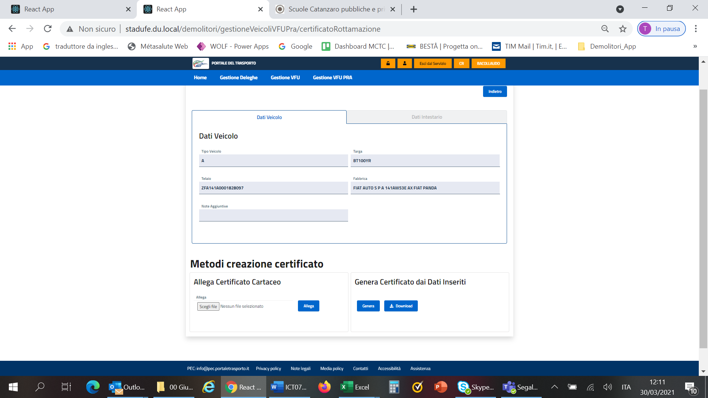{width="4.070866141732283in"
height="1.5737882764654418in"}

Pertanto, è disponibile il tasto "**Allega**" che consente l'upload di
un file in formato Pdf/Jpeg/Bmp/Gif/Png con dimensione massima non
superiore a 2 Mb.

Una volta allegato il file il sistema restituisce il messaggio

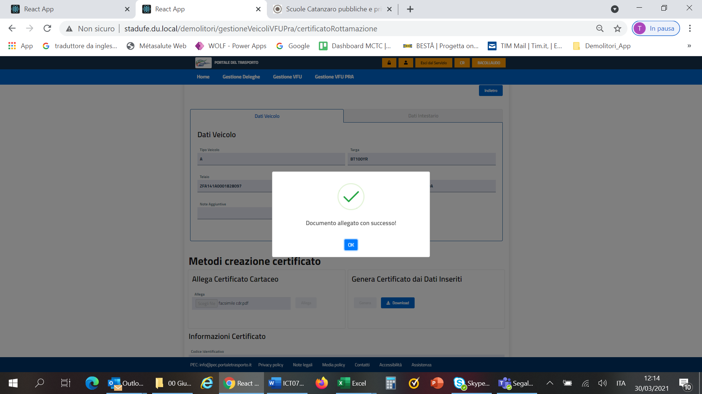{width="4.070866141732283in"
height="2.4931616360454942in"}

e dopo si può procedere con le operazioni di firma del documento
utilizzando la Firma Digitale Remota (FDR).

#### Firma Certificato di Rottamazione cartaceo

Una volta caricato il documento, occorre selezionare il tasto "**Firma
documento**" che invia sul dispositivo (tablet) collegato il documento
da firmare, per apporre la firma.

Terminata l'operazione sul tablet, sarà possibile ottenere il documento
firmato mediante il tasto "**Recupera** **Documento Firmato**".

### Gestione Veicoli Fuori Uso (PRA) -- Presa in carico

Scegliendo la voce "**Registro dei Veicoli Fuori Uso CON obbligo di
Iscrizione al PRA**" è disponibile la funzione "**Presa in carico**".

L'utente può specificare una serie di parametri per ricerca uno o più
veicoli già inseriti nel Registro dei Veicoli Fuori Uso.

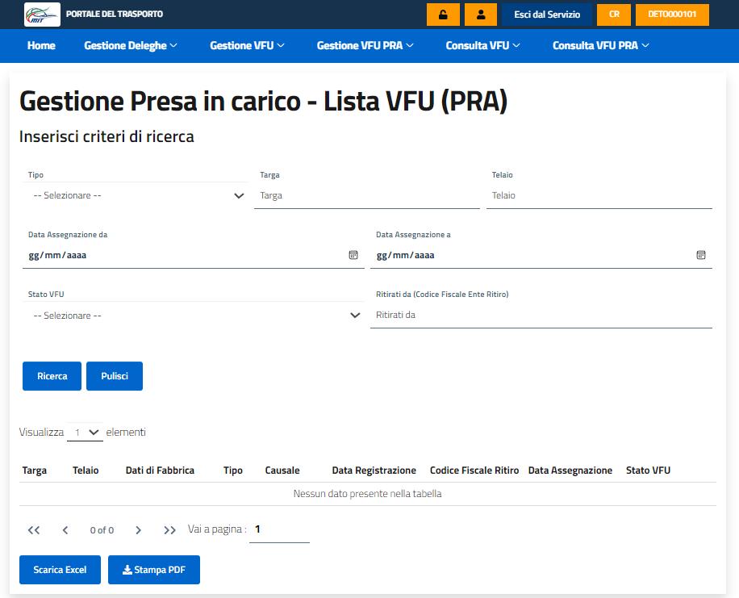{width="5.770138888888889in"
height="4.668055555555555in"}

La ricerca può essere effettuata specificando:

- tipo veicolo e targa o in alternativa tipo veicolo e n° di telaio, per
  ottenere uno specifico veicolo

- stato del veicolo (selezionabile da un menu a tendina) che può
  assumere i valori:

  - **Conferito**, per ottenere tutti i veicoli ritirati da un
    concessionario delegato e conferito al Centro di Raccolta;

  - **Preso in carico**, se si cercano i veicoli ritirati dallo stesso
    Centro di Raccolta o quelli già presi in carico per la lavorazione;

  - **Trasferito,** per ottenere tutti i veicoli trasferiti da altri
    Centri di Raccolta;

- intervallo temporale di data ritiro

- impresa di ritirato veicolo, ottenendo così la lista dei veicoli che
  un determinato concessionario ha ritirato per proprio conto.

I diversi criteri di selezione possono essere combinati riducendo in tal
modo i risultati della ricerca.

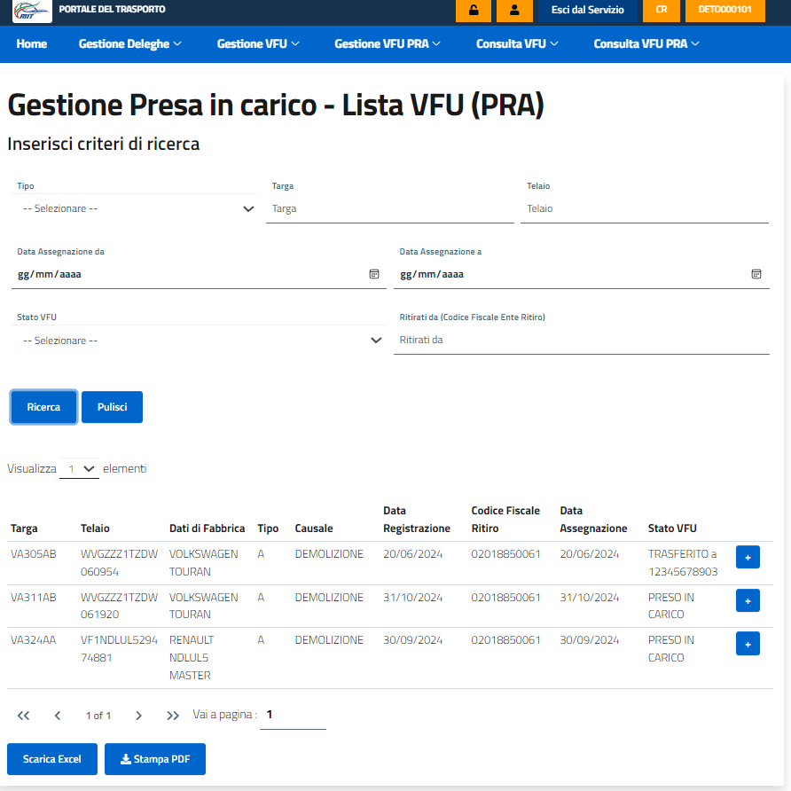{width="5.770138888888889in"
height="5.770138888888889in"}

Per ciascun elemento della lista ottenuta sono visualizzati:

- Identificativo del veicolo nel registro

- dati del veicolo (Tipo -- Targa -- N° Telaio -- Fabbrica)

- Dati di registrazione (data ritiro, Impresa di Ritiro)

- stato di lavorazione del veicolo

- identificativo e data del certificato di rottamazione

Per ogni elemento è possibile accedere ai dati di dettaglio selezionando

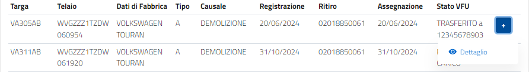{width="5.770138888888889in"
height="0.7958333333333333in"}

Sono inoltre disponibili le funzioni di scarica e stampa della lista
visualizzata.

#### Scarica Lista Veicoli

La lista dei veicoli ricercati può essere scaricata in un file, in
formato excel, che riporta oltre ai dati visualizzati e quelli delle
pagine precedenti e successive (viene riportato il contenuto di tutte le
pagine), anche il titolo, la data di scarico e il n° totale dei veicoli.

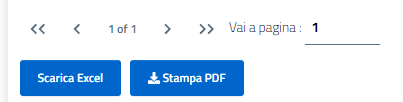{width="4.070866141732283in"
height="1.0303433945756781in"}

#### Stampa Lista Veicoli

La lista dei veicoli ricercati può essere stampata su un file, in
formato PDF, che riporta oltre ai dati visualizzati e quelli delle
pagine precedenti e successive (viene riportato il contenuto di tutte le
pagine), anche il titolo, la data di stampa, la matricola del
richiedente, il n° totale dei veicoli.

{width="4.070866141732283in"
height="1.0303433945756781in"}

#### Dettaglio Veicolo Registrato

Per il veicolo scelto, il sistema visualizza le seguenti sezioni:

- **Dati veicolo** non modificabili

  - tipo veicolo, targa, telaio, fabbrica e modello, anno
    immatricolazione

  - note

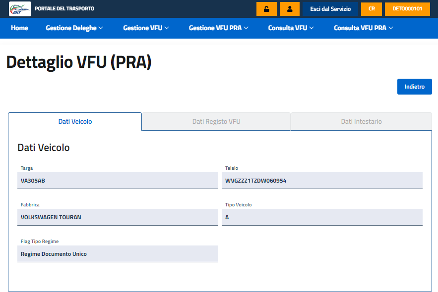{width="5.770138888888889in"
height="3.8555555555555556in"}

- **Dati di registrazione** (non modificabili)

  - data e impresa di ritiro (che può essere un concessionario delegato
    o il Centro di raccolta)

  - data e impresa di trasferimento (solo se il veicolo è stato oggetto
    di trasferimento tra Centri di Raccolta

  - stato del veicolo

  - causale di registrazione

  - identificativo del veicolo nel Registro

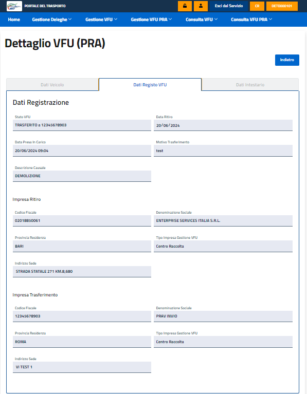{width="5.770138888888889in"
height="7.413194444444445in"}

- Dati dell'intestatario del veicolo

  - dati anagrafici (non modificabili)

  - indirizzo

  - campi per l'indicazione dei documenti di riconoscimento

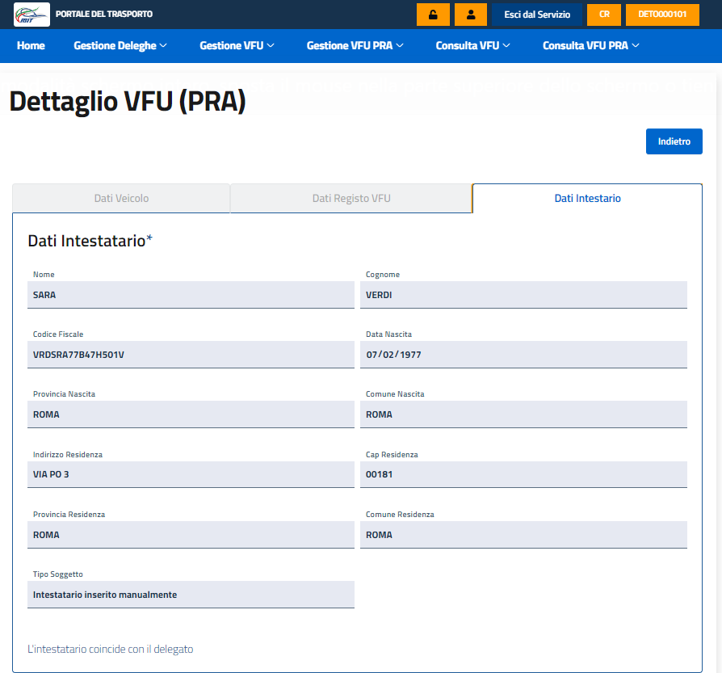{width="5.770138888888889in"
height="5.376388888888889in"}

- Dati del detentore che ha consegna il veicolo per conto
  dell'intestatario

  - dati anagrafici del detentore del veicolo

  - indirizzo del detentore

  - estremi dei documenti di riconoscimento

> questa sezione non è presente se il veicolo è stato consegnato
> dall'intestatario (quindi non esiste il detentore delegato)

- Dati del certificato di rottamazione (codice, data,).

> Per poter proseguire con la funzionalità "**Prendi in carico"** è
> necessario inserire Data e Ora della presa in carico.
>
> 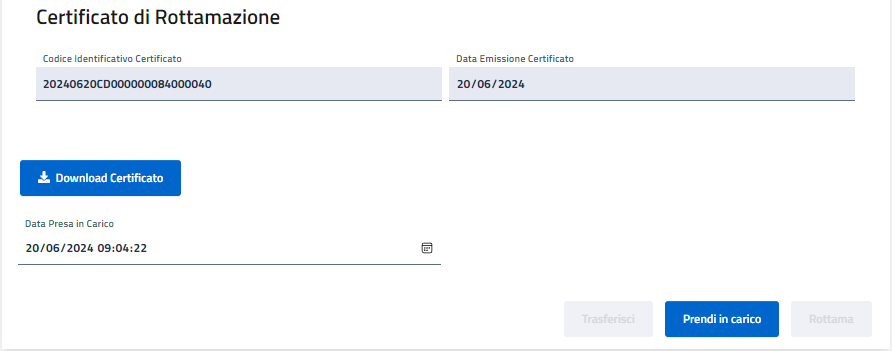{width="5.770138888888889in"
> height="2.270138888888889in"}

Per il veicolo sono subito disponibili i tasti:

a.  **Prendi in Carico**, per veicoli in stato **"Conferito"** o
    "**Trasferito"** che devono essere presi in carico dal Centro di
    Raccolta

b.  **Trasferisci ad altro CR**, per veicoli in stato **"Conferito"** o
    **"Presi in carico"**, per consentire al Centro di Raccolta di
    inviare ad un altro Centro quei veicoli che per vari motivi non
    possono essere lavorati

c.  **Rottama**, per veicoli in stato **"Presi in carico"**, che devono
    essere lavorati.

#### Presa in carico Veicolo Fuori Uso (PRA)

Vedi § 2.3.2.4.

#### Trasferisci Veicolo Fuori Uso ad altro CR (PRA)

Vedi § 2.3.2.5.

#### Visualizza Certificato di rottamazione (PRA)

Vedi § 2.3.2.6.

###  Gestione Veicoli Fuori Uso (PRA) -- Rottama VFU

la funzione si attiva scegliendo sotto la voce "**Registro dei Veicoli
Fuori Uso CON obbligo di Iscrizione al PRA**" la funzione "**Rottama
VFU**".

L'utente può specificare una serie di parametri per ricerca uno o più
veicoli già inseriti nel Registro dei Veicoli Fuori Uso,

La ricerca può essere effettuata specificando:

- tipo veicolo e targa o in alternativa tipo veicolo e n° di telaio, per
  uno specifico veicolo

- stato del veicolo (selezionabile da un menu a tendina) che può
  assumere i valori:

  - **Conferito**, per ottenere tutti i veicoli ritirati da un
    concessionario delegato e conferito al Centro di Raccolta;

  - **Preso in carico**, se si cercano i veicoli ritirati dallo stesso
    Centro di Raccolta o quelli già presi in carico per la lavorazione;

  - **Validato**, per ottenere i veicoli per cui è in corso la
    lavorazione ed è stata effettuata la validazione

  - **Da Radiare**, per ottenere i veicoli già lavorati che sono in
    attesa della radiazione da parte dell'ufficio UMC competente per
    territorio

  - **Radiato**, per individuare i veicoli che sono stati radiati, per i
    quali è possibile procedere alla distruzione delle targhe.

> La distruzione della documentazione deve avvenire ***non prima del
> 120° giorno*** successivo a quello di emissione del certificato di
> rottamazione. Il predetto termine si applica alla documentazione sia
> dei veicoli presi in carico nella Sezione "Veicoli iscritti al PRA"
> sia di quelli presi in carico nella Sezione "Veicoli non iscritti al
> PRA" del RVFU.

- **Assegnato a STA**, per individuare i veicoli che sono stati
  assegnati ad uno STA per la radiazione

- **Integrazione**, per individuare i veicoli che presentano una
  richiesta di integrazione di documenti dallo STA a cui sono stati
  assegnati.

<!-- -->

- intervallo temporale di data ritiro

- impresa di ritirato veicolo, ottenendo così la lista dei veicoli che
  un determinato concessionario ha ritirato per proprio conto.

I diversi criteri di selezione possono essere combinati riducendo in tal
modo i risultati della ricerca.

e il sistema restituisce la lista dei veicoli che soddisfano i criteri
di ricerca indicati

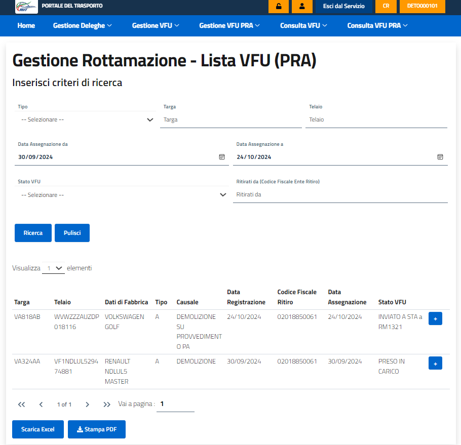{width="5.770138888888889in"
height="5.573611111111111in"}

Per ogni elemento è possibile accedere ai dati di dettaglio selezionando

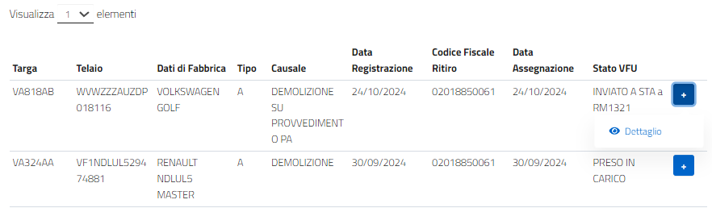{width="5.770138888888889in"
height="1.6875in"}

oltre ad avere a disposizione le funzioni di scarico e stampa della
lista visualizzata (vedi § 2.5.2.1 e 2.5.2.2)

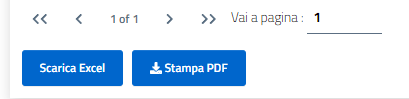{width="5.771653543307087in"
height="1.3970516185476816in"}.

#### Dettaglio Veicolo da Rottamare

Per il veicolo scelto, il sistema visualizza le seguenti sezioni:

- **Dati veicolo** non modificabili

  - tipo veicolo, targa, telaio, fabbrica e modello, anno
    immatricolazione

  - note

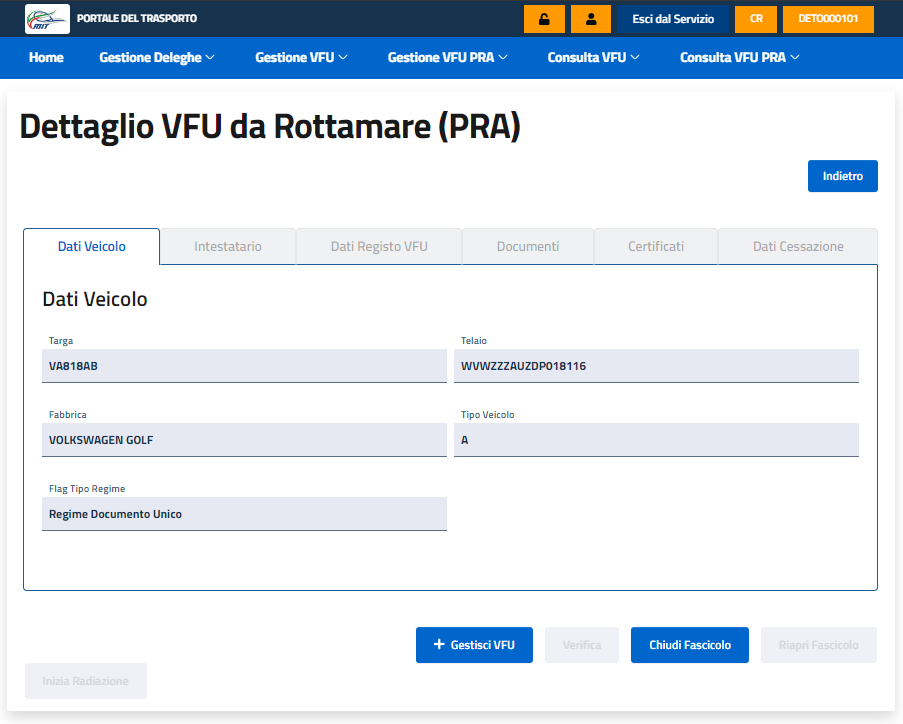{width="5.770138888888889in"
height="4.626388888888889in"}

- **Dati di registrazione** (non modificabili)

  - data e impresa di ritiro (che può essere un concessionario delegato
    o il Centro di raccolta)

  - data e impresa di trasferimento (solo se il veicolo è stato oggetto
    di trasferimento tra Centri di Raccolta

  - stato del veicolo

  - Causale di inserimento

  - identificativo del veicolo nel Registro

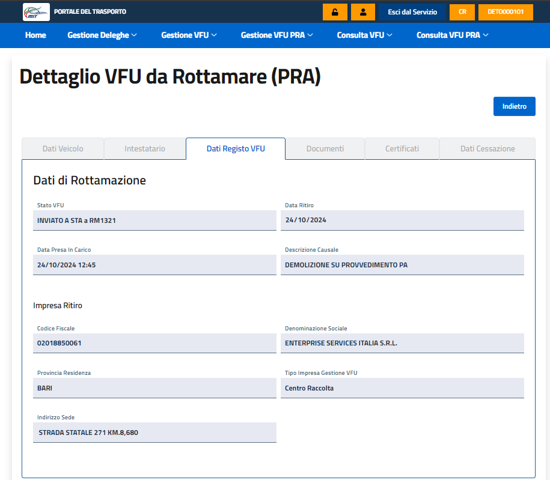{width="5.770138888888889in"
height="5.038888888888889in"}

- Dati dell'**intestatario** del veicolo

  - dati anagrafici (non modificabili)

  - indirizzo

  - campi per l'indicazione dei documenti di riconoscimento

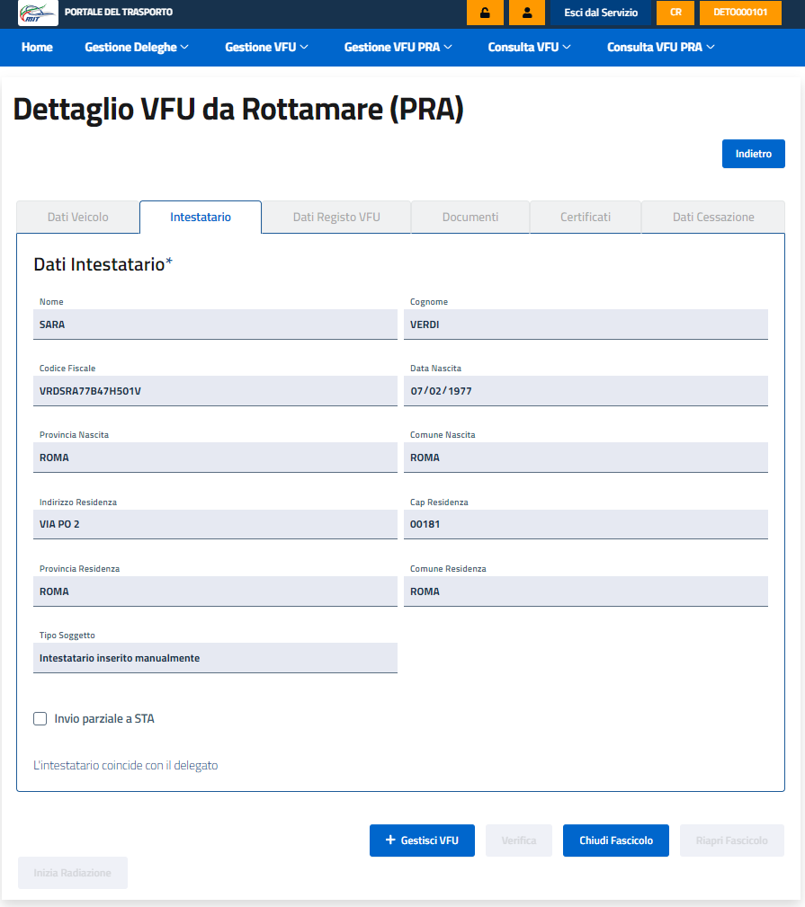{width="5.770138888888889in"
height="6.5055555555555555in"}

- Dati del **detentore** che ha consegna il veicolo per conto
  dell'intestatario

  - dati anagrafici del detentore del veicolo

  - indirizzo del detentore

  - estremi dei documenti di riconoscimento

> questa sezione non è presente se il veicolo è stato consegnato
> dall'intestatario (quindi non esiste il detentore delegato)

- **Documenti** già caricati nel fascicolo del registro. Questa sezione
  contiene almeno il certificato di rottamazione, generato in fase di
  registrazione del veicolo, oltre ad altri eventuali documenti aggiunti
  durante la lavorazione.

> 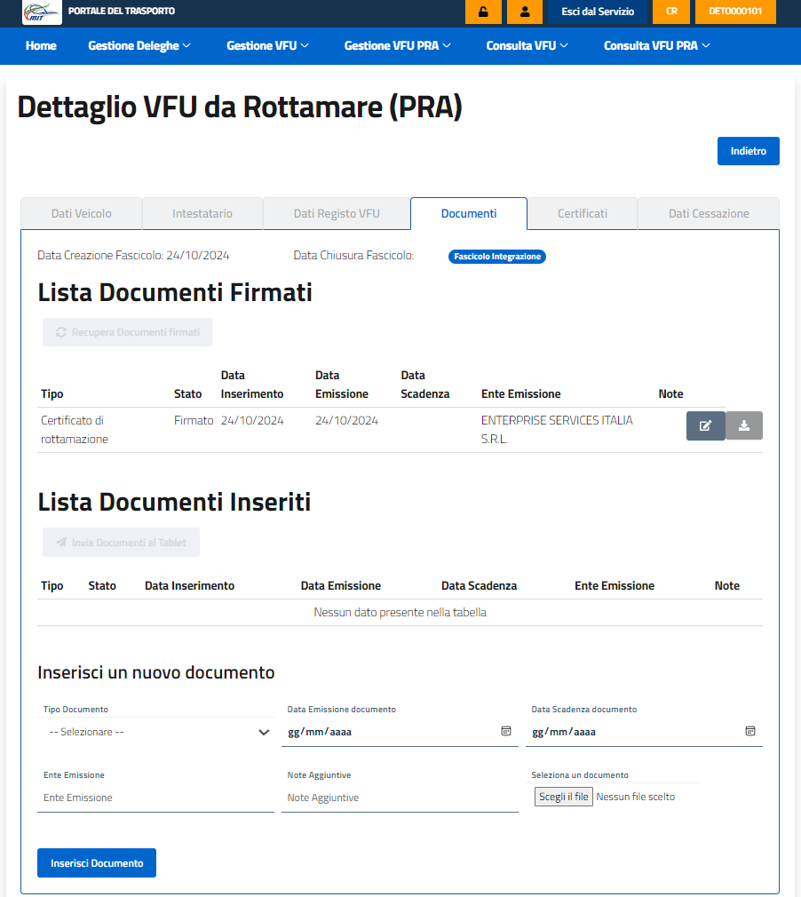{width="5.770138888888889in"
> height="6.461111111111111in"}

- dati del **certificato** di rottamazione (codice, data, note)

> 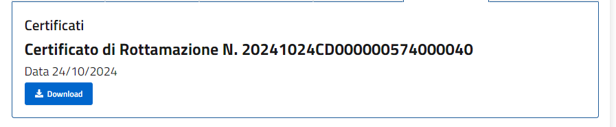{width="5.770138888888889in"
> height="1.1902777777777778in"}

Selezionando il tasto "**Gestione VFU**" si potrà accedere alle
funzionalità:

a.  **Modifica Veicolo**, per veicoli in stato **"Preso in carico"**

b.  **Annulla Veicolo**, solo per veicoli presi in carico direttamente
    dal Centro di raccolta.

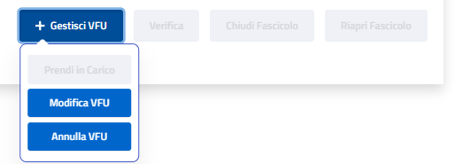{width="5.771653543307087in"
height="2.0773458005249346in"}

In aggiunta sono disponibili i tasti per accedere alle funzionalità:

a.  **Verifica Veicolo**, per veicoli in stato **"Presi in carico"** da
    avviare alla lavorazione

b.  **Chiudi Fascicolo**, per i veicoli in stato **"Validato"** per cui
    è terminata la fase di rottamazione

c.  **Inizia Radiazione,** per i veicoli in stato **"Da Radiare",**
    consente di gestire l'Associazione del veicolo ad uno STA per la
    radiazione.

> 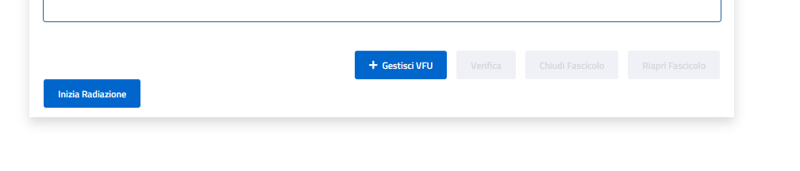{width="5.771653543307087in"
> height="1.2371303587051619in"}

#### Modifica Veicolo Fuori Uso (PRA)

La funzione di Modifica dei dati consente di aggiornare le note de
veicolo.

#### Annulla Inserimento Registro (PRA)

La cancellazione del veicolo da l registro è consentita SOLO se il
veicolo è stato ritirato dallo stesso Centro di Raccolta. Per i veicoli
conferiti da un concessionario o trasferiti da altro Centro di Raccolta
la funzione è inibita.

Selezionando il tasto "**Annulla**" il sistema richiede la conferma e
rispondendo **SI** il veicolo viene eliminato (annullato) dal Registro.
Rimane comunque traccia delle operazioni fatte sul veicolo e delle
matricole che le hanno effettuate.

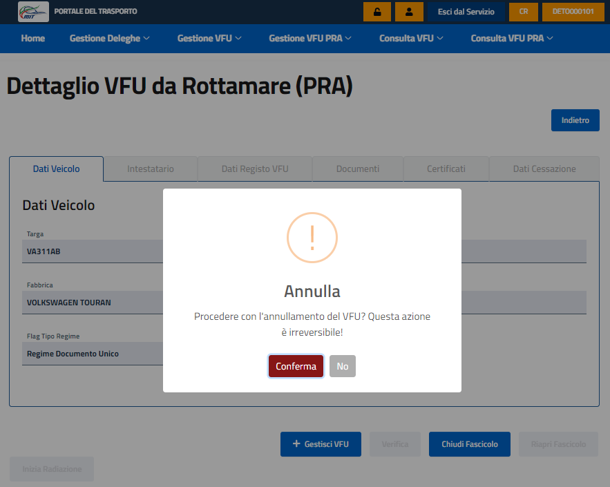{width="5.770138888888889in"
height="4.606944444444444in"}

#### Valida Veicolo Fuori Uso (PRA)

La funzione, attivabile mediante selezione del tasto "**Valida**", è
disponibile per i veicoli che si trovano nello stato "**Preso in
Carico**" e consente di effettuare la verifica di assenza di vincoli
amministrativi che si oppongono alla rottamazione del veicolo.

Il controllo è effettuato accedendo sia ai sistemi ACI-PRA che ai
sistemi MCTC, e sarà evidenziato l'ambito in cui è stato rilevato il
vincolo.

Se il veicolo presenta ostativi PRA, tutti forzabili, la validazione
darà comunque esito positivo.

In caso di esito negativo della validazione sarà visualizzato il
messaggio esplicativo dell'impossibilità a proseguire con la
rottamazione.

In caso di esito positivo della validazione è visualizzato il fascicolo
del veicolo, già creato in fase di registrazione, che contiene il
certificato di rottamazione. La gestione del fascicolo è consentita a
partire dalla sezione "**Dettaglio Fascicolo**".

#### Gestisci Documenti Fascicolo (PRA)

Dalla sezione "**Documenti**" del "**Dettaglio Veicolo da Rottamare**" è
possibile agire sulla documentazione che costituisce il fascicolo del
registro.

##### Dettaglio Fascicolo Veicolo Fuori Uso (PRA)

Nella sezione "**Documenti**" è visualizza la lista dei documenti
presenti nel fascicolo, raggruppati in base al relativo stato. Sono
pertanto disponibili le seguenti sezioni:

a)  **Documenti Firmati**: all'interno della sezione è certamente
    visualizzato il certificato di rottamazione digitale (se prodotto
    dal sistema) e qualsiasi altro documento che sia stato firmato con
    FDR. Per ciascun documento presente in lista sono riportati:

    - identificativo documento

    - tipo documento

    - numero e data di emissione

    - ente di emissione

    - stato del documento

Per ciascun documento è disponibile la funzione di visualizzazione
(**Recupera Documento Firmato**), e, fatta eccezione per il certificato
di rottamazione, sono disponibili anche le funzioni di modifica e
annullamento (vedere paragrafi successivi).

b)  **Documenti Inseriti**: nella sezione sono riportati i documenti
    acquisiti dal Centro di raccolta che devono ancora essere sottoposti
    a firma. Per ciascun documento presente in lista sono riportati:

    - identificativo documento

    - tipo documento

    - numero e data di emissione

    - ente di emissione

    - stato del documento

    - indicatore di upload (indica che è presente la copia digitalizzata
      del documento)

Per ciascun documento sono disponibili le funzioni di visualizzazione,
upload, modifica, firma e annullamento (vedere paragrafi successivi).

c)  **Inserisci nuovo documento**: la sezione consente di indicare le
    informazioni relative ai documenti da inserire nel fascicolo del
    registro.

Quando tutta la documentazione richiesta per la rottamazione è stata
inserita nel fascicolo, che può quindi ritenersi completo, si può
procedere con la sua chiusura, mediante la funzione "**Chiudi
Fascicolo**", per avviare il processo di radiazione.

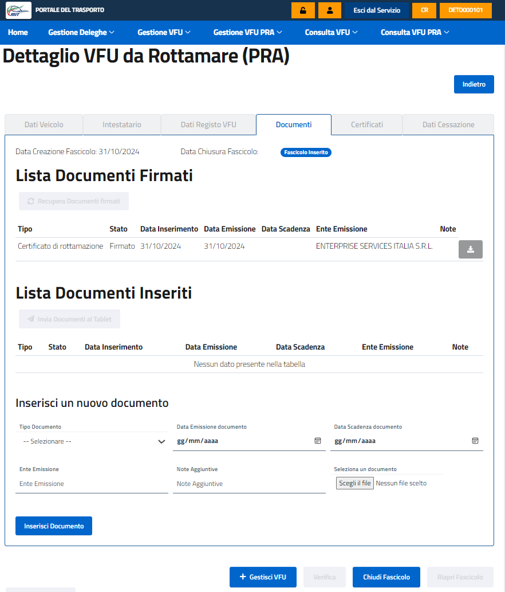{width="5.770138888888889in"
height="6.758333333333334in"}

Attraverso le icone che affiancano ciascun documento è possibile operare
sui documenti presenti.

- Eliminare un documento già inserito

> {width="0.4781408573928259in"
> height="0.39675634295713036in"}

- Scaricare documento

> {width="0.48803696412948383in"
> height="0.37644247594050745in"}

- Sostituire il file allegato

> {width="0.5108103674540683in"
> height="0.3916207349081365in"}

##### Inserisci nuovo documento

Nella sezione "**Inserisci un nuovo Documento**" è possibile indicare i
dati del nuovo documento

- tipo documento

- data ed ente di emissione

- data di scadenza

- note

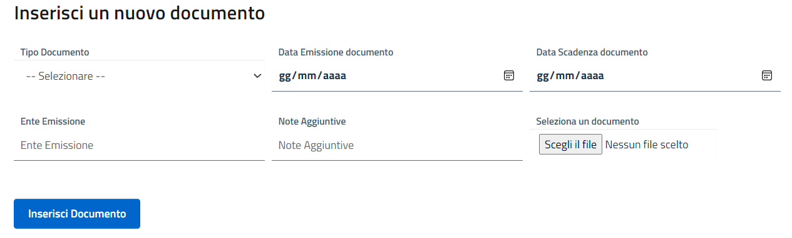{width="5.770138888888889in"
height="1.742361111111111in"}

e selezionando il tasto "**Inserisci Documento**" i dati sono aggiunti
nel fascicolo del registro e al documento è assegnato un identificativo
e lo stato è impostato con il valore "**Inserito**".

Dopo, mediante la funzione "Scegli file", si può allegare la copia
digitalizzata del documento che dovrà essere firmata mediante la Firma
Digitale Remota (FDR) fornita a tutti i Centri di raccolta.

Dopo l'inserimento con esito positivo il documento è aggiunto alla lista
dei documenti firmati.

##### Sostituisci documento 

Nella sezione "**Lista Documenti Inseriti**" è possibile procedere alla
sostituzione di un allegato selezionando il tasto
{width="0.37771325459317584in"
height="0.2895800524934383in"}

Il sistema permette di allegare il nuovo documento che sostituisce
quello esistente. I dati caratteristici restano inalterati.

Inoltre, è possibile scaricare il documento inserito selezionando il
tasto {width="0.35414916885389325in"
height="0.3018974190726159in"}.

##### Invia documenti al tablet (Firma Documento)

Nella sezione "**Lista Documenti Inseriti**" è possibile inviare in
firma i documenti in essa contenuti, selezionando il tasto "**Invia
Documenti al Tablet**"

{width="1.3263998250218723in"
height="0.32054680664916885in"}

Dopo aver inviato i documenti al Tablet, apparirà la seguente schermata:

{width="5.770138888888889in"
height="1.4388888888888889in"}

Attraverso il tasto
{width="1.3228346456692914in"
height="0.3282950568678915in"} è possibile eliminare i documenti inviati
al Tablet, dopo aver cliccato il pulsante apparirà il seguente messaggio
di conferma.

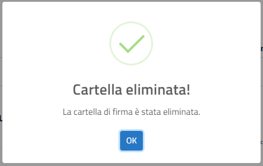{width="4.070866141732283in"
height="2.581299212598425in"}

Tutti i documenti presenti saranno inviati in firma e il loro stato è
modificato in "**Inviato in firma**".

Terminata l'operazione di firma sul tablet, sarà possibile ottenere il
documento firmato mediante il tasto "**Recupera** **Documento
Firmato**".

##### Recupera documenti firmati

Nella sezione "**Lista Documenti Inseriti**" è anche disponibile il
tasto "**Recupera documenti firmati**", che agisce sui documenti della
lista che si trovano nello stato "**Inviato in firma**".

La funzione recupera la copia firmata dei documenti per cui è stato
completato il processo di firma e, all'esito positivo, aggiunge i
documenti nella lista dei documenti firmati modificandone lo stato in
"**Firmato**".

##### Visualizza documento 

Mediante selezione dell'icona

{width="0.48803696412948383in"
height="0.37644247594050745in"}

è possibile ottenere la copia digitale del documento che viene scaricata
e può essere stampata.

##### Elimina documento 

La funzione, attivata mediante selezione dell'icona

{width="0.4781408573928259in"
height="0.39675634295713036in"}

permette l'eliminazione di un documento presente nel fascicolo del
registro, a meno del certificato di rottamazione, che non può essere
eliminato.

Il sistema richiede conferma dell'operazione che non è reversibile
mostrando il messaggio:

{width="4.070866141732283in"
height="2.7094181977252845in"}

Confermata l'operazione il documento non è più nella disponibilità del
demolitore.

Nota: l'operazione effettuata è comunque tracciata, con la matricola
dell'operatore che l'ha effettuata, per eventuali controlli degli uffici
competenti.

##### Modifica Documento Veicolo Fuori Uso (PRA)

I dati dei documenti inseriti possono essere modificati in riferimento a

- tipo documento

- numero e data di emissione

- ente di emissione

- stato del documento

- note, se presenti

Se si desidera modificare il tipo di documento si deve procedere con
l'eliminazione di quello esistente e l'inserimento del nuovo.

#### Chiudi Fascicolo

La funzione consente di registrare il completamento delle operazioni di
rottamazione selezionando il tasto "**Chiudi Fascicolo**"

{width="5.770138888888889in"
height="0.8840277777777777in"}

Il sistema richiede la conferma dell'operazione visualizzando il
messaggio

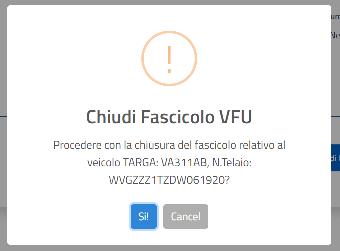{width="4.070866141732283in"
height="3.0111384514435695in"}

Per ottenere un esito positivo è necessario che si verifichino le
seguenti condizioni:

- tutti i documenti del fascicolo siano stati firmati, e in caso
  negativo il sistema restituisce il messaggio:

{width="3.1390507436570427in"
height="2.5070734908136485in"}

- siano presenti nel fascicolo tutti i documenti obbligatori previsti
  per il tipo di veicolo che si sta rottamando, e in caso negativo il
  sistema restituisce il messaggio

{width="4.070833333333334in"
height="3.0in"}

Alla conferma dell'operazione lo stato del fascicolo diventa
"**Completo**" e lo stato del veicolo diventa:

- "**Da Radiare**" per causali SD DEMOLIZIONE e PA DEMOLIZIONE SU
  PROVVEDIMENTO PA

- "**Radiato**" per causale RD RADIATO

È possibile, inoltre, attraverso il pulsante
{width="1.3231146106736658in"
height="0.40978346456692916in"} far passare lo stato del fascicolo da
"**Fascicolo Chiuso**" in "**Fascicolo Integrazione".**

{width="4.070866141732283in"
height="0.48276246719160104in"}

In questo stato, è possibile aggiungere, modificare documenti e dati
precedentemente inseriti.

Ad eccezione dei documenti "CRD", "CDPD", "Ricevuta presa in carico" e
"Ricevuta radiazione", è possibile eliminare tutti i documenti inseriti.

{width="5.770138888888889in"
height="3.5145833333333334in"}

#### Associa Veicolo Fuori Uso (PRA) a STA

La funzione **Inizia Radiazione,** disponibile nel Dettaglio dei veicoli
in stato "**Da Radiare**", visualizza la scelta della modalità di
radiazione: i Centri di raccolta infatti possono scegliere se effettuare
la radiazione direttamente o avvalersi di uno studio di consulenza. In
quest'ultimo caso devono indicare il codice dell'agenzia cui delegare la
radiazione del veicolo.

Per accedere direttamente alla funzione di radiazione occorre
selezionare il tasto "**Richiedi Radiazione Veicolo**".

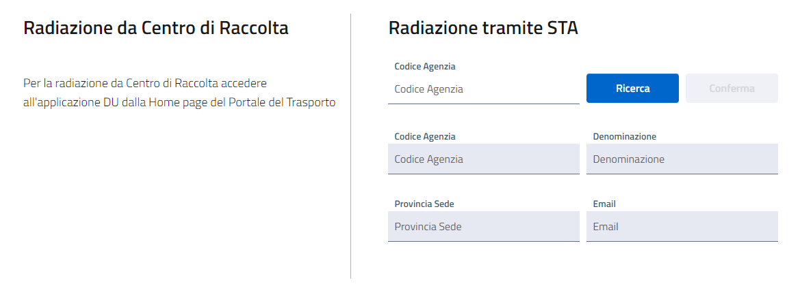{width="5.770138888888889in"
height="2.058333333333333in"}

Per avvalersi di uno studio di consulenza

- l'utente deve indicare il codice dell'agenzia e selezionare il tasto
  "**Ricerca**"

- l'applicazione ne verifica la correttezza e visualizza la descrizione

- l'utente conferma la richiesta mediante il tasto "**Conferma**"

- 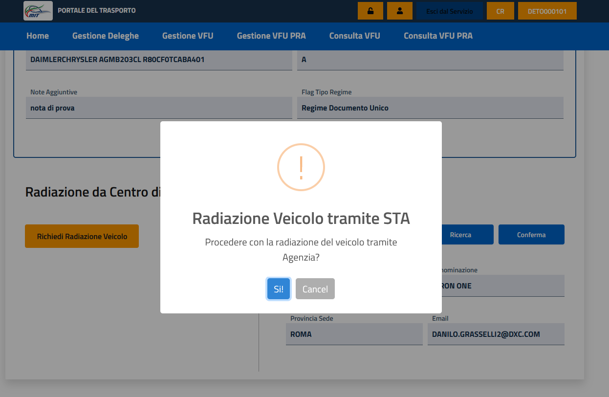{width="5.770138888888889in"
  height="3.7604166666666665in"}

> alla conferma lo stato del veicolo diventa "**Inviato a STA**". Questa
> operazione è possibile esclusivamente se il fascicolo è chiuso e il
> veicolo è nello stato "**Da Radiare**".
>
> Quando il fascicolo non risulta chiuso viene visualizzato il seguente
> messaggio di errore:
>
> 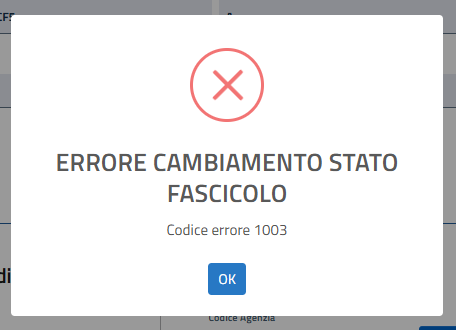{width="3.166829615048119in"
> height="2.291784776902887in"}

Nel caso in cui il veicolo non risulti nello stato "**Da Radiare**" non
si attiva il tasto "**Inizia Radiazione**".

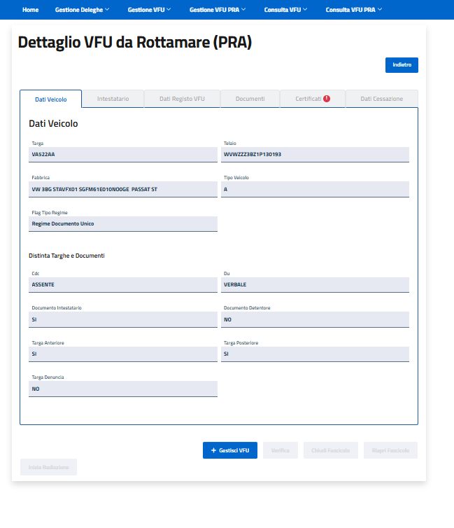{width="4.507176290463692in"
height="5.2363801399825025in"}

Quando lo stato del veicolo diventa "**Inviato a STA**", il veicolo è
associato ad una agenzia che può procedere alla sua radiazione mediante
le funzionalità di cui già dispone.

Al termine della radiazione effettuata con le procedure del Documento
Unico sia da STA che da Centro di Raccolta, anche il Registro sarà
aggiornato in modo automatico e lo stato del veicolo diventerà
"**Radiato**".

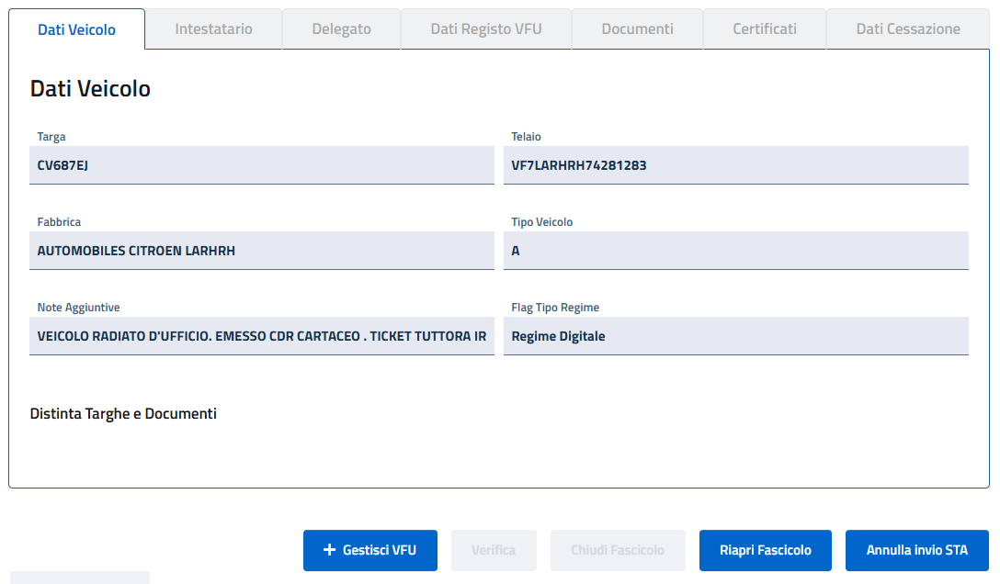{width="5.770138888888889in"
height="3.372916666666667in"}

È possibile annullare l'operazione di assegnazione ad Agenzia STA nel
caso il processo di presentazione della pratica di radiazione sul
Documento Unico non è stata ancora avviata.

#### Integrazione Veicolo Fuori Uso (PRA)

Gli STA che hanno veicoli assegnati possono aver bisogno di richiedere
una Integrazione di documenti al Centro di raccolta che glieli ha
assegnati. Il veicolo si troverà in questo caso nello stato
"**Integrazione".**

Per questi veicoli, selezionando **Dettaglio**

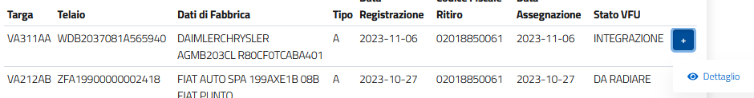{width="5.770138888888889in"
height="0.7548611111111111in"}

Oltre ai dati di dettaglio già descritti nei paragrafi precedenti che
includeranno nelle Note, il Motivo dell'Integrazione richiesta, saranno
disponibili le funzioni:

{width="4.070866141732283in"
height="1.6817858705161854in"}

- **Riapri Fascicolo,** permette di riaprire il fascicolo e apportare le
  modifiche alla documentazione richieste da STA. Successivamente sarà
  necessario chiudere nuovamente il fascicolo

- **Assegna a STA,** permette di assegnare il veicolo nuovamente allo
  STA. La funzione è disponibile solo se il fascicolo è chiuso.

#### Riapertura Fascicolo Veicolo Fuori Uso (PRA)

Nel Dettaglio di un veicolo che si trova nello stato "**Integrazione"**
è disponibile la funzione **Riapri Fasciolo.** Selezionando il pulsante
viene visualizzato il messaggio di conferma:

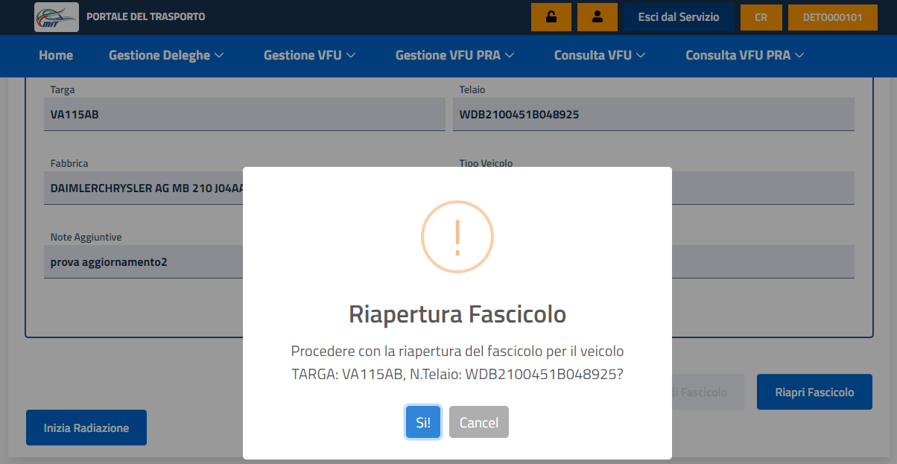{width="5.770138888888889in"
height="2.9854166666666666in"}

Alla conferma il fascicolo viene riaperto

{width="4.070866141732283in"
height="2.6000820209973754in"}

E' possibile quindi gestire il fascicolo e i documenti in esso contenuti
come già descritto in precedenza nella gestione del veicolo
**Validato.**

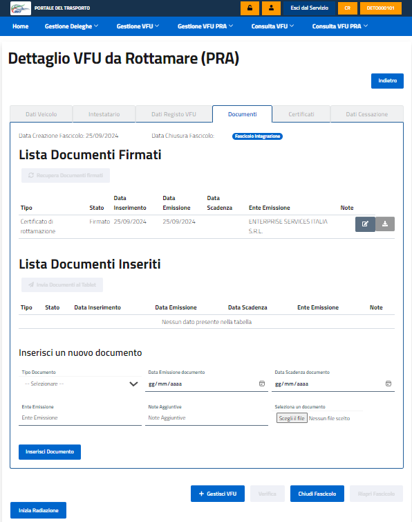{width="5.770138888888889in"
height="7.299305555555556in"}

E' disponibile la funzione **Chiudi Fascicolo** da utilizzare una volta
completata la gestione dei documenti.

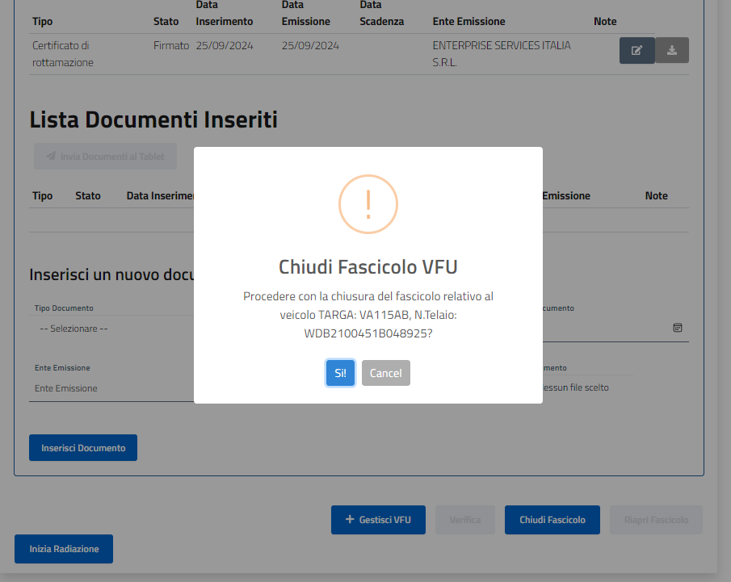{width="5.770138888888889in"
height="4.597222222222222in"}

Dopo la chiusura del fascicolo tornerà disponibile la funzione **Assegna
a STA** che permetterà di assegnare nuovamente il veicolo allo STA di
provenienza.

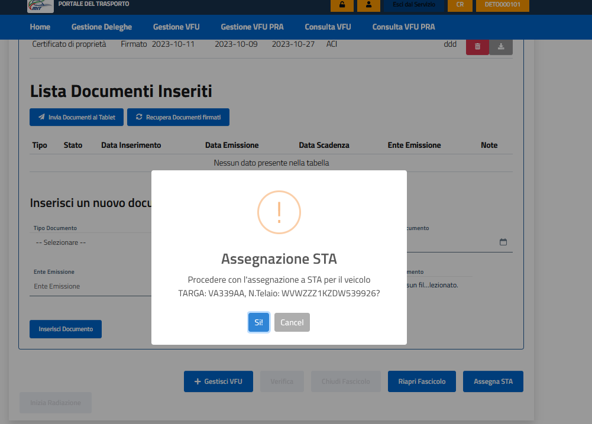{width="5.770138888888889in"
height="4.133333333333334in"}

All conferma il veicolo è nuovamente nello stato **Assegnato a STA**

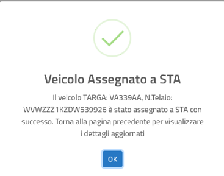{width="4.070866141732283in"
height="3.2056681977252843in"}

###  Gestione Veicolo Fuori Uso -- Radiati e Demoliti (PRA)

Scegliendo la voce "**Registro dei Veicoli Fuori Uso con obbligo di
Iscrizione al PRA**" è disponibile la voce di menu "**Gestione VFU
radiati e demoliti**".

La voce di menu permette di accedere alle funzioni per la registrazione
dell'avvenuta distruzione del veicolo delle targhe e dei documenti, una
volta che questo si trovi nello stato **"Radiato".**

La gestione è analoga a quella descritta per i veicoli senza obbligo di
iscrizione al PRA, per cui si rimanda al paragrafo dedicato § 2.3.4

###  Gestione Veicolo Fuori Uso -- Ceduti (PRA)

La gestione è analoga a quella descritta per i veicoli senza obbligo di
iscrizione al PRA, per cui si rimanda al paragrafo dedicato § 2.3.5.

## Visualizza VFU e Visualizza VFU PRA

Le voci di menu Visualizza VFU e Visualizza VFU PRA danno accesso a
funzioni di ricerca visualizzazione dei veicoli di competenza presenti
nel registro senza rendere disponibili funzioni di gestione. Sono
analoghe per le due tipologie di veicoli, senza con obbligo di
iscrizione al PRA.

Sono suddivise in

- **Visualizza VFU,** per consultare i veicoli in qualsiasi stato di
  lavorazione

- **Visualizza VFU radiati,** per consultare i veicoli in stato
  **"Radiato"** e **"Demolito"**

- **Visualizza storico VFU,** per consultare lo storico delle
  lavorazioni dei veicoli nei diversi passaggi di stato

### Visualizza VFU e VFU radiati 

Viene messa a disposizione una pagina di ricerca analoga a quella già
descritta per le diverse funzioni di gestione.

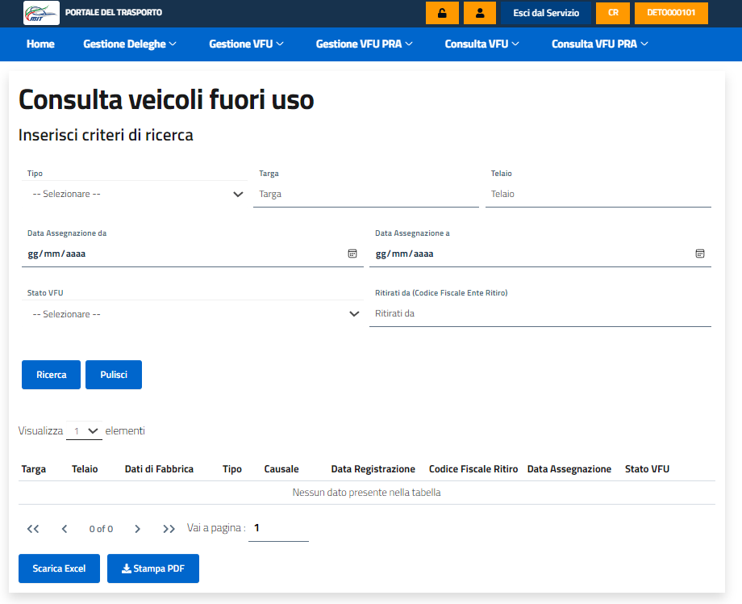{width="5.770138888888889in"
height="4.691666666666666in"}

La ricerca può essere effettuata specificando:

- tipo veicolo e targa o in alternativa tipo veicolo e n° di telaio, per
  uno specifico veicolo

- stato del veicolo (pre-impostato a **Radiato** per la funzione di menu
  dedicata ai VFU radiati)

- intervallo temporale di data ritiro

- eventuale codice STA di assegnazione

I diversi criteri di selezione possono essere combinati riducendo in tal
modo i risultati della ricerca

Dopo la selezione del pulsante Ricerca vengono visualizzati i risultati
che rispettano i criteri inseriti.

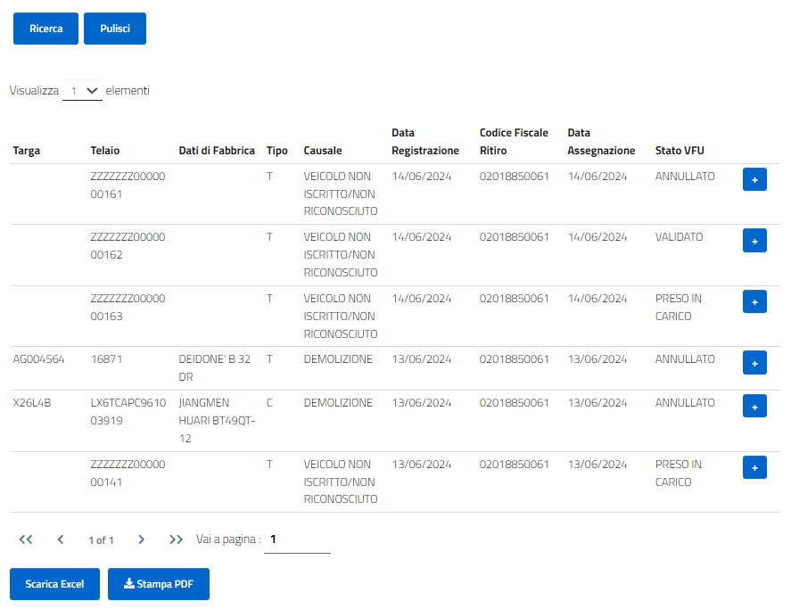{width="5.770138888888889in"
height="4.4430555555555555in"}

Sono disponibili i pulsanti per scaricare la lista risultato in excel e
pdf.

Come nelle altre funzioni di Ricerca già descritte, è possibile
visualizzare le sezioni di dettaglio del veicolo, Dati veicolo, Dati
intestatario, Dati Registro, Documenti, selezionando la voce
**Dettaglio** visualizzata per la singola occorrenza.

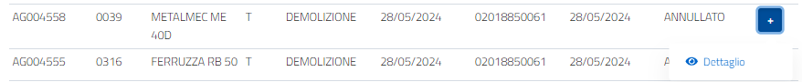{width="5.770138888888889in"
height="0.5916666666666667in"}

**Dati veicolo:**

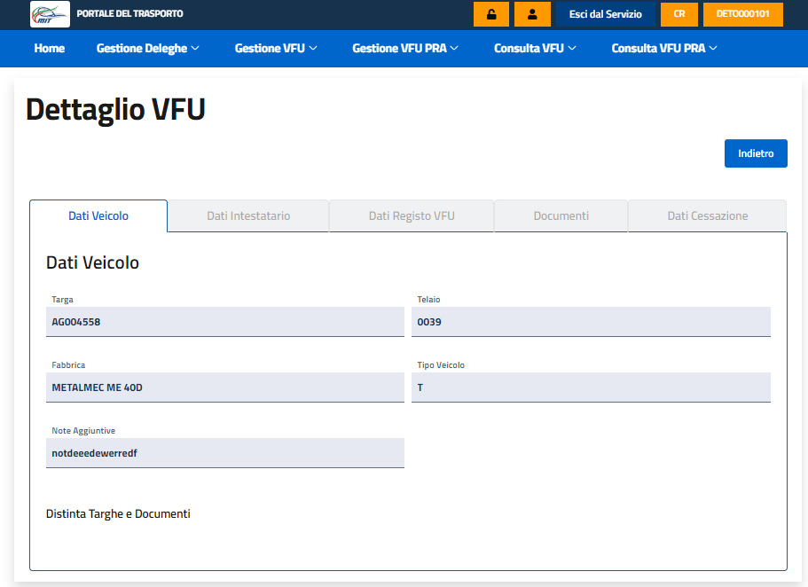{width="5.770138888888889in"
height="4.1930555555555555in"}

**Dati Intestatario:**

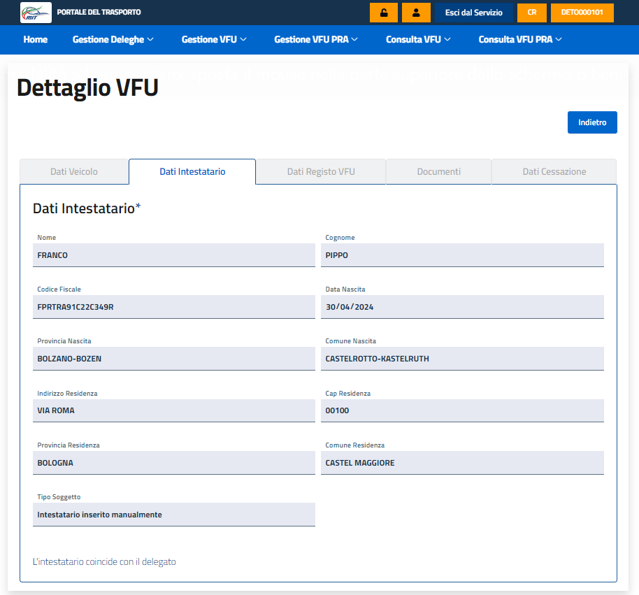{width="5.770138888888889in"
height="5.372222222222222in"}

**Dati Registro VFU:**

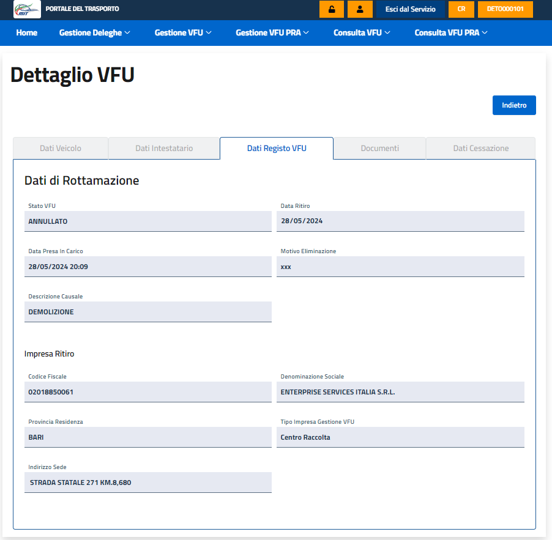{width="5.770138888888889in"
height="5.648611111111111in"}

**Documenti:**

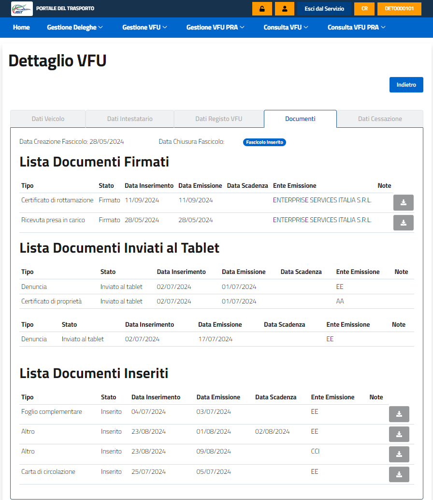{width="5.770138888888889in"
height="6.652777777777778in"}

**Dati Cessazione:**

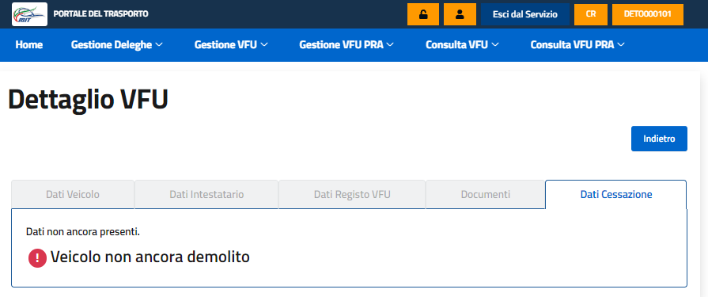{width="5.770138888888889in"
height="2.417361111111111in"}

### Visualizza storico VFU

Viene messa a disposizione una pagina di ricerca puntuale dei veicoli di
competenza che richiede l'inserimento di almeno Tipo veicolo e Targa

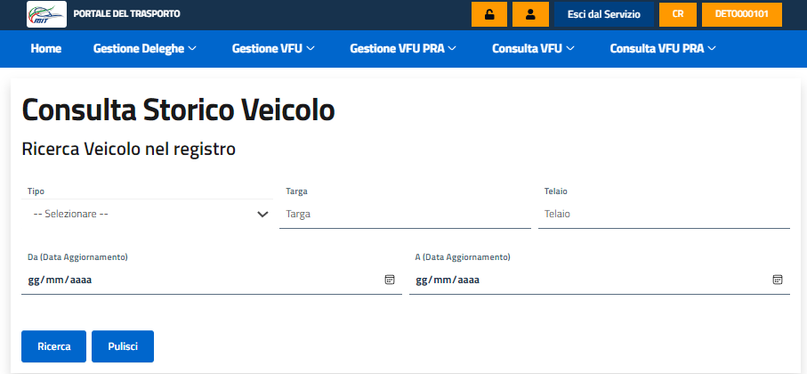{width="5.770138888888889in"
height="2.671527777777778in"}

Compilati i campi e selezionato il pulsante **Ricerca** viene
visualizzata una pagina di dettaglio che contiene lo stato attuale del
veicolo nel registro e la storia di tutti passaggi di stato con le
relative date

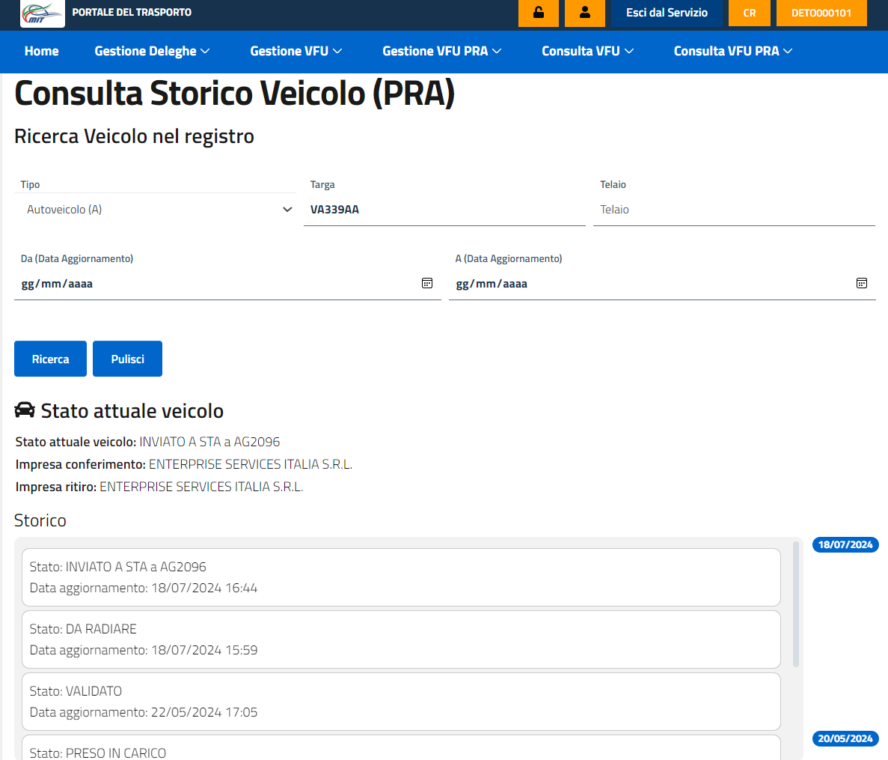{width="5.770138888888889in"
height="4.934027777777778in"}
