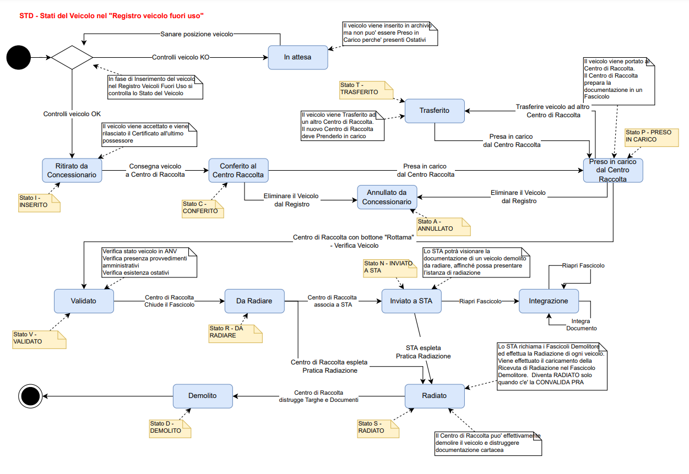
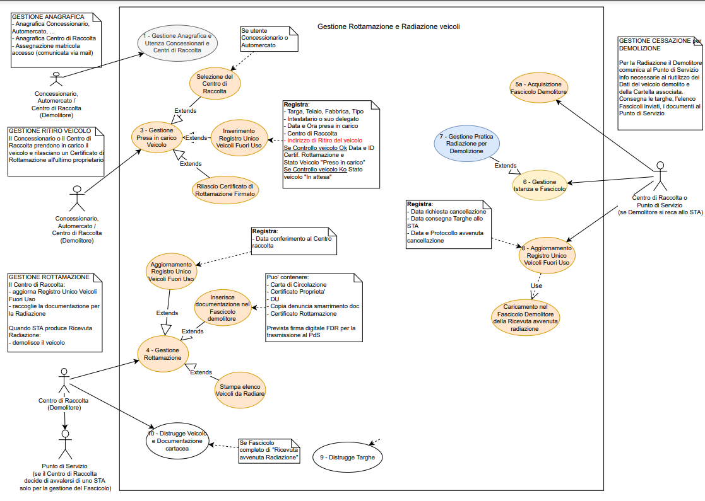
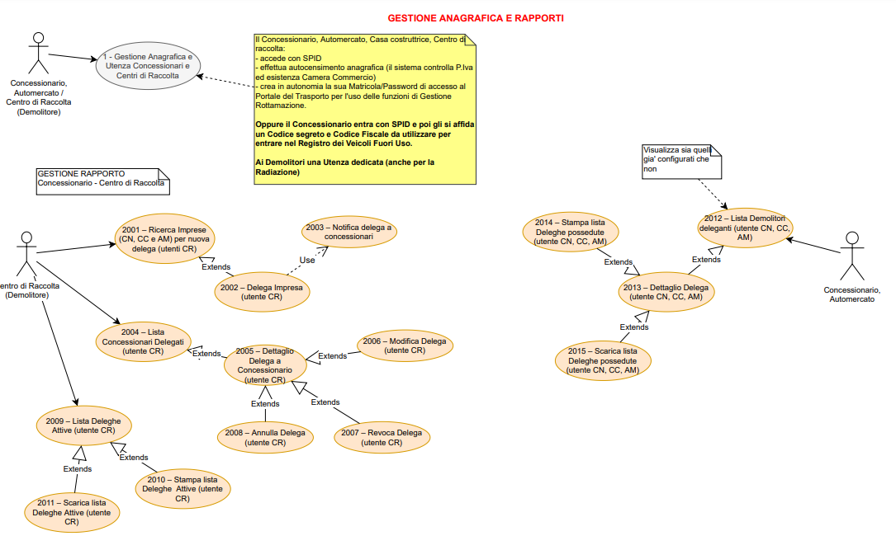
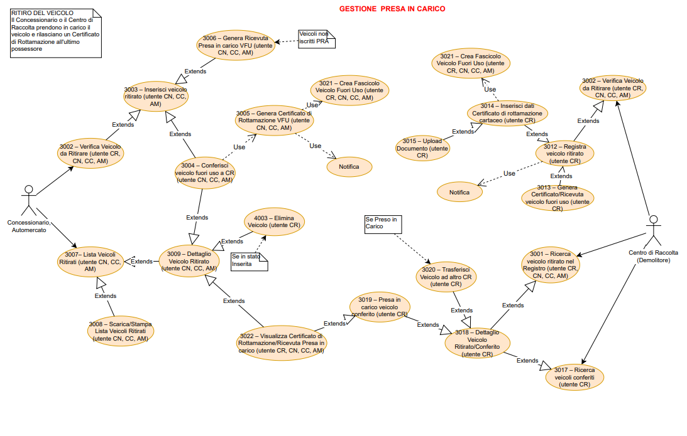
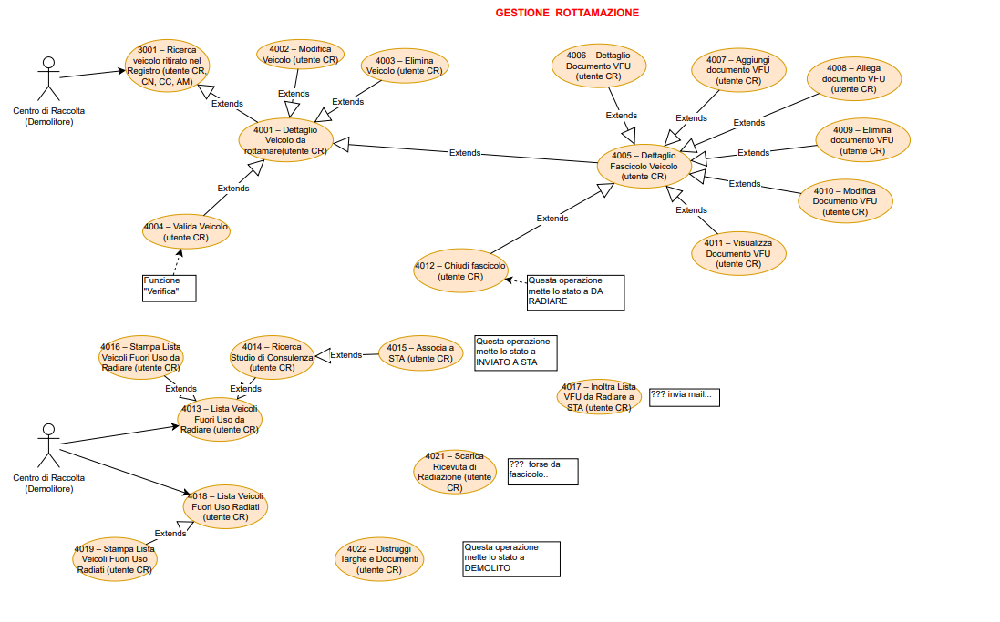
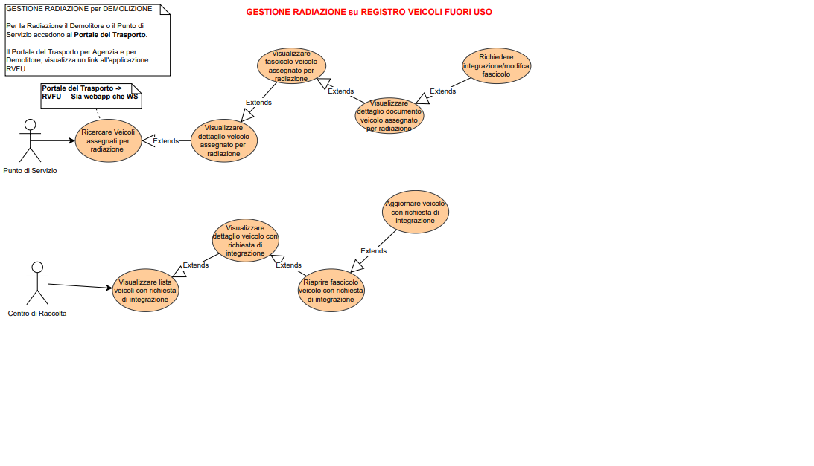
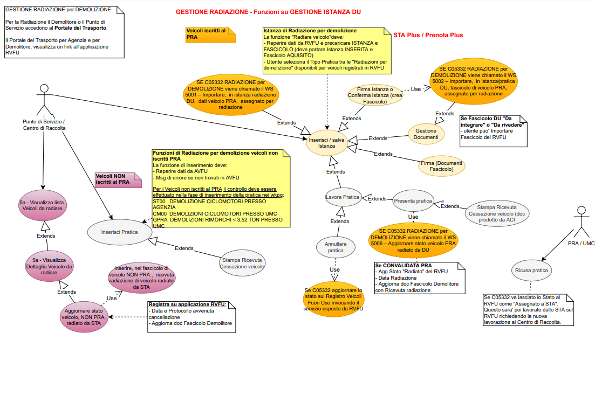
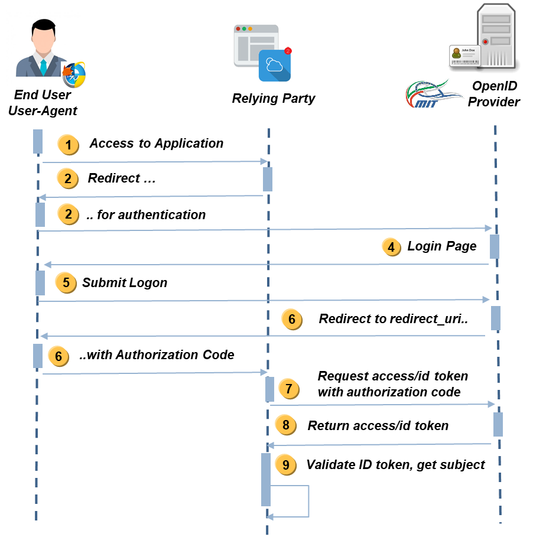
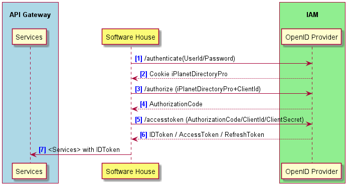

Specifiche Web Services

Gestione Demolitori

SH

# Storia del Documento {#storia-del-documento .Heading-Unum-1}

Il seguente registro cronologico delle modifiche contiene una
registrazione delle modifiche apportate al presente documento:

+:---------------:+:------------:+:-------------------------------------:+
| **Versione**    | **Data**     | **Note**                              |
+-----------------+--------------+---------------------------------------+
| 1.0             | 29/05/2023   | Prima emissione                       |
+-----------------+--------------+---------------------------------------+
| 1.1             | 04/08/2023   | Revisione API                         |
+-----------------+--------------+---------------------------------------+
| 1.2             | 08/02/2024   | Aggiornati html e json paragrafi 4.1, |
|                 |              | 4.2\                                  |
|                 |              | Casi di Test al paragrafo 4.3,        |
+-----------------+--------------+---------------------------------------+
| 1.3             | 09/02/2024   | Modifica dei puntamenti ambienti      |
|                 |              | negli esempi                          |
+-----------------+--------------+---------------------------------------+
| 1.4             | 22/02/2024   | Aggiornamento pacchetto JSON e HTML   |
|                 |              |                                       |
|                 |              | Aggiornamento documentazione WS       |
|                 |              |                                       |
|                 |              | - CR veicolo esempi targhe PRA e NON  |
|                 |              |   PRA                                 |
|                 |              |                                       |
|                 |              | - CR DELEGA modifica request post     |
|                 |              |                                       |
|                 |              | - CR TRASFERISCI modifica request     |
|                 |              |   post                                |
|                 |              |                                       |
|                 |              | - CR CONSULTA CONCESS modifica        |
|                 |              |   response                            |
|                 |              |                                       |
|                 |              | - CR CONSULTA DELEGA modifica         |
|                 |              |   response                            |
|                 |              |                                       |
|                 |              | - CR VFU modifica response            |
|                 |              |                                       |
|                 |              | - CR CONSULTA CENTRO RACCOLTA         |
|                 |              |   modifica response                   |
|                 |              |                                       |
|                 |              | - CR DELEGA modifica response         |
|                 |              |                                       |
|                 |              | Aggiornamento documentazione campi    |
|                 |              | obbligatori e formati per i WS        |
+-----------------+--------------+---------------------------------------+
| 1.5             | 23/02/2024   | Aggiornamento allegati HTML e JSON    |
+-----------------+--------------+---------------------------------------+
| 1.6             | 29/02/2024   | Aggiornamento documentazione WS casi  |
|                 |              | di test                               |
|                 |              |                                       |
|                 |              | (campi obbligatori e formati)         |
|                 |              |                                       |
|                 |              | -PUT cr/delega                        |
|                 |              |                                       |
|                 |              | -PUT cr/revoca/delega                 |
|                 |              |                                       |
|                 |              | -PUT cr/VFU                           |
|                 |              |                                       |
|                 |              | -PUT cr/annulla/VFU                   |
|                 |              |                                       |
|                 |              | -PUT cr/demolisci/VFU                 |
|                 |              |                                       |
|                 |              | -GET cr/consulta/centroRaccolta       |
|                 |              |                                       |
|                 |              | aggiunto campo nella response         |
+-----------------+--------------+---------------------------------------+
| 1.7             | 07/03/2024   | Aggiornamento del file HTML (è        |
|                 |              | possibile caricarlo su browser)       |
|                 |              |                                       |
|                 |              | Aggiornamento documentazione WS casi  |
|                 |              | di test a seguito della modifica per  |
|                 |              | la gestione di più sedi operative     |
|                 |              |                                       |
|                 |              | In elenco i WS modificati e           |
|                 |              | aggiornati nella documentazione:      |
|                 |              |                                       |
|                 |              | -PUT cr/trasferisci/vfu               |
|                 |              |                                       |
|                 |              | -POST cr/delega                       |
|                 |              |                                       |
|                 |              | -GET cr/consulta/centroRaccolta       |
|                 |              |                                       |
|                 |              | -GET cr/delega                        |
|                 |              |                                       |
|                 |              | -GET cr/VFU                           |
|                 |              |                                       |
|                 |              | -GET cr/consulta/concessionario       |
|                 |              |                                       |
|                 |              | -GET cr/consulta/delega               |
+-----------------+--------------+---------------------------------------+
| 1.8             | 11/03/2024   | Aggiornamento pacchetto JSON con      |
|                 |              | ultima versione rilasciata in         |
|                 |              | esercizio                             |
+-----------------+--------------+---------------------------------------+
| 1.9             | 15/03/2024   | Aggiornamento file HTML               |
+-----------------+--------------+---------------------------------------+
| 1.10            | 12/04/2024   | Aggiornamento documentazione WS casi  |
|                 |              | di test per il servizio di download:  |
|                 |              |                                       |
|                 |              | GET /rvfu/sh/cr/documentoVFU          |
+-----------------+--------------+---------------------------------------+
| 1.11            | 16.04.2024   | Modifica POST e PUT /cr/documentoVFU: |
|                 |              | aggiunti dei parametri in input nella |
|                 |              | request per la ricerca del documento  |
|                 |              | da sostituire o cancellare            |
|                 |              |                                       |
|                 |              | I WS interessati sono Consulta,       |
|                 |              | Download, Sostituzione e              |
|                 |              | Cancellazione                         |
|                 |              |                                       |
|                 |              | Aggiornamento JSON e HTML alla        |
|                 |              | versione in rilascio il 18.04.2024    |
+-----------------+--------------+---------------------------------------+
| 1.12            | 15.05.2024   | Aggiornamento documentazione casi di  |
|                 |              | test                                  |
|                 |              |                                       |
|                 |              | "Casi di test e dettaglio parametri   |
|                 |              | WS ACI (CR)  v 1.8.doc"               |
+-----------------+--------------+---------------------------------------+
| 1.13            | 23.052024    | Aggiornamento pacchetti JSON e HTML   |
|                 |              |                                       |
|                 |              | Aggiornamento documentazione casi di  |
|                 |              | test                                  |
|                 |              |                                       |
|                 |              | "Casi di test e dettaglio parametri   |
|                 |              | WS ACI (CR)  v 1.9.doc"               |
|                 |              |                                       |
|                 |              | In particolare i sevizi che           |
|                 |              | utilizzano il nuovo campo causale     |
|                 |              |                                       |
|                 |              | GET cr/veicolo                        |
|                 |              |                                       |
|                 |              | POST cr/VFU                           |
|                 |              |                                       |
|                 |              | PUT                                   |
|                 |              | cr/verifica/VFU/\${idVFU}/\${causale} |
+-----------------+--------------+---------------------------------------+
| 1.14            | 26.06.2024   | Aggiornamento file HTML e JSON        |
|                 |              | allineati al rilascio del 26.06 in    |
|                 |              | formazione                            |
|                 |              |                                       |
|                 |              | per tutte le interfacce che           |
|                 |              | restituivano in output i campi        |
|                 |              | statoVFU e statoFascicolo sono stati  |
|                 |              | aggiunti due nuovi campi entrambe     |
|                 |              | enumerazioni                          |
|                 |              |                                       |
|                 |              | **StatoVfuEnum**                      |
|                 |              |                                       |
|                 |              | **statoFascicoloEnum**                |
+-----------------+--------------+---------------------------------------+
| 1.15            | 04.07.2024   | Aggiornamento file HTML e JSON        |
|                 |              | allineati al rilascio del 03.07 in    |
|                 |              | formazione                            |
|                 |              |                                       |
|                 |              | Nuovo end-point di firma per          |
|                 |              | eliminare le sessioni di firma appese |
|                 |              |                                       |
|                 |              | **DELETE                              |
|                 |              | /rest/cr/cartellaFirma/{idCartella}** |
+-----------------+--------------+---------------------------------------+
| 1.16            | 19.07.2024   | Aggiornamento file HTML e JSON        |
|                 |              | allineati al rilascio del 17.07 in    |
|                 |              | formazione                            |
|                 |              |                                       |
|                 |              | \- Nuova gestione indirizzi +         |
|                 |              | refactoring                           |
|                 |              |                                       |
|                 |              | \- Refactoring WS di ricerca - filtri |
|                 |              | base universali                       |
+-----------------+--------------+---------------------------------------+
| 1.17            | 06.09.2024   | Aggiornamento file HTML e JSON        |
|                 |              | allineati al rilascio del 04.09 in    |
|                 |              | formazione:                           |
|                 |              |                                       |
|                 |              | - Gestione doppie matricole nei       |
|                 |              |   processi di firma                   |
|                 |              |                                       |
|                 |              | - rimozione campi di input            |
|                 |              |   inutilizzati (\*\*)                 |
|                 |              |                                       |
|                 |              | - recupero in autonomia di ostativi e |
|                 |              |   forzature per notifica rottamazione |
|                 |              |   (\*\*\*)                            |
|                 |              |                                       |
|                 |              | - ricerca vfu per telaio              |
|                 |              |                                       |
|                 |              | - download documenti consentito anche |
|                 |              |   in stato inserito                   |
|                 |              |                                       |
|                 |              | - annullamento vfu per CR post        |
|                 |              |   giornata caricamento CDR con        |
|                 |              |   postilla                            |
|                 |              |                                       |
|                 |              | - messaggi espliciti per regime       |
|                 |              |   veicolo non previsto (\*\*\*\*)     |
|                 |              |                                       |
|                 |              | - rimozione record tipo documento non |
|                 |              |   mappato (Denuncia smarrimento)      |
|                 |              |                                       |
|                 |              | - id fascicolo incluso in output      |
|                 |              |   inserimento vfu                     |
+-----------------+--------------+---------------------------------------+
| 1.18            | 25.09.2024   | Aggiornamento file HTML e JSON        |
|                 |              | allineati al rilascio del 25.09 in    |
|                 |              | formazione:                           |
|                 |              |                                       |
|                 |              | - Nuova logica di integrazione        |
|                 |              |   fascicolo                           |
|                 |              |                                       |
|                 |              | - Nuovi criteri e servizi di ricerca  |
|                 |              |   per comuni, province, stati esteriù |
|                 |              |                                       |
|                 |              | - Genera CdR al conferimento          |
|                 |              |                                       |
|                 |              | - Aggiunta matricola sede impresa     |
|                 |              |   ritiro su CdR                       |
|                 |              |                                       |
|                 |              | - Inoltro a sta inibito per veicoli   |
|                 |              |   non PRA                             |
|                 |              |                                       |
|                 |              | - Introduzione nuove date             |
|                 |              |                                       |
|                 |              | - Gestione postille su CdR            |
+-----------------+--------------+---------------------------------------+
| 1.19            | 05.11.2024   | Aggiornamento file HTML e JSON        |
|                 |              | allineati al rilascio del nuovo       |
|                 |              | pacchetto contenente le seguenti      |
|                 |              | modifiche:                            |
|                 |              |                                       |
|                 |              | • implementazione specifica distinta  |
|                 |              | vfu                                   |
|                 |              |                                       |
|                 |              | • nuova gestione detentore persona    |
|                 |              | giuridica e rappresentante fisico     |
|                 |              |                                       |
|                 |              | • trasferimento VFU consentito prima  |
|                 |              | della presa in carico                 |
|                 |              |                                       |
|                 |              | • check stato fascicolo chiuso per    |
|                 |              | inoltro a STA                         |
|                 |              |                                       |
|                 |              | • aggiornamento CRD + recupero CIC in |
|                 |              | consultazione + refactoring           |
|                 |              |                                       |
|                 |              | • aggiornamento ricevuta presa in     |
|                 |              | carico                                |
|                 |              |                                       |
|                 |              | • matricola utente ed ente emissione  |
|                 |              | da CR per ricevuta radiazione         |
|                 |              |                                       |
|                 |              | • consentito \"sbiancamento\" note    |
|                 |              | aggiuntive in aggiornamento VFU       |
|                 |              |                                       |
|                 |              | • modifica note aggiuntive inibita    |
|                 |              | dopo caricamento/generazione CRD      |
|                 |              |                                       |
|                 |              | • nuovo campo VFU notePartiRifiuti e  |
|                 |              | relativo filtro ricerca booleano      |
|                 |              |                                       |
|                 |              | • annullamento inoltro VFU a STA +    |
|                 |              | flag primo contatto DU                |
|                 |              |                                       |
|                 |              | • dati residenza forniti da client    |
|                 |              | per intestatario non forzato          |
|                 |              |                                       |
|                 |              | • inibita forzatura intestatario per  |
|                 |              | concessionari                         |
|                 |              |                                       |
|                 |              | • fix mancato check pertinenza per    |
|                 |              | verifica VFU                          |
|                 |              |                                       |
|                 |              | • matricola sede impresa ricavata da  |
|                 |              | matricola utente                      |
|                 |              |                                       |
|                 |              | • rimozione servizi internal per      |
|                 |              | accreditamento e gestione utenze      |
|                 |              |                                       |
|                 |              | • autenticazione servizi radiazione   |
|                 |              | interni (DU) per verifica utente VFU  |
|                 |              |                                       |
|                 |              | • fix inversione provincia/tipo per   |
|                 |              | matricola impresa in tutti i contesti |
|                 |              |                                       |
|                 |              | • logica denominazione/sigla          |
|                 |              | provincia dinamicizzata lato MIT      |
+-----------------+--------------+---------------------------------------+

+:---------------:+:------------:+:-----------------------------------+
| 1.20            |              | Aggiornamento file HTML e JSON     |
|                 |              | allineati al rilascio del nuovo    |
|                 |              | pacchetto contenente le seguenti   |
|                 |              | modifiche:                         |
|                 |              |                                    |
|                 |              | • aumento dimensioni campi         |
|                 |              | anagrafica soggetto vfu            |
|                 |              |                                    |
|                 |              | • modifica codice e messaggio di   |
|                 |              | errore per aggiornamento VFU non   |
|                 |              | consentito                         |
+-----------------+--------------+------------------------------------+
| 1.21            |              | Aggiornamento file HTML e JSON     |
|                 |              | allineati ai rilasci del 22.11 e   |
|                 |              | 10.12 contenente le seguenti       |
|                 |              | modifiche:                         |
|                 |              |                                    |
|                 |              | - Rivisitazione template CDR       |
|                 |              |                                    |
|                 |              | - Introduzione distinta            |
|                 |              |                                    |
|                 |              | - Nuovo campo note aggiuntive      |
|                 |              |                                    |
|                 |              | - Nuova gestione codici istat      |
|                 |              |                                    |
|                 |              | - Annullamento inoltro a STA       |
|                 |              |                                    |
|                 |              | - Blocco concessionario su         |
|                 |              |   forzatura                        |
|                 |              |                                    |
|                 |              | - Traferimento veicolo prima della |
|                 |              |   presa in carico                  |
|                 |              |                                    |
|                 |              | - Nuova gestione dati detentore    |
+-----------------+--------------+------------------------------------+
| 1.22            |              | Aggiornamento file HTML e JSON     |
|                 |              | allineati al rilascio del 16.12    |
|                 |              | contenente le seguenti modifiche:  |
|                 |              |                                    |
|                 |              | - Fix gestione dati geografici     |
|                 |              |   soggetti in update VFU           |
+-----------------+--------------+------------------------------------+
| 1.23            | 23.01.2025   | Aggiornamento file HTML e JSON     |
|                 |              | allineati al nuovo pacchetto del   |
|                 |              | 23.01 contenente le seguenti       |
|                 |              | modifiche:                         |
|                 |              |                                    |
|                 |              | - export massivo risultati         |
|                 |              |   ricerche VFU in formato pdf e    |
|                 |              |   xlsx                             |
|                 |              |                                    |
|                 |              | <!-- -->                           |
|                 |              |                                    |
|                 |              | - bugfix distinta: warning foglio  |
|                 |              |   complementare in presenza del    |
|                 |              |   documento                        |
+-----------------+--------------+------------------------------------+
| 1.24            | 03.02.2025   | Aggiornamento file HTML e JSON     |
|                 |              | allineati al nuovo pacchetto del   |
|                 |              | 03.02 contenente le seguenti       |
|                 |              | modifiche:                         |
|                 |              |                                    |
|                 |              | - fix: codice istat località       |
|                 |              |   prelevato da MCTC                |
|                 |              |                                    |
|                 |              | - nuovi vincoli detentore persona  |
|                 |              |   giuridica e rappresentante       |
|                 |              |   fisico                           |
|                 |              |                                    |
|                 |              | - trasferimento vfu consentito     |
|                 |              |   solo presso la stessa impresa    |
|                 |              |                                    |
|                 |              | - fix ed adeguamento mail          |
|                 |              |   trasferimento                    |
|                 |              |                                    |
|                 |              | - rimossa ricerca sede per codice  |
|                 |              |   fiscale                          |
|                 |              |                                    |
|                 |              | - fix errore 500 per id vfu non    |
|                 |              |   esistenti                        |
+-----------------+--------------+------------------------------------+
| 1.25            | 12.05.2025   | Aggiornamento file HTML e JSON     |
|                 |              | allineati al nuovo pacchetto (tag  |
|                 |              | 10.0.2) contenente le seguenti     |
|                 |              | modifiche:                         |
|                 |              |                                    |
|                 |              | - Registrazione possibile anche    |
|                 |              |   per i veicoli PRA in regime 4    |
|                 |              |   (No documento unico)             |
|                 |              |                                    |
|                 |              | - Trasferimento del VFU ad altro   |
|                 |              |   CR (anche azienda diversa) anche |
|                 |              |   nello stato RADIATO              |
|                 |              |                                    |
|                 |              | - Nuovo campo introdotto IMPRESA   |
|                 |              |   IN CARICO contenente             |
|                 |              |   l'identificativo del CR che ha   |
|                 |              |   in gestione il veicolo           |
|                 |              |                                    |
|                 |              | - Creazione di un nuovo stato      |
|                 |              |   veicolo alternativo al DEMOLITO  |
|                 |              |   denominato PRESERVATO            |
|                 |              |                                    |
|                 |              | - Rettifica del riferimento alla   |
|                 |              |   legge nei CDR relativi a VEI     |
|                 |              |   SCONOSCIUTI riferiti alle        |
|                 |              |   tipologie Autoveicolo, Motociclo |
|                 |              |   o Rimorchio: la legge di         |
|                 |              |   riferimento è la D.lgs 152/2006  |
+-----------------+--------------+------------------------------------+

# Indice del Documento {#indice-del-documento .Heading-Unum-1}

[1 Introduzione [9](#introduzione)](#introduzione)

[1.1 Scopo e campo di applicazione
[9](#scopo-e-campo-di-applicazione)](#scopo-e-campo-di-applicazione)

[1.2 Applicabilità [9](#applicabilità)](#applicabilità)

[1.3 Standard [9](#standard)](#standard)

[2 URL DEI SERVIZI [10](#url-dei-servizi)](#url-dei-servizi)

[2.1 AMBIENTE DI ESERCIZIO
[10](#ambiente-di-esercizio)](#ambiente-di-esercizio)

[2.2 AMBIENTE DI FORMAZIONE
[10](#ambiente-di-formazione)](#ambiente-di-formazione)

[3 DIAGRAMMA DI PROCESSO
[11](#diagramma-di-processo)](#diagramma-di-processo)

[3.1 DESCRIZIONE [11](#descrizione)](#descrizione)

[3.2 ELENCO STATI RICHIESTA
[14](#elenco-stati-richiesta)](#elenco-stati-richiesta)

[3.3 Diagramma dei Casi D'Uso
[15](#diagramma-dei-casi-duso)](#diagramma-dei-casi-duso)

[4 DEFINIZIONE DEI SERVIZI
[18](#definizione-dei-servizi)](#definizione-dei-servizi)

[4.1 HTML [18](#html)](#html)

[4.2 JSON [18](#json)](#json)

[4.3 ESEMPI DI CHIAMATE AI SERVIZI
[19](#esempi-di-chiamate-ai-servizi)](#esempi-di-chiamate-ai-servizi)

[4.4 TIPOLOGICHE [19](#tipologiche)](#tipologiche)

[4.4.1 ELENCO STATI VFU [19](#elenco-stati-vfu)](#elenco-stati-vfu)

[4.4.2 TIPO DOCUMENTO [19](#tipo-documento)](#tipo-documento)

[4.4.3 TIPO VEICOLO [20](#tipo-veicolo)](#tipo-veicolo)

[4.4.4 ELENCO STATI FASCICOLO
[21](#elenco-stati-fascicolo)](#elenco-stati-fascicolo)

[5 MODALITÀ DI AUTENTICAZIONE DI UN UTENTE PER L'UTILIZZO DEI WEB
SERVICE
[22](#modalità-di-autenticazione-di-un-utente-per-lutilizzo-dei-web-service)](#modalità-di-autenticazione-di-un-utente-per-lutilizzo-dei-web-service)

[5.1 Specifiche OpenID Provider
[23](#specifiche-openid-provider)](#specifiche-openid-provider)

[5.1.1 URL SERVIZI DI AUTENTICAZIONE
[23](#url-servizi-di-autenticazione)](#url-servizi-di-autenticazione)

[5.1.1.1 AMBIENTE DI ESERCIZIO
[23](#ambiente-di-esercizio-1)](#ambiente-di-esercizio-1)

[5.1.1.2 AMBIENTE DI FORMAZIONE
[23](#ambiente-di-formazione-1)](#ambiente-di-formazione-1)

[5.1.2 OIDC TOKENS [23](#oidc-tokens)](#oidc-tokens)

[5.2 Informazioni DI INTEGRAZIONE
[25](#informazioni-di-integrazione)](#informazioni-di-integrazione)

[5.3 Flusso di Autenticazione
[26](#flusso-di-autenticazione)](#flusso-di-autenticazione)

[5.3.1 AUTHENTICATE [27](#authenticate)](#authenticate)

[5.3.2 AUTHORIZE [28](#authorize)](#authorize)

[5.3.3 ACCESS TOKEN [29](#access-token)](#access-token)

[5.4 AGGIORNAMENTO Token
[30](#aggiornamento-token)](#aggiornamento-token)

[5.5 Logout [31](#logout)](#logout)

[6 change log [32](#change-log)](#change-log)

[6.1 versione 1.0 [32](#versione-1.0)](#versione-1.0)

[7 APPENDICE B: Termini ed acronimi
[33](#appendice-b-termini-ed-acronimi)](#appendice-b-termini-ed-acronimi)

# Introduzione

## Scopo e campo di applicazione

Il presente documento intende fornire la specifica dei servizi esposti
dal MIMS verso le Software House, realizzati con la tecnologia dei
RESTful Web Services, per il Nuovo Sistema Gestione Pagamenti.

## Applicabilità

N.a.

## Standard

N.a.

# URL DEI SERVIZI

## AMBIENTE DI ESERCIZIO

L'indirizzo in ambiente di esercizio dei servizi è il seguente:

*{{baseUrl}}= <https://www.ilportaledeltrasporto.it/>*

## AMBIENTE DI FORMAZIONE

L'indirizzo in ambiente di formazione dei servizi è il seguente:

> *{{baseUrl}}= <https://formazione.ilportaledeltrasporto.it/>*

# DIAGRAMMA DI PROCESSO 

## DESCRIZIONE

Il progetto ha come obiettivo quello di istituire e gestire il Registro
Digitale dei Veicoli Fuori Uso.  

In questo contesto si rende necessario 

- garantire un "unico punto di accesso" alle funzionalità per i soggetti
  abilitati alla gestione del registro 

- definire un processo di business che gestisca l'iter procedurale dal
  ritiro del veicolo fino alla radiazione e rottamazione 

- consentire la consultazione della situazione di uno specifico veicolo
  avviato alla demolizione, da parte degli interlocutori interessati,
  ivi comprese le forze di pubblica sicurezza deputate ai controlli.  

 

Gli attori coinvolti nel progetto sono: 

- [concessionari]{.underline}, [case costruttrici]{.underline} e
  [automercati]{.underline}, che possono ritirare un veicolo da avviare
  alla rottamazione, per conto di un centro di raccolta, rilasciando il
  certificato di rottamazione digitale 

- [centri di raccolta]{.underline}, che devono  

<!-- -->

- prendere in carico i veicoli da rottamare,  

<!-- -->

- svolgere gli accertamenti sulla documentazione  

- richiedere la radiazione del veicolo  

- procedere con la rottamazione 

<!-- -->

- [studi di consulenza/agenzie]{.underline}, ai quali si possono
  rivolgere i centri di raccolta per essere supportati nella fase di
  radiazione del veicolo, in particolare per quelli con obbligo di
  iscrizione al PRA 

- gli [uffici PRA/UMC]{.underline} che sovrintendono alle operazioni di
  radiazione ai quali deve essere consentita la consultazione del
  registro 

<!-- -->

- le [forze dell'ordine]{.underline}, che devono poter consultare il
  registro ai fini di accertamento 

 

Si seguito si riportano le macro-aree di cui si compone il progetto:  

1.  [Censimento soggetti abilitati]{.underline} alla gestione del
    registro: concessionari, case costruttrici, automercati e centri di
    raccolta potranno accedere alle funzionalità di gestione del
    Registro mediante accesso al Portale del Trasporto (PdT) messo a
    disposizione dal MIT, e pertanto dovranno essere dotati di
    credenziali di accesso. si rende quindi necessario 

- effettuare un primo censimento massivo dei soggetti abilitati
  attualmente attivi, ai quali saranno attribuite credenziali di accesso
  da notificare tramite e-mail, secondo il processo già in essere per
  gli utenti del PdT.  

<!-- -->

- permettere la gestione tanto di nuovi soggetti che si aggiungono a
  quelli già autorizzati ad operare, quanto di quelli che cessano a
  vario titolo l'attività, ai quali deve essere consentito di portare a
  termine le attività già avviate, oltre a consentire la consultazione
  nel periodo stabilità dalla norma per la conservazione della
  documentazione 

> Considerata la numerosità dei soggetti e le possibili variazioni, è
> messa a disposizione una funzionalità di verifica dello stato di
> accreditamento dei soggetti, a disposizione degli uffici territoriali
> UMC e PRA. 

2.  [Gestione della delega]{.underline} che ciascun Centro di Raccolta
    può concedere ad uno o più concessionari, che potranno ritirare i
    veicoli da rottamare per proprio conto.  Il Centro di Raccolta
    dovrà  

- indicare i soggetti che intende delegare specificando il periodo di
  durata di detta delega,  

- potrà modificare il periodo precedentemente indicato, e infine  

<!-- -->

- potrà revocare la nel momento in cui cessi il rapporto privato
  stabilito.  

- in qualsiasi momento potrà verificare tramite funzioni di
  consultazione lo stato dei suoi rapporti di delega attivi.  

3.  [Ritiro, da parte dei concessionari, dei veicoli
    consegnati]{.underline} da intestatari/delegati, con  

- verifica di radiabilità del veicolo 

- conferimento del veicolo ad un Centro di Raccolta 

<!-- -->

- rilascio del Certificato di Rottamazione Digitale, generato dal
  sistema, e nel solo caso dei veicoli fuori uso senza obbligo di
  iscrizione al PRA, rilascio della ricevuta di presa in carico della
  documentazione, per la successiva consegna all'UMC per la radiazione. 

- Ai concessionari è consentita la consultazione dei veicoli ritirati  

4.  [Ritiro, da parte dei centri di raccolta, dei veicoli
    consegnati]{.underline} da intestatari/delegati, con  

- verifica di radiabilità del veicolo 

- rilascio del Certificato di Rottamazione Digitale, generato dal
  sistema,  

<!-- -->

- rilascio, nel solo caso dei veicoli fuori uso senza obbligo di
  iscrizione al PRA, della ricevuta di presa in carico della
  documentazione, per la successiva consegna all'UMC per la radiazione. 

> Ai demolitori è consentito di emettere un certificato di rottamazione
> cartaceo, per sopperire a situazioni particolari in cui non è
> possibile procedere con l'iter ordinario. Il veicolo deve comunque
> essere inserito nel registro entro i termini stabiliti (entro le 24
> ore successive) e il certificato cartaceo deve essere caricato nel
> sistema e firmato con la firma digitale remota. 
>
> Ai demolitori è inoltre consentito di "forzare" la presa in carico di
> un veicolo che presenti vincoli di ostatività, nel caso ritenga di
> poterle risolvere per poi procedere con la rottamazione. 

5.  [Presa in carico o trasferimento di veicoli conferiti]{.underline},
    cioè ritirati per proprio conto da un concessionario, mediante 

- conferma di presa in carico del veicolo conferito  

<!-- -->

- trasferimento di un veicolo conferito ad altro centro di raccolta, nel
  caso di indisponibilità a demolirlo.  

6.  [Rottamazione di un veicolo fuori uso]{.underline} da parte di un
    centro di raccolta, che deve  

- verificare la mancanza di vincoli ostativi alla rottamazione 

- acquisire la documentazione richiesta in base al regime del veicolo 

- predisporre la radiazione del veicolo. 

> Nel caso dei veicoli con obbligo di iscrizione al PRA la radiazione
> avviene mediate l'utilizzo delle funzionalità del Documento Unico.
> Tale operazione può essere effettuata direttamente dal demolitore se
> questi decide di procedere in autonomia o, nel caso in cui scelga di
> avvalersi di uno studio di consulenza (agenzia), da uno STA. In
> quest'ultimo caso, il demolitore può predisporre una lista di veicoli
> da associare ad uno studio di consulenza che si occuperà di effettuare
> la radiazione per suo conto. 
>
> Nel caso di veicoli senza obbligo di iscrizione al PRA le operazioni
> di radiazione sono a carico degli UMC, che operano mediante le
> procedure del sistema MCTC, a fronte della presentazione, da parte del
> detentore del veicolo, della ricevuta di presa in carico della
> documentazione, rilasciata dal demolitore. L'adeguamento delle
> funzioni citate esula dallo scopo del progetto. 

7.  [Radiazione del veicolo fuori uso]{.underline}, nel caso di veicolo
    con obbligo di iscrizione al PRA. L'operazione può essere svolta
    direttamente dal centro di raccolta o per il tramite di uno studio
    di consulenza, mediante la funzione di Radiazione per demolizione
    disponibile nell'area Documento Unico, che sarà modificata per
    consentire  

- la verifica della presenza di un certificato di rottamazione  

- la visualizzazione e l'acquisizione dei documenti già inseriti nel
  fascicolo associato al registro dei veicoli fuori uso 

<!-- -->

- l'aggiornamento del registro a fronte della convalida della pratica di
  radiazione e l'inserimento della ricevuta di radiazione nel fascicolo
  del registro 

> L'adeguamento delle funzioni citate esula dallo scopo del progetto. 

8.  [Registrazione della demolizione]{.underline}, che è conseguente
    alla conferma di cancellazione del veicolo dagli archivi PRA e MCTC
    dei veicoli circolanti. I demolitori hanno inoltre l'obbligo della
    conservazione della documentazione per il periodo stabilito dalla
    normativa (10 anni), e solo dopo tale periodo possono procedere con
    la relativa distruzione. 

<!-- -->

9.  [Consultazione del Registro Veicolo Fuori Uso, da parte degli uffici
    territoriali del PRA]{.underline}, limitatamente alla sezione del
    registro riferita ai veicoli CON obbligo di iscrizione al PRA, che
    potranno consultare i dati del registro procedendo con  

- Ricerca del veicolo in Registro Veicoli Fuori Uso  

<!-- -->

- Visualizzazione dei dati di dettaglio del veicolo e stato di
  lavorazione dello stesso 

- Visualizzazione del Fascicolo associato al registro 

- Lista dei documenti inclusi nel Fascicolo del registro, con la
  possibilità di visionarli 

10. [Consultazione del Registro Veicolo Fuori Uso da parte di utenti
    preposti all'assistenza]{.underline}, come Help Desk e Poli,
    abilitando la verifica dello stato di lavorazione del procedimento
    di rottamazione.  

> Rientrano nel perimetro del progetto i web service di accesso al
> registro, mentre ciascuna amministrazione provvederà ad integrarli
> nelle proprie applicazioni di gestione dell'assistenza. 

11. [Consultazione del Registro Veicolo Fuori Uso]{.underline}, da parte
    degli uffici territoriali della MCTC (UMC), che devono poter 

- Ricercare il veicolo in Registro Veicoli Fuori Uso  

- Visualizzare i dati di dettaglio  

- Visualizzare il Fascicolo associato al registro 

- Visualizzare i documenti inclusi nel Fascicolo del registro 

> Gli uffici UMC potranno scegliere tra le 2 sezioni del registro
> (Veicoli CON e SENZA obbligo di iscrizione al PRA). La funzione sarà
> realizzata all'interno dei sistemi MCTC e utilizzerà i servizi messi a
> disposizione per la consultazione del registro ed esula dallo scopo
> del progetto. 

12. [Consultazione del Registro Veicolo Fuori Uso]{.underline}, da parte
    delle Forze di Polizia, che devono poter  

- ricercare uno specifico veicolo per verificare i requisiti per la
  circolazione 

- ricercare un centro di raccolta, per valutare la lista dei veicoli
  fuori uso trattati 

> La funzione sarà realizzata all'interno dei sistemi MCTC nell'area
> InfoWEB e utilizzerà i servizi messi a disposizione per la
> consultazione del registro ed esula dallo scopo del progetto. 

##  ELENCO STATI RICHIESTA

Di seguito il diagramma degli stati che può assumere un veicolo nel
Registro veicoli fuori uso:

{width="5.766666666666667in"
height="3.966666666666667in"}

##  Diagramma dei Casi D'Uso

Il diagramma che segue descrive l'interazione uomo-macchina che può
aiutare nella comprensione dei servizi disponibili e di come operano.

{width="5.758333333333334in"
height="4.1in"}

{width="5.766666666666667in"
height="3.55in"}

\
{width="5.766666666666667in"
height="3.6666666666666665in"}

{width="5.766666666666667in"
height="3.591666666666667in"}

{width="5.766666666666667in"
height="3.308333333333333in"}

{width="5.766666666666667in"
height="3.8333333333333335in"}

# DEFINIZIONE DEI SERVIZI

Nel presente capitolo viene fornita una descrizione completa delle
operazioni (file HTML) disponibili e sono contenuti i json.

Ogni operazione ha come risposta due elementi:

> un esito (obbligatorio), che indica al chiamante se la chiamata è
> andata a buon fine (CodiceEsito=OK) oppure se è stato riscontrato un
> problema che non ha permesso la corretta esecuzione dell'operazione
> richiesta (CodiceEsito=KO) Di seguito un esempio di un esito indicando
> un problema in fase di esecuzione dell'operazione:
>
> un risultato (opzionale), che contiene il dettaglio dei dati di
> risposta se ci sono

+----------------------------------------------------------------------+
| {                                                                    |
|                                                                      |
| \"esito\": {                                                         |
|                                                                      |
|   \"codice\": \"KO\",                                                |
|                                                                      |
|   \"descrizione\": \"Descrizione dell'errore\"                       |
|                                                                      |
|  }                                                                   |
|                                                                      |
| \"risultato\": {}                                                    |
|                                                                      |
| }                                                                    |
+======================================================================+

## HTML

La documentazione è specificata nel seguente documento html:

## JSON

Nel file json sono presenti degli endpoint che non saranno esposti alle
swh, perchè di uso interno, nel file di documentazione sono presenti
tutti gli endpoint utilizzabili.

## ESEMPI DI CHIAMATE AI SERVIZI 

Di seguito si riportano gli esempi sugli endpoint dei WS ACI comprensivi
del dettaglio dei parametri nelle request, dei valori ammessi
proveniente da tipologiche e la lunghezza dei campi string.

## TIPOLOGICHE

Di seguito le tipologiche relative agli Stati del Veicolo e agli stati
del Fascicolo.

Per le altre Tipologiche fare riferimento agli esempi del paragrafo 4.3

### ELENCO STATI VFU

  ------------------------------------
   **CODICE**  **DESCRIZIONE**
  ------------ -----------------------
       C       CONFERITO

       T       TRASFERITO

       P       PRESO IN CARICO

       R       DA RADIARE

       N       INVIATO A STA

       S       RADIATO

       D       DEMOLITO

       A       ANNULLATO

       I       INSERITO

       V       VALIDATO

       Z       PRESERVATO
  ------------------------------------

### TIPO DOCUMENTO

  ------------------------------------------------
   **CODICE**  **DESCRIZIONE**
  ------------ -----------------------------------
       A       Attestazione presentazione
               formalità

       B       Cdp

       C       Certificato di rottamazione

       D       Denuncia

       E       Ricevuta radiazione

       F       Foglio complementare

       I       Documento di identità intestatario

       L       Altro

       M       Documento di identità detentore

       P       Certificato di proprietà

       R       Ricevuta presa in carico

       S       Denuncia di smarrimento

       T       Procura del detentore

       U       Documento Unico

       V       Verbale di consegna

       Z       Carta di circolazione
  ------------------------------------------------

### TIPO VEICOLO

  -------------------------------------------------------------
  **CODICE**   **DESCRIZIONE**
  ------------ ------------------------------------------------
  A            AUTOVEICOLO

  B            ALTRO

  C            CICLOMOTORE

  F            FILOBUS

  M            MOTOVEICOLO PRA

  N            MACCHINE OPERATRICI TRAINATE

  P            MACCHINE OPERATRICI SEMOVENTI

  R            RIMORCHIO

  S            MACCHINE AGRICOLE SEMOVENTI DUE ASSI

  T            RIMORCHI AGRICOLI

  U            MACCHINE AGRICOLE SEMOVENTI UN ASSE

  V            MACCHINE AGRICOLE OPERATRICI

  X            MACCHINE AGRICOLE TRAINATE

  Z            MACCHINE OPERATRICI NON CIRCOLANTI

  Y            RIMORCHI AGRICOLI CON MASSA
  -------------------------------------------------------------

### ELENCO STATI FASCICOLO

  ------------------------------------
   **CODICE**  **DESCRIZIONE**
  ------------ -----------------------
       I       Inserito

       C       Chiuso

       S       Integrazione
  ------------------------------------

# MODALITÀ DI AUTENTICAZIONE DI UN UTENTE PER L'UTILIZZO DEI WEB SERVICE

Vengono di seguito descritte delle linee guida di integrazione per
permettere alle applicazioni di integrarsi con il sistema IAM mediante
OpenID Connect.

Secondo il modello di autenticazione OIDC, l'infrastruttura IAM agirà da
OpenID Provider (OP) e l'applicazione da integrare da Relying Party (RP)
in accordo alle specifiche del protocollo OpenID Connect 1.0
\[<https://openid.net/connect/>\]. Per un livello di sicurezza adeguato,
è necessario garantire un canale sicuro tra i client e l'OpenID
Provider.

OpenID Connect 1.0 è l'identity layer costruito on top al protocollo
OAuth 2.0 \[<https://tools.ietf.org/html/rfc6749>\]. Permette al client
di verificare l'identità dell'utente finale sulla base
dell'autenticazione effettuata verso l'OpenID Provider ed ottenere allo
stesso tempo informazioni aggiuntive relative all'utente.

OpenID Connect ha ereditato da OAuth2 degli standard denominati Grant
Types (chiamati anche flows o protocol flows) che descrivono come il
client può interagire con l'OpenID Provider per ricevere un token
autorizzativo.

Il flusso utilizzato per l'integrazione all'interno dell'infrastruttura
IAM è ***Authorization Code Flow**.*

Di seguito, a titolo di esempio, il diagramma di flusso che rappresenta
l'autenticazione di un RP con grant type **Authorization Code Flow**:

{width="3.533333333333333in"
height="3.475in"}

OIDC Authorization Code Flow (Standard)

##  Specifiche OpenID Provider

### URL SERVIZI DI AUTENTICAZIONE

### AMBIENTE DI ESERCIZIO

L'indirizzo in ambiente di esercizio dei servizi di autenticazione è il
seguente:

*{{baseUrl}}=
[https://sso.ilportaledeltrasporto.it/sso](https://sso.ilportaledeltrasporto.it/sso/)*

### AMBIENTE DI FORMAZIONE

L'indirizzo in ambiente di collaudo dei servizi di autenticazione è il
seguente:

> *{{baseUrl}}=
> [https://ssoformazione.ilportaledeltrasporto.it/sso](https://ssoformazione.ilportaledeltrasporto.it/sso/)*

Di seguito sono riportati gli EndPoint utilizzati:

  ----------------------------------------------------------------------------------------------------------------------------------------
  **Nome         **URL**
  Servizio**     
  -------------- -------------------------------------------------------------------------------------------------------------------------
  Authenticate   [*{{baseUrl}}*/json/authenticate](https://ssoformazione.ilportaledeltrasporto.it/sso/json/authenticate)

  Authorize      *{{baseUrl}}*/oauth2/authorize

  AccessToken    *{{baseUrl}}*/oauth2/access_token

  EndSession     *{{baseUrl}}*[/oauth2/connect/endSession](https://ssoformazione.ilportaledeltrasporto.it/sso/oauth2/connect/endSession)
  ----------------------------------------------------------------------------------------------------------------------------------------

Tra gli endpoint disponibili vi sono:

- */sso/oauth2/authorize***:** definito in
  [rfc6749](https://tools.ietf.org/html/rfc6749) serve per raccogliere
  il consenso e l'autorizzazione per il proprietario della risorsa.

- */sso/oauth2/access_token:* definito in
  [rfc6749](https://tools.ietf.org/html/rfc6749) serve per ottenere I
  token richiesti dall'applicazione (access, refresh e Id token)

- */sso/oauth2/connect/endSession:* definito in
  [openid_spec](https://openid.net/specs/openid-connect-session-1_0.html#rfc.section.4.1)
  termina la sessione dell'utente autenticato**.**

### OIDC TOKENS

Nella risposta che l'OP fornisce al RP vi sono i seguenti token:

- L' **ID Token,** in formato *JWT*, specifico per il protocollo *OpenID
  Connect*, contiene tra gli altri i claims relativi all'informazione
  dell'utente.

- L' **Access Token,** specifico per il protocollo *OAuth2*, è il token
  che può essere speso per essere autorizzati ad accedere direttamente
  ad una risorsa.

- Il **Refresh Token,** specifico per il protocollo *OAuth2*, contiene
  informazioni necessarie a recuperare un nuovo access token,
  tipicamente quando l'access token è scaduto. *Tale token viene
  rilasciato solo su richiesta del client qualora necessario per scopi
  applicativi.*

L' ID Token e l'Access Token, di solito, hanno una validità temporale
molto limitata. Anche i Refresh Token scadono ma tipicamente hanno una
lunga durata e sono soggetti a vincoli di memorizzazione stringenti per
evitare che siano trafugati da un attaccante.

Di seguito un esempio di access token, id token e refresh token
rilasciati dall'infrastruttura IAM:

*{\"access_token\":\"fdhYNyTikmph8MCI2MgMq2MVdGE\",\"refresh_token\":\"jRo-4GUC8ImpgiJ6eNeYoVGjQsI\",\"scope\":\"openid
profile\",\"id_token\":\"eyJ0eXAiOiJKV1QiLCJraWQiOiIxTi9xbkgrUnJSZVk5V29pN00zRW02eDZ1S0E9IiwiYWxnIjoiUlMyNTYifQ.*[eyJhdF9oYXNoIjoiY0dZcG9kRmdETHVoaUFjTUpCOTMtZyIsInN1YiI6IkFHUk0wNjQ5MDEiLCJhdWRpdFRyYWNraW5nSWQiOiJmYTEzNjY2Ny05YzllLTQxNTQtYWQzNy0wNWMzZmE2NWJmOTItMTUzNzM5IiwiaXNzIjoiaHR0cDovL3Nzb2Zvcm1hemlvbmUuaWxwb3J0YWxlZGVsdHJhc3BvcnRvLml0L3Nzby9vYXV0aDIiLCJ0b2tlbk5hbWUiOiJpZF90b2tlbiIsIm5vbmNlIjoiMTIzYWJjIiwiYXVkIjoic29]{.mark}.VAVGrzlwq72wkDOUQPJ1W_y1UmD_s9jJlzRyiFi3RqQCiUchAiPvo4K0Xu9PTuSxWKd3ETtC_zG0QiXjbrJzyaXLiAemOwIl0sPVIyCGhdqFHG84mP1Jwys167BjZ3lvR2UG6Y8_GOC44grJKpiwA1h_6z06iFNW42AnfUQMmtArMK2A62hbUrCoCtqgGtaiQxepk0CkafGygT-nUGmBgsoTyhtYH_D8VOrMigSLXsD6mWrIEm-ELoTkQIJA-6GNQCUXOyLTyIDexW31c278KvvCZdK7oa4SXOcTyUih2x6GSHij7hsGQOam2MPnZhCh-oM0SZdbY1rfVZje0MkNEg\",\"token_type\":\"Bearer\",\"expires_in\":1799,\"nonce\":\"123abc\"}

L'ID token, essendo un JWT, è diviso in *tre sezioni*, separate da
carattere punto (.), come da indicazioni
[openid_spec_idtoken](https://openid.net/specs/openid-connect-core-1_0.html#IDToken).

Nella prima parte sono riportate le informazioni relative al tipo di
token ed algoritmo utilizzato (in questo caso RS256). Nella seconda
(evidenziata in grigio), è presente il payload codificato in base64 con
le claim relative all'utente autenticato ed i dati relativi
all'emissione del ticket, tra i quali:

- sub: subject per il quale è stato rilasciato il token

- iss: URL dell'Authorization server issuer

- auth_time: timestamp dell'autenticazione

- exp: scadenza del token

Di seguito, viene rappresentato a titolo di esempio in ambiente di
**FORMAZIONE** il payload decodificato dell'id_token :

> *{*
>
> *\"sub\": \"\<UserIdAgenzia\>\",*
>
> *\"auditTrackingId\":
> \"fa136667-9c9e-4154-ad37-05c3fa65bf92-139234\",*
>
> *\"iss\":
> \"http://ssoformazione.ilportaledeltrasporto.it/sso/oauth2\",*
>
> *\"tokenName\": \"id_token\",*
>
> *\"nonce\": \"123abc\",*
>
> *\"aud\": \"softwarehouse1\",*
>
> *\"c_hash\": \"7QZnkWwiQVZMsxLZfxIgNA\",*
>
> *\"acr\": \"0\",*
>
> *\"org.forgerock.openidconnect.ops\":
> \"E9l3hJoCe9GT0h-2NRjxFYXimUY\",*
>
> *\"s_hash\": \"bKE9UspwyIPg8LsQHkJaiQ\",*
>
> *\"azp\": \"softwarehouse1\",*
>
> *\"auth_time\": 1623243153,*
>
> *\"name\": \"\<NomeAgenzia\>\",*
>
> *\"realm\": \"/\",*
>
> *\"exp\": 1623268788,*
>
> *\"tokenType\": \"JWTToken\",*
>
> *\"family_name\": \"\<Agenzia\>\",*
>
> *\"iat\": 1623243588*
>
> *}*

nella terza ed ultima parte è specificata la signature per la verifica
della stessa.

##  Informazioni DI INTEGRAZIONE

Per procedere all'integrazione con la piattaforma IAM, la Software House
dovrà condividere le seguenti informazioni:

  ------------------------------------------------------------------------
  **Nome**              **Descrizione**   **Note**
  --------------------- ----------------- --------------------------------
  ClientID              Nome del client   CodiceUtente di
                                          IdentificativoSoftwareHouse

  Client Secret         Password del      PasswordUtente di
                        Client            IdentificativoSoftwareHouse

  Redirection URIs      URL di redirect   <https://localhost/>

  Post Logout URIs      URL di Post       <https://localhost/>
                        Logout            

  AuthorizationCode     Durata del        Il valore di default, se non
  LifeTime              Authorization     specificato dal client è pari a
                        Code              2 minuti

  AccessToken LifeTime  Durata del Access Il valore di default, se non
                        Token             specificato dal client è pari a
                                          30 minuti

  IDToken LifeTime      Durata del ID     Se non specificato dal client è
                        Token             pari a 4 ore

  RefreshToken LifeTime Durata del        Il valore di default, se non
                        Refresh Token     diversamente richiesto è pari a
                                          2 giorni
  ------------------------------------------------------------------------

**Il metodo di autenticazione utilizzato è client_secret_post.**

##  Flusso di Autenticazione

Prima del flusso standard di **Authorization Code Flow**, dovrà essere
implementata una chiamata all'endpoint */authenticate* per evitare la
richiesta della pagina di Login nella chiamata ai Web Services.

Pertanto il flusso implementato sarà il seguente:

{width="5.975in"
height="3.2083333333333335in"}

Di seguito sono descritti gli step da effettuare per l'autenticazione:

1.  Il client effettua la chiamata all'enpoint ***/autenticate*** per
    avviare una sessione autenticata con le credenziali dell'agenzia.

2.  Il Provider, verifica le credenziali passate e, se valide,
    restituisce il cookie iPlanetDirectoryPro

3.  Il client chiama l'endpoint ***/authorize*** necessario per la
    prosecuzione del flusso passando il cookie iPlanetDirectoryPro e il
    ClientId

4.  Il Provider verifica le informazioni e restituisce
    l'AuthorizationCode.

5.  Il Client chiama l'endpoint ***/accesstoken*** passando
    l'AuthorizationCode e le credenziali del Client
    (ClientID/ClientSecret)

6.  Il Provider verifica le informazioni e restituisce l'IDToken,
    l'AccessToken e il RefreshToken

7.  Il Client chiama l'API Gateway passando l'IDToken (Bearer ) nel
    Header Authorization.

**Tutte le chiamate della fase di autenticazione devono essere fatte in
POST.**

###  AUTHENTICATE

Per avviare il flusso di autenticazione, necessario per accedere ad una
risorsa protetta, il Client dovrà richiamare l'endpoint */authenticate*
passando le credenziali di accesso.

Nella chiamata all'endpoint */authenticate*, i parametri necessari sono:

- *user_id*: è l'identificativo dell'agenzia

- *password*: è la password dell'agenzia

- *Content-Type:* è un valore fisso impostato a "***application/json*"**

- *Accept-API-Version:* è un valore fisso impostato a
  "***Accept-API-Version*"**

Nella tabella di seguito vengono descritti i parametri di **Input**:

  ------------------------------------------------------------------------
  **Param**             **Tipologia**     **Valore**
  --------------------- ----------------- --------------------------------
  Content-Type          header            **application/json**

  X-OpenAM-Username     header            \<UserID Agenzia\>

  X-OpenAM-Password     header            \<Passwd Agenzia\>

  Accept-API-Version    header            **Accept-API-Version**
  ------------------------------------------------------------------------

A titolo di esempio una chiamata, per l' endpoint dell'ambiente di
**FORMAZIONE**, mediante curl:

curl \--request POST \--header \"Content-Type: application/json\"
\--header \"X-OpenAM-Username: \<UserIDAgenzia\>\" \--header
\"X-OpenAM-Password: \<PasswdAgenzia\>\" \--header \"Accept-API-Version:
resource=2.0, protocol=1.0\"
<https://ssoformazione.ilportaledeltrasporto.it/sso/json/authenticate>

Il Sistema IAM verificherà le credenziali passate, e se corrette
ritornerà al chiamante il cookie iPlanetDirectoryPro che attesta
l'avvenuta autenticazione sul sistema.

Di seguito un esempio di risposta in caso di autenticazione avvenuta con
successo, che contiene l'IPlanetDirectoryPro (in grassetto con il nome
di **tokenID**):

{

\"tokenId\":
\"**k2tqmxhjYYfH4cYirncim0zHgxk.\*AAJTSQACMDIAAlNLABxxemtTT3hYeGNvK1dsT3hOVVQrUURNMVpvTGM9AAR0eXBlAANDVFMAAlMxAAIwNA..\***\",

\"successUrl\": \"/sso/console\",

\"realm\": \"/\"

}

Di seguito un esempio di risposta in caso di **autenticazione fallita**

{

\"code\": 401,

\"reason\": \"Unauthorized\",

\"message\": \"Authentication Failed\"

}

###  AUTHORIZE

La chiamata all'endpoint */authorize* serve per ottenere
l'**authorization** **code**, necessario per la prosecuzione del flusso.
I parametri necessari sono:

- *iPlanetDirectoryPro*: è il valore del Cookie ritornato dal servizio
  /*authenticate*.

- *scope*: è un valore fisso impostato a "**openid profile**".

- *response_type*: è un valore fisso impostato a "**code**".

- *client_id*: è l'identificativo univoco del client indicato nelle
  informazioni di integrazione.

- csrf: è il valore del Cookie ritornato dal servizio /*authenticate*.

- *redirect_uri*: è il valore di redirect indicato nelle informazioni di
  integrazione.

- *state*: è un valore fisso impostato a "**abc123**"*.*

- *nonce*: è un valore fisso impostato a "**123abc**"*.*

- *decision*: è un valore fisso impostato a "**allow**"*.*

Nella tabella di seguito vengono riepilogati i parametri di **Input**:

  -------------------------------------------------------------------------------
  **Param**             **Tipologia**   **Valore**
  --------------------- --------------- -----------------------------------------
  iPlanetDirectoryPro   Cookie          \<Valore del cookie tornato dalla
                                        chiamata /authenticate\>

  scope                 data            **openid profile**

  response_type         data            **code**

  client_id             data            \<ClientID della SoftwareHouse\>

  csrf                  data            \<Valore del cookie tornato dalla
                                        chiamata /authenticate\>

  redirect_uri          data            \<Redirection URI SoftwareHouse\>

  state                 data            **abc123**

  nonce                 data            **123abc**

  decision              data            **allow**
  -------------------------------------------------------------------------------

A titolo di esempio una chiamata, per gli endpoint dell'ambiente di
**FORMAZIONE**, mediante curl:

curl \--dump-header - \--request POST \--Cookie
\"iPlanetDirectoryPro=GcJUXdAjFcCFjYdnIVw8qM7clFU.\*AAJTSQACMDIAAlNLABxNTFNZZGxRTUE4T2pETk5NWEp5SGRCTW5RV2M9AAR0eXBlAANDVFMAAlMxAAIwMQ..\*\"
\--data \"scope=openid profile\" \--data \"response_type=code\" \--data
\"client_id=softwarehouse1\" \--data
\"csrf=GcJUXdAjFcCFjYdnIVw8qM7clFU.\*AAJTSQACMDIAAlNLABxNTFNZZGxRTUE4T2pETk5NWEp5SGRCTW5RV2M9AAR0eXBlAANDVFMAAlMxAAIwMQ..\*\"
\--data \"redirect_uri=http://localhost/\" \--data \"state=abc123\"
\--data \"nonce=123abc\" \--data \"decision=allow\"
https://ssoformazione.ilportaledeltrasporto.it/sso/oauth2/authorize

Questo un esempio di risposta, che contiene l'authorization code (in
grassetto):

\<redirect
url\>?code=**1AxzjSmuIkEG9MTF4wrff_5PpLs**&iss=http%3A%2F%2Fssoformazione.ilportaledeltrasporto.it%2Fsso%2Foauth2&state=abc123&client_id=softwarehouse1

[Riferirsi comunque alle specifiche del proprio client
oidc/oauth2.]{.underline}

### ACCESS TOKEN

Nella chiamata all'endpoint */access_token*, i parametri necessari sono:

- *grant_type*: valore fisso impostato a "*authorization_code"*.

- *code*: è l'authorization code ottenuto in precedenza dall'endpoint
  /*authorize.*

- *client_id*: è l'identificativo univoco del client della
  SoftwareHouse, definito nelle informazioni di integrazione.

- *client_secret*: è la password del client della SoftwareHouse,
  definito nelle informazioni di integrazione.

- *redirect_uri*: è il valore di redirect indicato nelle informazioni di
  integrazione.

Nella tabella di seguito vengono riepilogati i parametri di **Input**:

  -----------------------------------------------------------------------------
  **Param**           **Tipologia**   **Valore**
  ------------------- --------------- -----------------------------------------
  grant_type          data            **authorization_code**

  code                data            \<Valore ritornato dalla chiamata
                                      /*authorize*\>

  client_id           data            \<ClientID della SoftwareHouse\>

  client_secret       data            \<ClientIPassword della SoftwareHouse\>

  redirect_uri        data            \<Redirection URI SoftwareHouse\>
  -----------------------------------------------------------------------------

A titolo di esempio una chiamata, per gli endpoint dell'ambiente di
**FORMAZIONE**, mediante curl:

curl \--request POST \--data \"grant_type=authorization_code\" \--data
\"code=R_rdi4dn0dTtOgDzLzVV83pACYw\" \--data
\"client_id=softwarehouse1\" \--data \"client_secret=\<Password\>\"
\--data \"redirect_uri=http://localhost/\"
https://ssoformazione.ilportaledeltrasporto.it/sso/oauth2/access_token

Questo un esempio di risposta, che contiene i Token:

{\"**access_token**\":\"4snJehFX6iIcJm4JS-bPHSUKf_U\",\"**refresh_token**\":\"J1KdkBSuM8VUWJfnZlBdgIvB4-0\",\"scope\":\"openid
profile\",\"**id_token**\":\"eyJ0eXAiOiJKV1QiLCJraWQiOiIxTi9xbkgrUnJSZVk5V29pN00zRW02eDZ1S0E9IiwiYWxnIjoiUlMyNTYifQ.eyJhdF9oYXNoIjoiM2R6Rl9TUC1tcllzN0EzcGZOUFZSUSIsInN1Y...\",\"token_type\":\"Bearer\",\"expires_in\":1799,\"nonce\":\"123abc\"}

[Riferirsi comunque alle specifiche del proprio client
oidc/oauth2.]{.underline}

##  AGGIORNAMENTO Token

La funzione di aggiornamento del Token, serve per ottenere un nuovo
token di accesso quanto il token corrente non è più valido. Per
effettuare il refresh del token, viene utilizzato l''endpoint
*/access_token*, e i parametri necessari sono:

- *grant_type*: valore fisso impostato a "*refresh_token"*.

- *refresh_token*: è il token precedentemente memorizzato dalla chiamata
  ad /*access_token*.

- *client_id*: è l'identificativo univoco del client della
  SoftwareHouse, definito nelle informazioni di integrazione.

- *client_secret*: è la password del client, definito nelle informazioni
  di integrazione.

- *scope*: è un valore fisso impostato a "**openid profile**".

Nella tabella di seguito vengono riepilogati i parametri di **Input**:

  -----------------------------------------------------------------------------
  **Param**           **Tipologia**   **Valore**
  ------------------- --------------- -----------------------------------------
  grant_type          data            **refresh_token**

  refresh_token       data            \<valore del token precedentemente
                                      memorizzato\>

  client_id           data            \<ClientID della SoftwareHouse\>

  client_secret       data            \<ClientIPassoword della SoftwareHouse\>

  scope               data            **openid profile**
  -----------------------------------------------------------------------------

A titolo di esempio una chiamata, per gli endpoint dell'ambiente di
**FORMAZIONE**, mediante curl:

curl \--request POST \--data \"grant_type=refresh_token\" \--data
\"refresh_token=xTQx4lqw0VxzLxTl9XtvpiMjHAw\" \--data
\"client_id=softwarehouse1\" \--data \"client_secret=\<Password\>\"
\--data \"scope=openid%20profile\"
https://ssoformazione.ilportaledeltrasporto.it/sso/oauth2/access_token

Questo un esempio di risposta, che contiene i Token:

{\"**access_token**\":\" OSoUB2kkHtbZ5a1vSxBLLw4qtJw
\",\"**refresh_token**\":\" kd9hxvEx73sMkzNVuVWe84X5Xgo
\",\"scope\":\"openid profile\",\"**id_token**\":\"
eyJ0eXAiOiJKV1QiLCJraWQiOiIxTi9xbkgrUnJ
SZVk5V29pN00zRW02eDZ1S0E9IiwiYWxnIjoiUlMyNTYifQ.eyJhdF9oYXNoIjoiM2R6Rl9TUC1tcllzN0EzcGZOUFZSUSIsInN1Y...\",\"token_type\":\"Bearer\",\"expires_in\":1799,\"nonce\":\"123abc\"}

[Riferirsi comunque alle specifiche del proprio client
oidc/oauth2.]{.underline}

##  Logout 

Quando l'utente effettua la logout direttamente dal RP, quest'ultimo
dovrà eseguire le chiamata verso gli endpoint /endSession per cancellare
la sessione, l'access token e il refresh token. **E' a carico del RP la
cancellazione delle sessioni applicative dell'utente.**

Nella chiamata all'endpoint /endSession, i parametri necessari sono:

- *client_id:* è l'identificativo univoco del client (RP)

- *id_token_hint*: è il valore dell'ID Token dell'utente che sta
  effettuando la logout.

- *post_logout_redirect_uri*: è il valore di post-logout-redirect URL
  indicato nelle informazioni di integrazione.

In questo caso, la chiamata viene fatta in **GET**.

A titolo di esempio una chiamata, per gli endpoint dell'ambiente di
**FORMAZIONE**, mediante curl:

curl \--request GET
https://ssoformazione.ilportaledeltrasporto.it/sso/oauth2/connect/endSession?id_token_hint=eyJ0eXAiOiJKV1QiLCJraW\...&client_id=softwarehouse1&post_logout_redirect_uri=http://localhost/

# change log

## versione 1.0

- Creazione del documento.

# APPENDICE B: Termini ed acronimi

  -----------------------------------------------------------------------
  **Termine**           **Definizione**
  --------------------- -------------------------------------------------
  JSON                  JavaScript Object Notation

                        

                        

                        

                        

                        
  -----------------------------------------------------------------------
