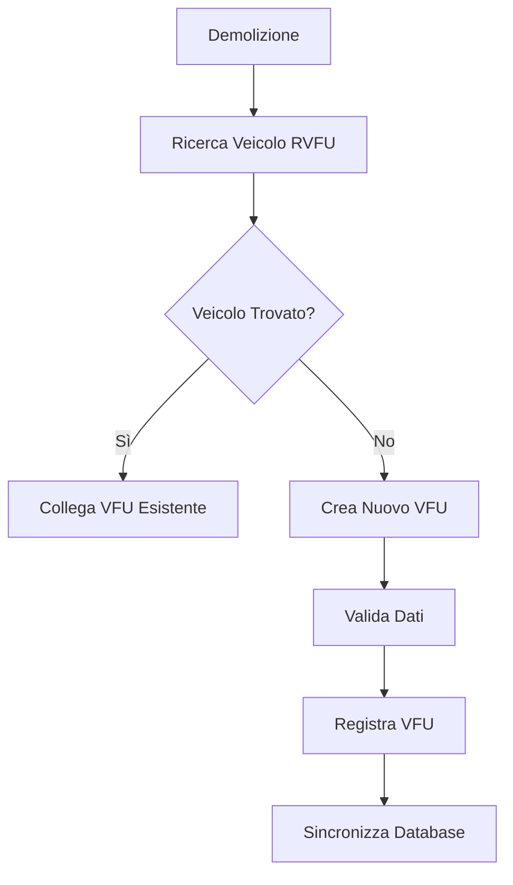
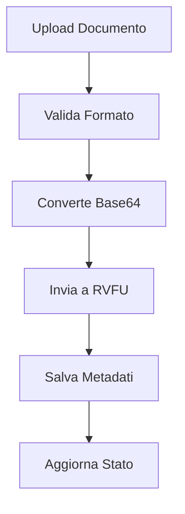

# 🚗 Integrazione Registro Veicoli Fuoriuso (RVFU) - RescueManager

## 📋 Panoramica

Questo documento descrive l'implementazione completa dell'integrazione con il **Registro Veicoli Fuoriuso (RVFU)** del MIT nel sistema RescueManager. L'integrazione permette di:

- ✅ Sincronizzare automaticamente i veicoli delle demolizioni con il sistema RVFU
- ✅ Gestire il ciclo di vita completo dei VFU (Veicoli Fuoriuso)
- ✅ Caricare e gestire documenti secondo gli standard MIT
- ✅ Monitorare lo stato delle pratiche in tempo reale
- ✅ Mantenere tracciabilità completa delle operazioni

---

## 🏗️ Architettura Implementata

### **Frontend (React/TypeScript)**
- **`src/lib/rvfu-types.ts`** - Definizioni TypeScript complete per tutte le API RVFU
- **`src/lib/rvfu-api.ts`** - Client API per comunicazione con RVFU
- **`src/lib/rvfu-validation.ts`** - Sistema di validazione secondo standard MIT
- **`src/hooks/useRVFU.ts`** - Hook personalizzato per operazioni RVFU
- **`src/components/rvfu/`** - Componenti UI per gestione VFU
- **`src/pages/DemolizioniRVFU.jsx`** - Pagina integrata demolizioni + RVFU

### **Backend (Supabase)**
- **`supabase/migrations/20250115000000_rvfu_integration.sql`** - Schema database esteso
- **`supabase/functions/rvfu-sync/index.ts`** - Edge Function per sincronizzazione
- **`supabase/functions/rvfu-documents/index.ts`** - Edge Function per documenti

---

## 🚀 Guida all'Implementazione

### **FASE 1: Configurazione Database**

1. **Esegui la migrazione Supabase:**
   ```bash
   supabase db push
   ```

2. **Configura le variabili d'ambiente:**
   ```env
   VITE_RVFU_BASE_URL=http://gestione-veicolo-fuoriuso-tst.serviziaci.it:80
   VITE_RVFU_API_KEY=your_api_key_here
   ```

3. **Inserisci configurazione RVFU per organizzazione:**
   ```sql
   INSERT INTO rvfu_configurations (org_id, rvfu_base_url, rvfu_api_key, rvfu_user_type)
   VALUES ('your-org-id', 'http://gestione-veicolo-fuoriuso-tst.serviziaci.it:80', 'your-api-key', 'concessionario');
   ```

### **FASE 2: Deploy Edge Functions**

1. **Deploy delle funzioni Supabase:**
   ```bash
   supabase functions deploy rvfu-sync
   supabase functions deploy rvfu-documents
   ```

2. **Configura le policy RLS** (già incluse nella migrazione)

### **FASE 3: Integrazione Frontend**

1. **Aggiungi la nuova pagina alle rotte:**
   ```jsx
   // src/App.jsx
   import DemolizioniRVFU from './pages/DemolizioniRVFU';
   
   // Aggiungi la rotta
   <Route path="/demolizioni-rvfu" element={<DemolizioniRVFU />} />
   ```

2. **Aggiorna la navigazione:**
   ```jsx
   // src/components/Shell.jsx
   <SideLink to="/demolizioni-rvfu" label="Demolizioni RVFU" icon={FiCar} />
   ```

---

## 📊 Funzionalità Implementate

### **Dashboard RVFU**
- 📈 Statistiche in tempo reale
- 🔍 Ricerca e filtri avanzati
- 📋 Gestione stati VFU
- 🔄 Sincronizzazione automatica

### **Gestione VFU**
- ➕ Creazione nuovi VFU
- ✏️ Modifica VFU esistenti
- 👁️ Visualizzazione dettagliata
- 📄 Gestione documenti
- 📈 Timeline operazioni

### **Integrazione Demolizioni**
- 🔗 Collegamento automatico VFU-Demolizioni
- 📊 Dashboard unificata
- 🔄 Sincronizzazione bidirezionale
- 📋 Tracciabilità completa

### **Sistema Documenti**
- 📤 Upload documenti
- 📥 Download documenti
- 📋 Gestione distinte
- 🔒 Sicurezza e validazione

---

## 🔧 Configurazione Avanzata

### **Tipi di Utente RVFU**

#### **Concessionario**
```typescript
const config = {
  userType: 'concessionario',
  baseUrl: 'http://gestione-veicolo-fuoriuso-tst.serviziaci.it:80',
  apiKey: 'your-concessionario-key'
};
```

#### **Centro di Raccolta (CR)**
```typescript
const config = {
  userType: 'cr',
  baseUrl: 'http://gestione-veicolo-fuoriuso-tst.serviziaci.it:80',
  apiKey: 'your-cr-key'
};
```

### **Validazione Dati**

Il sistema include validazione completa secondo standard MIT:

```typescript
import { RVFUValidator } from '@/lib/rvfu-validation';

const validation = RVFUValidator.validateVFUConcessionario(vfuData);
if (!validation.isValid) {
  console.error('Errori validazione:', validation.errors);
}
```

### **Gestione Errori**

```typescript
import { useRVFU } from '@/hooks/useRVFU';

const { registraVFUConcessionario, error, loading } = useRVFU();

try {
  const result = await registraVFUConcessionario(data);
  // Gestione successo
} catch (err) {
  // Gestione errore automatica tramite toast
}
```

---

## 📋 Stati VFU Supportati

| Stato | Descrizione | Azioni Disponibili |
|-------|-------------|-------------------|
| `INSERITO` | VFU appena inserito | Validare, Annullare |
| `VALIDATO` | VFU validato | Prendere in carico, Annullare |
| `PRESO_IN_CARICO` | VFU preso in carico | Conferire, Cedere, Trasferire |
| `CONFERITO` | VFU conferito | Inviare a STA |
| `INVIATO_A_STA` | Inviato a STA | Radiazione |
| `RADIATO` | VFU radiato | Demolire |
| `DEMOLITO` | VFU demolito | - |
| `ANNULLATO` | VFU annullato | - |

---

## 🔄 Workflow Operativo

### **1. Creazione VFU**


### **2. Gestione Documenti**


---

## 🛡️ Sicurezza e Compliance

### **Autenticazione**
- ✅ JWT token validation
- ✅ Row Level Security (RLS)
- ✅ Organization-based access control

### **Validazione Dati**
- ✅ Validazione formato targa italiana
- ✅ Validazione codice fiscale
- ✅ Validazione dati geografici ISTAT
- ✅ Validazione documenti base64

### **Audit Trail**
- ✅ Log completo operazioni RVFU
- ✅ Tracciabilità modifiche
- ✅ Timestamp automatici
- ✅ User attribution

---

## 📈 Monitoraggio e Analytics

### **Metriche Disponibili**
- 📊 Totale VFU per organizzazione
- 📈 VFU per stato
- ⏱️ Tempi medi di elaborazione
- ❌ Tasso di errori
- 📄 Documenti caricati

### **Dashboard Integrata**
```jsx
<RVFUDashboard
  orgId={orgId}
  onSelectVFU={handleSelectVFU}
  onNewVFU={handleNewVFU}
/>
```

---

## 🚨 Troubleshooting

### **Errori Comuni**

#### **1. "RVFU configuration not found"**
```sql
-- Verifica configurazione
SELECT * FROM rvfu_configurations WHERE org_id = 'your-org-id';
```

#### **2. "Veicolo non trovato nel sistema RVFU"**
- Verifica formato targa (AA999AA)
- Verifica formato telaio (8-20 caratteri)
- Controlla se veicolo è già registrato

#### **3. "Errore validazione dati"**
```typescript
// Debug validazione
const validation = RVFUValidator.validateVFUConcessionario(data);
console.log('Errori:', validation.errors);
console.log('Avvisi:', validation.warnings);
```

### **Log e Debug**

```typescript
// Abilita logging dettagliato
import { logger } from '@/lib/logger';

logger.info('RVFU operation started', { operation: 'create', data });
```

---

## 🔮 Roadmap Futura

### **Fase 2 - Automazione Avanzata**
- [ ] Sincronizzazione automatica ogni 15 minuti
- [ ] Notifiche push per cambi stato
- [ ] Integrazione webhook RVFU
- [ ] Reportistica avanzata

### **Fase 3 - Integrazione Estesa**
- [ ] Integrazione con PRA (Pubblico Registro Automobilistico)
- [ ] Sincronizzazione con ACI
- [ ] Gestione deleghe automatiche
- [ ] API pubbliche per partner

---

## 📞 Supporto

Per supporto tecnico o domande sull'implementazione:

1. **Documentazione API RVFU:** Consulta i file in `SOLO DA LEGGERE/`
2. **Log Supabase:** Controlla i log delle Edge Functions
3. **Debug Frontend:** Usa React DevTools e console browser
4. **Database:** Verifica le tabelle RVFU in Supabase Dashboard

---

## ✅ Checklist Implementazione

- [x] Schema database esteso
- [x] Edge Functions deployate
- [x] Client API implementato
- [x] Componenti UI creati
- [x] Validazione dati implementata
- [x] Integrazione demolizioni completata
- [x] Sistema documenti funzionante
- [x] Sicurezza e RLS configurati
- [x] Logging e monitoraggio attivi
- [x] Documentazione completa

**🎉 Implementazione RVFU completata con successo!**

---

*Ultimo aggiornamento: 15 Gennaio 2025*
*Versione: 1.0.0*
*Autore: RescueManager Development Team*
